##############################################################################
Chapter 0 Raspberry Pi Preparation
##############################################################################

Install a System
*****************************************************************************

Component List 
================================================================

Required Components
-------------------------------------------------------------------

.. list-table:: 
    :width: 100%
    :widths: 50 50
    :align: center
    :class: product-table

    *   -   Raspberry Pi 5 / 4B / 3B+ (Recommended) 
        -   5V/3A Power Adapter. Different versions of  
  
            Raspberry Pi have different power requirements.
    *   -   |Preparation00|
        -   |Preparation01|
    *   -   Micro USB Cable x1
        -   Micro SD Card (TF Card) x1, Card Reader x1
    *   -   |Preparation02|
        -   |Preparation03|

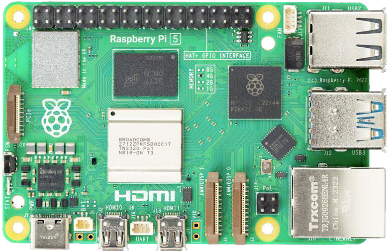
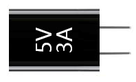
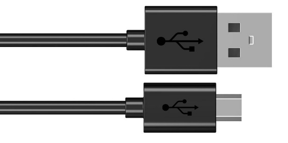
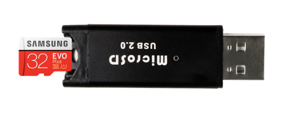

This robot also supports the following versions of the Raspberry Pi, but additional accessories need to be prepared by yourself. 

+--------------------------------------------+------------------------------------------------------------------------+
|  Raspberry                                 | Additional accessories                                                 |      
+--------------------------------------------+------------------------------------------------------------------------+
|                                            | Camera cable(>25cm) for zero w, 15 Pin 1.0mm Pitch to 22 Pin 0.5mm     |
|  Raspberry Pi Zero W                       |                                                                        |
|                                            | https://www.amazon.com/dp/B076Q595HJ/                                  |     
+--------------------------------------------+------------------------------------------------------------------------+
|                                            | wireless network adapter,                                              |      
|                                            |                                                                        |     
|  Raspberry Pi Zero 1.3                     | Camera cable(>25cm) for zero w, 15 Pin 1.0mm Pitch to 22 Pin 0.5mm,    |     
|                                            |                                                                        |     
|                                            | OTG cable (USB Type micro B to USB Type A)                             |     
+--------------------------------------------+------------------------------------------------------------------------+
|  Raspberry Pi 2 Model B                    | wireless network adapter                                               |     
+--------------------------------------------+------------------------------------------------------------------------+
|  Raspberry Pi 1 Model A+                   | wireless network adapter                                               |     
+--------------------------------------------+------------------------------------------------------------------------+
|  Raspberry Pi 1 Model B+                   | wireless network adapter                                               |     
+--------------------------------------------+------------------------------------------------------------------------+

Power requirements of various versions of Raspberry Pi are shown in following table:

+-------------------------+----------------------------------+----------------------------------------------------+------------------------------------------------+
| Product                 | Recommended PSU current capacity | Maximum total USB peripheral current draw          | Typical bare-board active current consumption  |
+=========================+==================================+====================================================+================================================+
| Raspberry Pi 1 Model A  | 700mA                            | 500mA                                              | 200mA                                          |
+-------------------------+----------------------------------+----------------------------------------------------+------------------------------------------------+
| Raspberry Pi 1 Model B  | 1.2A                             | 500mA                                              | 500mA                                          |
+-------------------------+----------------------------------+----------------------------------------------------+------------------------------------------------+
| Raspberry Pi 1 Model A+ | 700mA                            | 500mA                                              | 180mA                                          |
+-------------------------+----------------------------------+----------------------------------------------------+------------------------------------------------+
| Raspberry Pi 1 Model B+ | 1.8A                             | 1.2A                                               | 330mA                                          |
+-------------------------+----------------------------------+----------------------------------------------------+------------------------------------------------+
| Raspberry Pi 2 Model B  | 1.8A                             | 1.2A                                               | 350mA                                          |
+-------------------------+----------------------------------+----------------------------------------------------+------------------------------------------------+
| Raspberry Pi 3 Model B  | 2.5A                             | 1.2A                                               | 400mA                                          |
+-------------------------+----------------------------------+----------------------------------------------------+------------------------------------------------+
| Raspberry Pi 3 Model A+ | 2.5A                             | Limited by PSU, board, and connector ratings only. | 350mA                                          |
+-------------------------+----------------------------------+----------------------------------------------------+------------------------------------------------+
| Raspberry Pi 3 Model B+ | 2.5A                             | 1.2A                                               | 500mA                                          |
+-------------------------+----------------------------------+----------------------------------------------------+------------------------------------------------+
| Raspberry Pi 4 Model B  | 3.0A                             | 1.2A                                               | 600mA                                          |
+-------------------------+----------------------------------+----------------------------------------------------+------------------------------------------------+
| Raspberry Pi 5          | 5.0A                             | 1.6A (600mA if using a 3A power supply)            | 800mA                                          |
+-------------------------+----------------------------------+----------------------------------------------------+------------------------------------------------+
| Raspberry Pi 400        | 3.0A                             | 1.2A                                               | 800mA                                          |
+-------------------------+----------------------------------+----------------------------------------------------+------------------------------------------------+
| Raspberry Pi Zero       | 1.2A                             | Limited by PSU, board, and connector ratings only  | 100mA                                          |
+-------------------------+----------------------------------+----------------------------------------------------+------------------------------------------------+

.. seealso:: 

    For more details, please refer to https://www.raspberrypi.org/help/faqs/#powerReqs

In addition, RPi also needs an Ethernet network cable used to connect it to a WAN (Wide Area Network).

The Raspberry Pi 5 provides 1.6A of power to downstream USB peripherals when connected to a power supply capable of 5A at +5V (25W). When connected to any other compatible power supply, the Raspberry Pi 5 restricts downstream USB devices to 600mA of power.

Optional Components
================================================================

Under normal circumstances, there are two ways to login to Raspberry Pi: 

1) Using a stand-alone monitor. 
2) Using a remote desktop or laptop computer monitor “sharing” the PC monitor with your RPi.

Required Accessories for Monitor
------------------------------------------------------------------

If you choose to use an independent monitor, mouse and keyboard, you also need the following accessories:

1. A display with a HDMI interface

2. A Mouse and a Keyboard with an USB interface

As to Pi Zero and Pi Zero W, you also need the following accessories:

1.	A Mini-HDMI to HDMI Adapter and Cable.

2.	A Micro-USB to USB-A Adapter and Cable (Micro USB OTG Cable). 

3.	A USB HUB.

4.	USB to Ethernet Interface or USB Wi-Fi receiver. 

For different Raspberry Pi Modules, the optional items may vary slightly but they all aim to convert the interfaces to Raspberry Pi standards.

+----------------------------------------------------------+--------------------------------------------+----------------------+----------------------+-----------------------+----------+-----------+-------+-------+
|                                                          | Pi Zero                                    | Pi A+                | Pi Zero W            | Pi 3A+                | Pi B+/2B | Pi 3B/3B+ | Pi 4B | Pi 5  |
+==========================================================+============================================+======================+======================+=======================+==========+===========+=======+=======+
| Monitor                                                  | Yes (All)                                                                                                                                               |
+----------------------------------------------------------+                                                                                                                                                         +
| Mouse                                                    |                                                                                                                                                         |
+----------------------------------------------------------+                                                                                                                                                         +
| Keyboard                                                 |                                                                                                                                                         |
+----------------------------------------------------------+--------------------------------------------+----------------------+----------------------+-----------------------+----------+-----------+-------+-------+
| Micro-HDMI to HDMI Adapter & Cable                       | Yes                                        | No                   | Yes                  | No                    | No       | No        | No    | No    |
+----------------------------------------------------------+--------------------------------------------+----------------------+----------------------+-----------------------+----------+-----------+-------+-------+
| Micro-HDMI to HDMI Adapter & Cable                       | No                                         | Yes                  |                      |                       |          |           |       |       |
+----------------------------------------------------------+--------------------------------------------+----------------------+----------------------+-----------------------+----------+-----------+-------+-------+
| Micro-USB to USB-A Adapter & Cable (Micro USB OTG Cable) | Yes                                        | No                   | Yes                  | No                    |          |           |       |       |
+----------------------------------------------------------+--------------------------------------------+----------------------+----------------------+-----------------------+----------+-----------+-------+-------+
| USB HUB                                                  | Yes                                        | Yes                  | Yes                  | Yes                   | No       | No        | No    | No    |
+----------------------------------------------------------+--------------------------------------------+----------------------+----------------------+-----------------------+----------+-----------+-------+-------+
| USB to Ethernet Interface                                | select one from two or select two from two | optional             | Internal Integration | Internal Integration  |          |           |       |       |
+----------------------------------------------------------+--------------------------------------------+----------------------+----------------------+-----------------------+----------+-----------+-------+-------+
| USB Wi-Fi Receiver                                       |                                            | Internal Integration | optional             |                       |          |           |       |       |
+----------------------------------------------------------+--------------------------------------------+----------------------+----------------------+-----------------------+----------+-----------+-------+-------+

Required Accessories for Remote Desktop
------------------------------------------------------------------

+----------------------------------------------------------+---------+-----------+-------+--------+----------+----------------+
|                                                          | Pi Zero | Pi Zero W | Pi A+ | Pi 3A+ | Pi B+/2B | Pi 3B/3B+/4B/5 |
+==========================================================+=========+===========+=======+========+==========+================+
| Micro-USB to USB-A Adapter & Cable (Micro USB OTG Cable) | Yes     | Yes       | No    | NO                                 |
+----------------------------------------------------------+---------+-----------+-------+                                    +
| USB to Ethernet interface                                | Yes     | Yes       | Yes   |                                    |
+----------------------------------------------------------+---------+-----------+-------+--------+----------+----------------+

Raspberry Pi OS
===================================================================

Install imager tool
-------------------------------------------------------------

Visit this website to install imager tool.

https://www.raspberrypi.com/software/

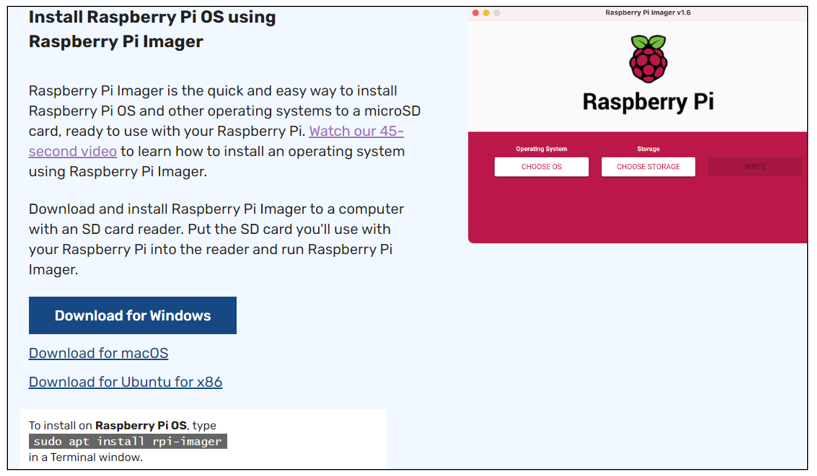

Download OS file
------------------------------------------------------------------

Due to the poor software pwm performance of Raspberry PI 5, we recommend using Raspberry PI 4 or below as the main control board of the robot arm.

Visit following website to download the OS file.

https://www.raspberrypi.com/software/operating-systems/

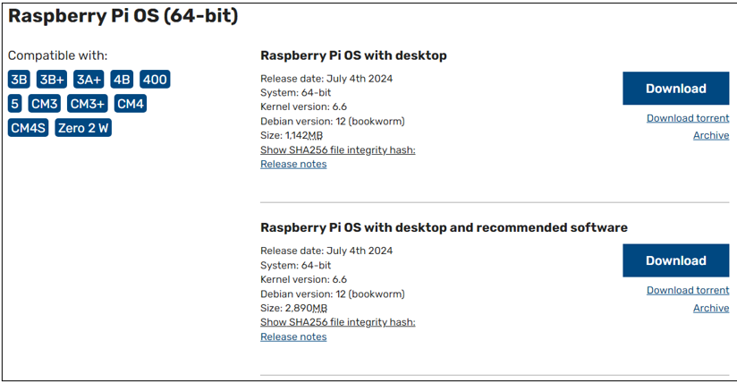

Write System to Micro SD Card 
----------------------------------------------------------------

First, insert your Micro **SD card** into **card reader** and connect it to USB port of **PC**. Then open imager tool. 

Choose system that you just downloaded in Use custom.

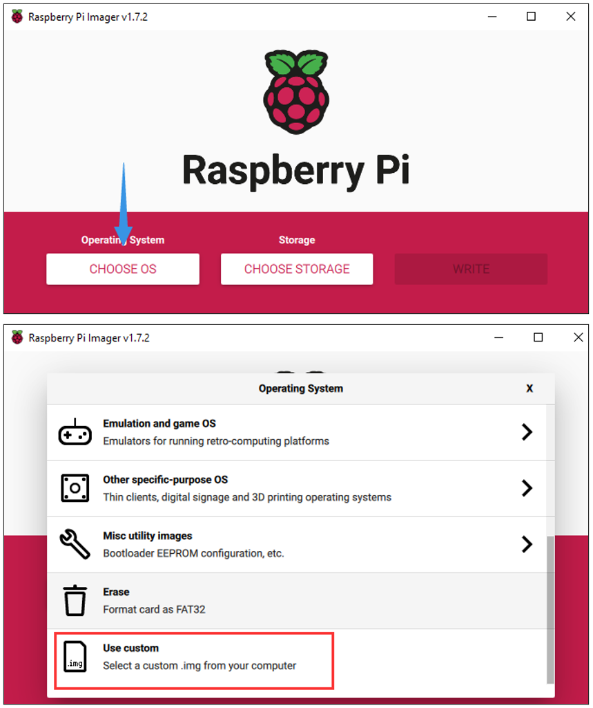

Choose the SD card. 

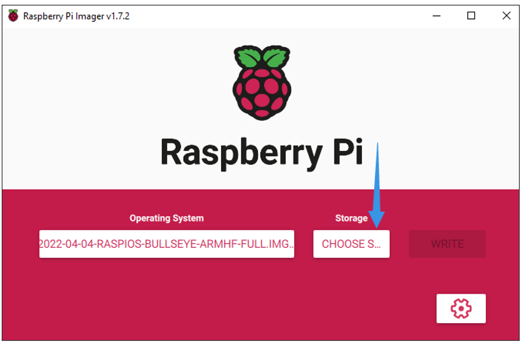

Image option.

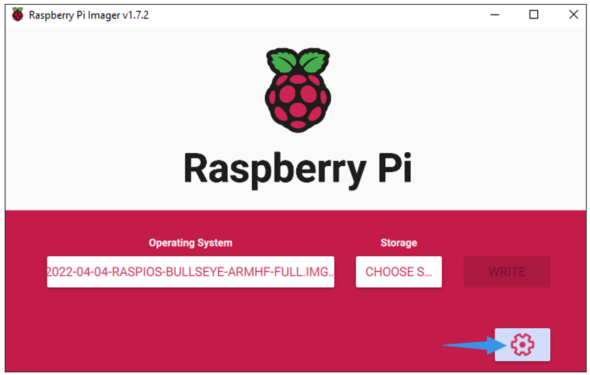

Enable SSH.

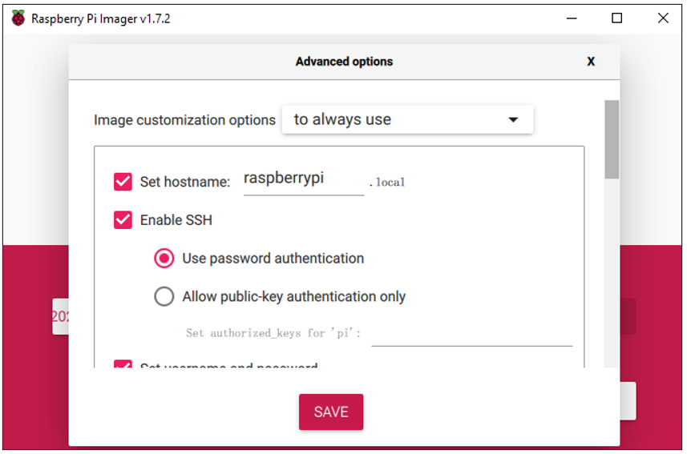

Configure WiFi and location. Here we set username as :red:`pi`, password as :red:`raspberry`

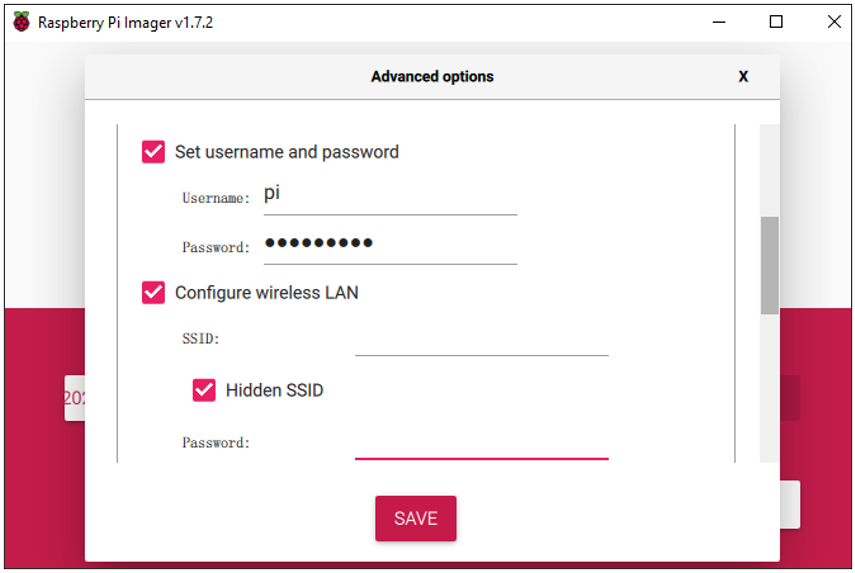

Finally WRITE.

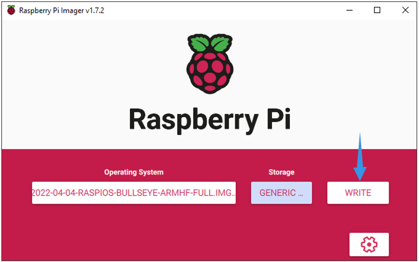

Start Raspberry Pi
------------------------------------------------------------------

If you don't have a spare monitor, please skip to next section. 

If you have a spare monitor, please follow the steps in this section. 

After the system is written successfully, put SD card into the SD card slot of RPi. Then connect your RPi to monitor through HDMI cable, attach your mouse and keyboard through the USB ports,

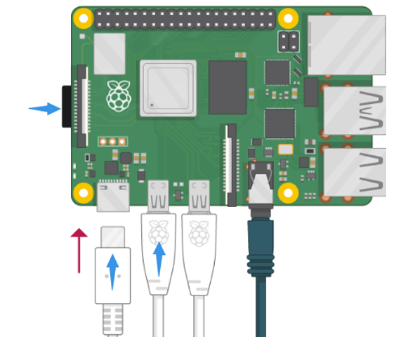

Later, after setup, you will need to enter your user name and password to login. The default user name: pi; password: raspberry. After login, you should see the following screen.

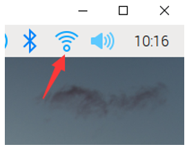

You can connect WiFi on the right corner if WiFi is connected successfully.

Now you can skip to :ref:`VNC Viewer <VNC_Viewer>`.

Remote desktop & VNC
*******************************************************************

After you log in Raspberry Pi, please use VNC Viewer to connect Raspberry Pi for this robot. Other remote ways may not support GUI. If you have logged in Raspberry Pi please skip to VNC Viewer.

If you don't have a spare monitor, mouse and keyboard for your RPi, you can use a remote desktop to share a display, keyboard, and mouse with your PC. Below is how to use: 

:ref:`MAC OS remote desktop<MAC>` and :ref:`Windows OS remote desktop<Windows>`.

.. _MAC:

MAC OS Remote Desktop
===================================================================

Open the terminal and type following command. :red:`If this command doesn't work, please move to next page.`

.. code-block:: console
    
    ssh pi@raspberrypi.local

The password is raspberry by default, case sensitive.

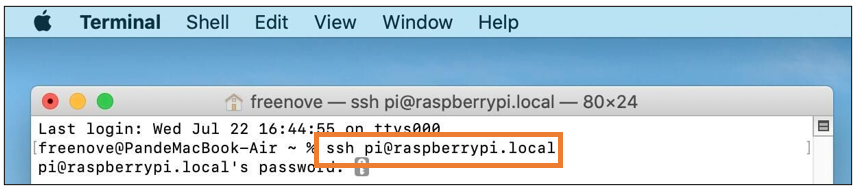

You may need to type yes during the process.

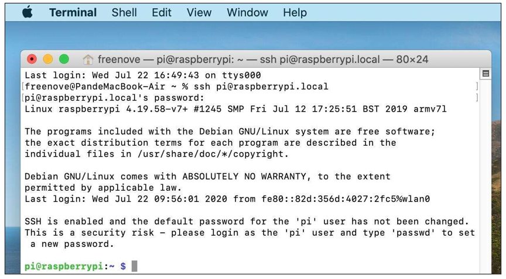

You can also use the IP address to log in Pi. 

Enter **router** client to **inquiry IP address** named “raspberry pi”. For example, I have inquired to **my RPi IP address, and it is “192.168.1.131".**

Open the terminal and type following command.

.. code-block:: console
    
    ssh pi@192.168.1.131

When you see pi@raspberrypi:~ $, you have logged in Pi successfully. Then you can skip to next section.

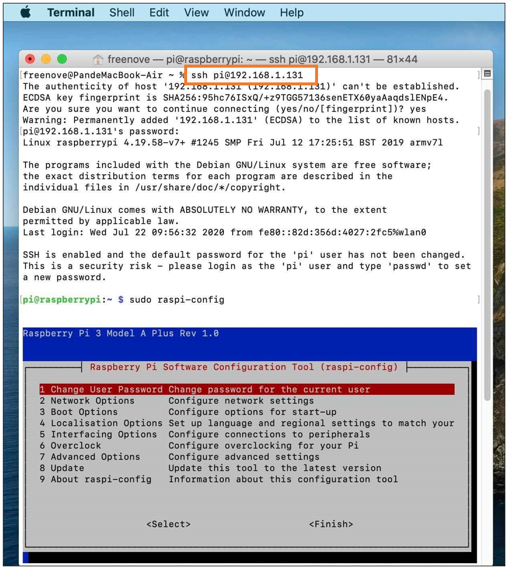

.. _Windows:

Windows OS Remote Desktop
===================================================================

**If you are using win10, you can use follow way to login Raspberry Pi without desktop.**

Press **Win+R** . Enter **cmd**. Then use this command to check IP:

.. code-block:: console
    
    ping -4 raspberrypi.local

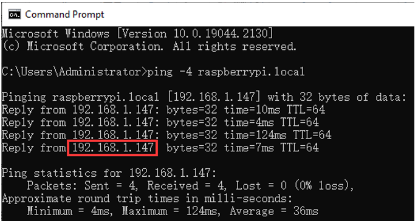

Then 192.168.1.147 is my Raspberry Pi IP.

Or enter router client to inquiry IP address named “raspberrypi”. For example, I have inquired to my RPi IP address, and it is “192.168.1.147".

.. code-block:: console
    
    ssh pi@192.168.1.147

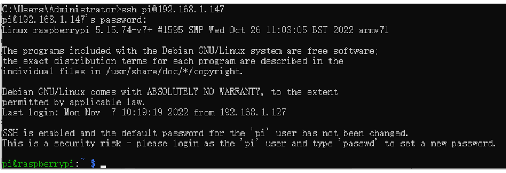

.. _VNC_Viewer:

VNC Viewer & VNC 
===================================================================

Open the Configuration Interface
--------------------------------------------------------------------

Run the following command to open the configuration interface.

.. code-block:: console
    
    sudo raspi-config

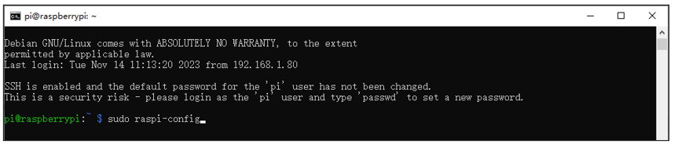

Debian Bookworm
--------------------------------------------------------------------

If your Raspberry Pi OS is Debian Bookworm system, please follow this section to operate. Here we take the version Raspberry Pi OS Full (64-bit) released on 2023-10-10 as an example.

If your RPi OS is not Debian Bookworm, you can skip this section.

Select Advanced Options.

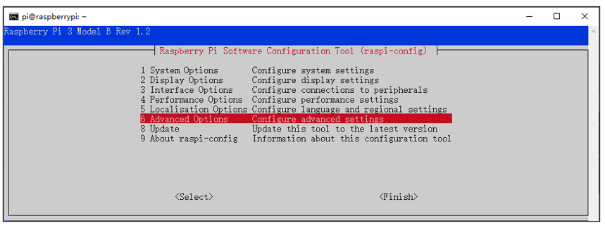

Select Wayland.

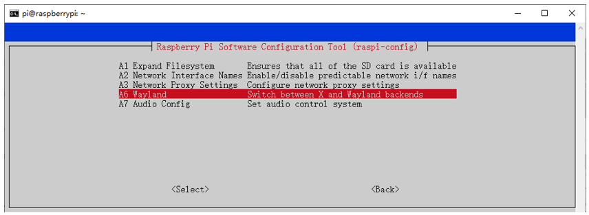

Select X11, press Enter and select OK.

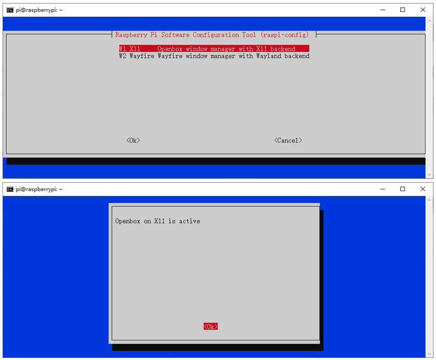

VNC Configuration
--------------------------------------------------------------------

To use VNC Viewer, you need to enable it first.

Select Interface Options.

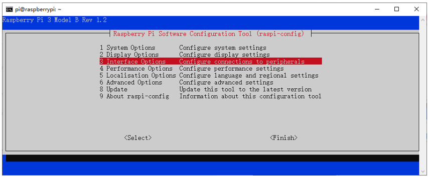

Select VNC.

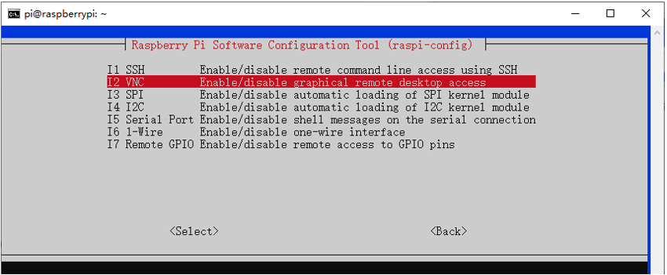

Select Yes.

.. image:: ../_static/imgs/0_Preparation/Preparation25.png
    :align: center

Select Finish.

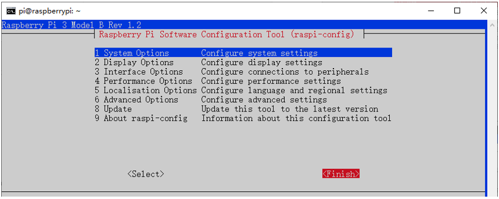

Reboot your Raspberry Pi and the settings will take effect.

Then download and install VNC Viewer according to your computer system by clicking following link:

https://www.realvnc.com/en/connect/download/viewer/

After installation is completed, open VNC Viewer. And click File  ->  New Connection. Then the interface is shown below. 

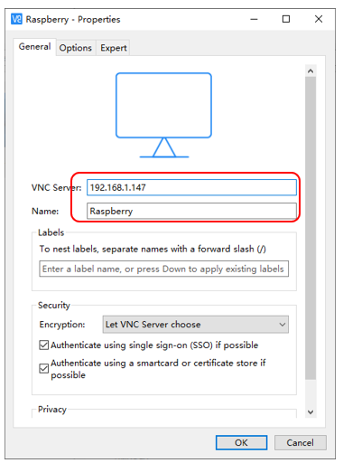

Enter IP address of your Raspberry Pi and fill in a Name. Click OK.

Then on the VNC Viewer panel, double-click new connection you just created, and the following dialog box pops up.  

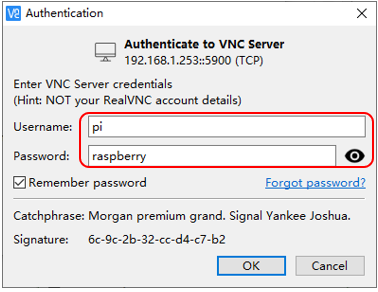

Enter username: pi and Password: raspberry. Click OK.

Here, you have logged in to Raspberry Pi successfully by using VNC Viewer

:red:`If the resolution ratio is not great or there is just a little window, you can set a proper resolution ratio via steps below.`

Click the Terminal icon.

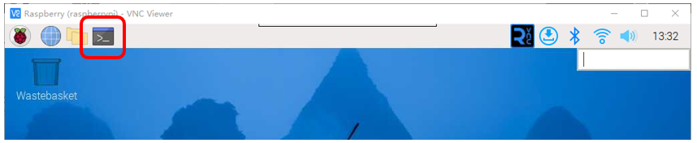

Run the command in the Terminal.

.. code-block:: console
    
    sudo raspi-config

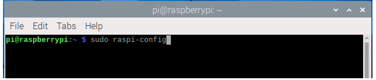

Select Display Options -> VNV Resolution -> Proper resolution ratio (set by yourself)  -> OK -> Finish -> Yes. 

Then reboot Raspberry Pi.

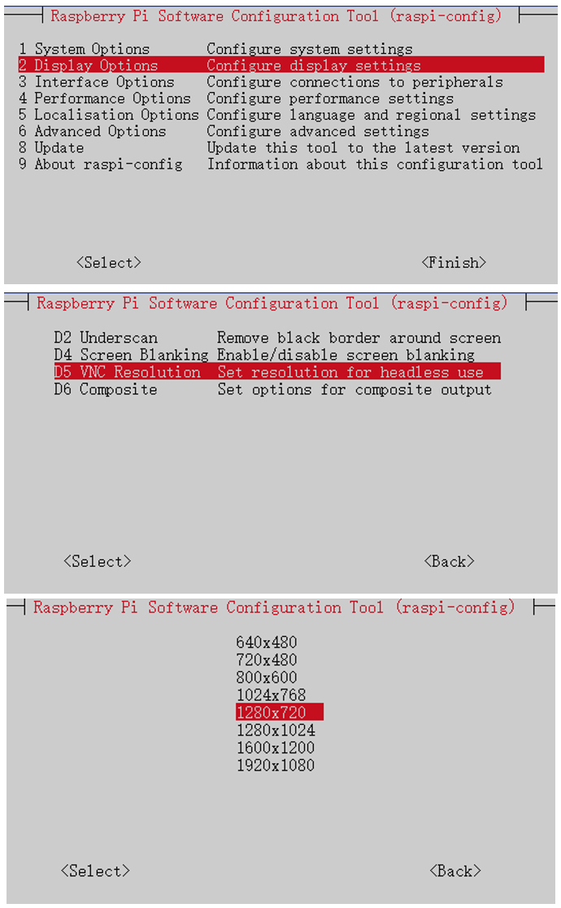

In addition, your VNC Viewer window may zoom your Raspberry Pi desktop. You can change it. On your VNC View control panel, click right key. Select Properties->Options label->Scaling. Then set proper scaling. 

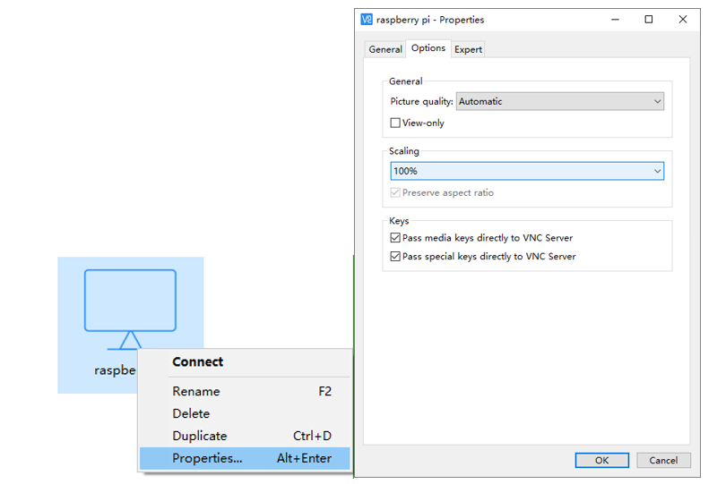

Here, you have logged in to Raspberry Pi successfully by using VNC Viewer and operated proper setting.

Raspberry Pi 4B/3B+/3B integrates a Wi-Fi adaptor. If you did not connect Pi to WiFi. You can connect it to wirelessly control the robot.

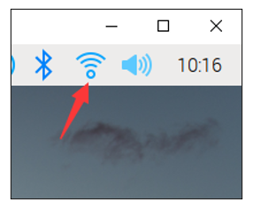

Install Python Libraries (Required)
*****************************************************************
If you have any concerns, please feel free to contact us at support@freenove.com

In this chapter, we will do some foundational preparation work: Start your Raspberry Pi and install some necessary libraries. And in next chapter, we will assemble the robot arm.

.. note::

   1. :red:`Make sure Raspberry Pi OS with Desktop (64-bit) is used.`

   2. The installation of libraries takes much time. :red:`You can power Raspberry Pi with a power supply Cable.`

   3. If you are using **remote desktop** to login Raspberry Pi, you need to use VNC viewer. If you use the 32-bit version, VNC viewer may not be able to use. 

Step 1 Obtain the Code
====================================================================

Start the Raspberry Pi and open the terminal. You can click the terminal as shown below, or press "CTAL+ALT+T" on the desktop.

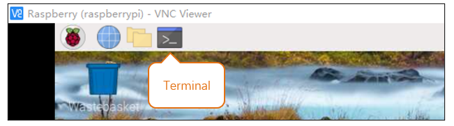

The terminal is shown below:

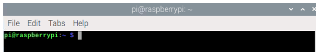

Type following command to get robot arm code and place it in user directory "Pi". 

Please execute commands below one by one in turn.

.. code-block:: console
    
    cd ~
    git clone --depth 1 https://github.com/Freenove/Freenove_Robot_Arm_Kit_for_Raspberry_Pi.git

Downloading takes much time. Please wait with patience. 

You can also find and download the code by visiting our official website (http://www.freenove.com) or our GitHub repository (https://github.com/freenove).

:red:`Please note that all codes for this robot arm is written with Python3. If executed under python 2, errors may occur.`

Set Python3 as default python
--------------------------------------------------------------------

First, check the default python on your raspberry Pi. Press Ctrl-Z to exit.

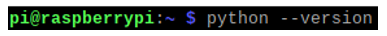

If it is python3, you can skip this section.

If it is python2, you need to execute the following commands to set default python to python3.

1.	Enter directory /usr/bin 
    
    cd /usr/bin

2.	Delete the old python link.

    sudo rm python

3.	Create new python links to python.

    sudo ln -s python3 python

4.	Check python. Press Ctrl-Z to exit.

    python -version

If you want to set python2 as default python in other projects, just repeat the above command and change python3 to python2.

Shortcut Key
---------------------------------------

Now, we will introduce several shortcuts that are very :red:`useful` and :red:`commonly used` in terminal.

1. **up and down arrow keys**. History commands can be quickly brought back by using up and down arrow keys, which are very useful when you need to reuse certain commands.

**When you need to type command, pressing “↑” (the Up key) will go backwards through the command history and pressing “↓” (the Down Key) will go forwards through the command history.**

2. **Tab key.** The Tab key can automatically complete the command/path you want to type. When there are multiple commands/paths conforming to the already typed letters, pressing Tab key once won’t have any result. And pressing Tab key again will list all the eligible options. However,  when there is only one eligible option, the command/path will be completely typed as soon as you press the Tab key..

As shown below, under the '~'directory, enter the Documents directory with the “cd” command. After typing “cd D”, press Tab key, there is no response. Press Tab key again, all the files/folders that begin with “D” is listed. Continue to type the character "oc", then press the Tab key, and then “Documents” is typed automatically.

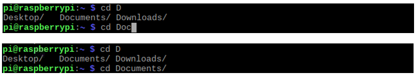

Step 2 Configuration
====================================================================

Additional supplement 
--------------------------------------------------------------------

Raspbery Pi, other than 4B and 400, needs to disable the audio module; otherwise the LED will not work properly.

1.	Create a new snd-blacklist.conf and open it for editing

.. code-block:: console
    
    sudo nano /etc/modprobe.d/snd-blacklist.conf

Add following content: After adding the contents, you need to press Ctrl+O, Enter, Ctrl+X.

.. code-block:: console
    
    blacklist snd_bcm2835

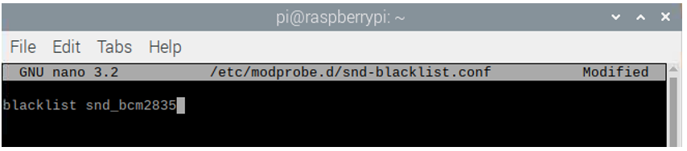

2.	We also need to edit config file.

.. code-block:: console
    
    sudo nano /boot/config.txt

Find the contents of the following two lines (with Ctrl + W you can search):

.. code-block:: console
    
    # Enable audio (loads snd_bcm2835)
    dtparam=audio=on

Add # to comment out the second line. Press Ctrl+O, Enter, Ctrl+X.

.. code-block:: console
    
    # Enable audio (loads snd_bcm2835)
    # dtparam=audio=on

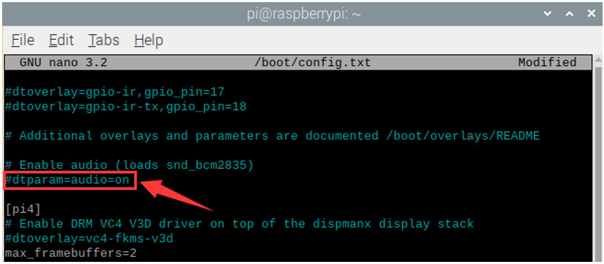

It will take effect after a reboot, and you can restart the pi after executing the next section.

If you want to restart the audio module, just restore the content modified in the above two steps.

Step 3 Run the Installation Program
--------------------------------------------------------------------

1.	Execute following commands to enter directory of “setup.py”.

.. code-block:: console
    
    cd ~/Freenove_Robot_Arm_Kit_for_Raspberry_Pi/Server

2.	Run setup.py

.. code-block:: console
    
    sudo python setup.py

This program will automatically install the pigpio, rpi_ws281x, etc. Please reboot the Raspberry Pi after the installation completes, as shown below.

After the installation completes, reboot the Raspberry Pi.

If the installation fails, please check your network and try again.

.. code-block:: console
    
    sudo python setup.py