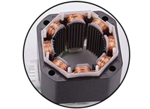
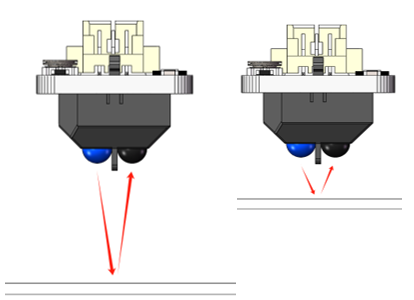
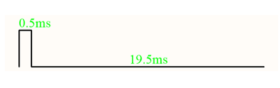
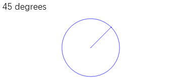
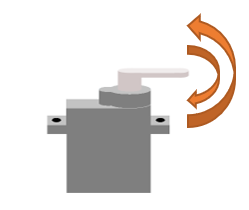

##############################################################################
Chapter 1 Function Tests
##############################################################################

Robot Arm Board for Raspberry Pi
******************************************************************************

Introduction to the Robot Board
==============================================================================

Take out the robot board as shown below from the product box.

In this chapter, we will test all modules with this robot board and the Raspberry Pi.

The board is connected to the Raspberry Pi through the IO Port on the board. The positioning holes on the board are suitable for the Raspberry Pi. The features and functions are as follows.

Installing Batteries and Robot Board
===============================================================================

Install batteries
---------------------------------------------------------------------------------

You can power the robot arm with external power supply or via the battery holder included. 

•	If you choose the former method, ensure that the voltage of the external supply remains within the range of 9-12.6V, with a current rating of at least 5A

•	If you use the battery holder included, please prepare three flat-top Li-ion 18650 batteries.

Put the 18650 batteries into the battery holder. During installation, please ensure that the orientation of the battery aligns with the indications on the battery box, as shown in the diagram below.

Installing the Robot Board
-----------------------------------------------------------------------------------

Assemble the robot board to the Raspberry Pi. Pay attention to the orientation of both boards, as shown below.

Please carefully verify that the pins of the Raspberry Pi align precisely with the female headers on the mainboard. If there is any misalignment, please reinstall them accordingly. 

Robot Board Test
-----------------------------------------------------------------------------------

Connect the robot board and the battery holder with the Dual DC power cable.

After conencting power supply, press the main switch, and you can see the power indicator ON1 light up. Then it will power the Raspberry Pi. The robot board also powers the LED module, buzzer and sensors.

Press the Load switch and ON2 will light up. It powers the A4988 moduld and the motors.

As you can see, there is another indicator above ON1. 

**It will light off when the total voltage of the three Li-ion batteries is lower than 10.5V, indicating a lower power supply. At this point, please charge the batteries.**

Stepper Motor Test
**********************************************************************************

If you are not interested in the principles of stepper motors and their driving modules, feel free to skip ahead to the debugging section.

Introduction to the Stepper Motors
===================================================================================

The main body of the stepper motor consists of a stator and a rotor.

The stator is composed of eight stator windings, which are divided into four groups, A, B, C, and D. Among them, groups A and C are connected together and the same goes to B and D.

.. list-table::
    :align: center

    * - |Function05|
      - |Function06|
      - |Function07| 

The rotor encompasses four sets of permanent magnets, with the N and S poles arranged alternately. These poles rotate around the axis of the motor rotor, offset by 3.6 degrees from each other.

Phase A and C together form a single phase in the motor system. When energized, Phase A generates a North pole electromagnetic field directed towards the motor rotor, while Phase C generates a corresponding South pole electromagnetic field. Alternatively, if Phase A produces a South pole electromagnetic field towards the motor rotor, Phase C will generate a North pole electromagnetic field towards the motor rotor. Similarly, Phases B and D operate in a similar manner to Phases A and C, collectively contributing to the electromagnetic fields that drive the motor's motion and functionality.

.. list-table::
    :align: center

    * - |Function09|
      - |Function10|

As shown in the above diagram, A and C form one set of motor windings, while B and D form another set. If you want the magnet to make one full rotation, pay attention to the direction of the current flow in the motor windings below.

.. list-table::
    :align: center

    * - |Function11|
      - |Function12|
      - |Function13|
      - |Function14|

Observing from the S pole of the motor rotor, we proceed with the following steps: 

Step 1: Apply positive voltage to A, negative to C, and leave B and D unpowered. 
   
   - A generates an N pole magnetic field toward the motor rotor, attracting the rotor gears to face the gears of group A.
   
   - C generates a magnetic field with a South pole directed towards the motor rotor, causing repulsion between the rotor gears and the C gears, offsetting each other. 
   
   - B and D do not produce a magnetic field, thus not interfering with the rotation of the motor rotor.

Step 2: Apply positive voltage to B, negative to D, and leave A and C unpowered. 
   
   - B generates an N pole magnetic field toward the motor rotor, attracting the rotor gears to face the gears of group B.
   
   - D generates a magnetic field with a South pole directed towards the motor rotor, causing repulsion between the rotor gears and the D gears, offsetting each other. 
   
   - A and C do not produce a magnetic field, thus not interfering with the rotation of the motor rotor.

Step 3: Apply positive voltage to C, negative to A, and leave B and D unpowered. 
   
   - C generates an N pole magnetic field toward the motor rotor, attracting the rotor gears to face the gears of group C.
   
   - A generates a magnetic field with a South pole directed towards the motor rotor, causing repulsion between the rotor gears and the A gears, offsetting each other. 
   
   - B and D do not produce a magnetic field, thus not interfering with the rotation of the motor rotor.

Step 4: Apply positive voltage to D, negative to B, and leave A and C unpowered. 
   
   - D generates an N pole magnetic field toward the motor rotor, attracting the rotor gears to face the gears of group D.
   
   - B generates a magnetic field with a South pole directed towards the motor rotor, causing repulsion between the rotor gears and the B gears, offsetting each other. 
   
   - A and C do not produce a magnetic field, thus not interfering with the rotation of the motor rotor.

Similarly, when observing from the motor rotor's N pole, careful examination of the gear's condition reveals that it exhibits attraction and repulsion in the opposite direction compared to the S pole. This characteristic enhances the uniformity of torque in the stepper motor.
 
With each iteration of this cycle, the stepper motor's rotor rotates clockwise by a distance of one tooth. The motor rotor comprises 50 teeth, with each tooth spanning an angle of 360°/50 = 7.2°. Therefore, in the aforementioned steps, with each step executed, the motor rotates by 7.2°/4 = 1.8°.

To complete one full rotation of the motor, it would require 360°/1.8° = 200 steps.

The direction of motor rotation depends on whether we execute the cycle steps in the forward or reverse order.

Following the steps from top to bottom, if we sequentially energize the motor's A, B, C, D phases, the stepper motor will rotate in one direction. Conversely, following the steps from bottom to top and sequentially energizing the motor's A, B, C, D phases will result in the stepper motor rotating in the opposite direction.

+-------------+-------------+-----+-----+-----+-----+
| CW          |         CCW | A   | B   | C   | D   |
+-------------+-------------+-----+-----+-----+-----+
|             |             | \+  |     | \-  |     |
|             |             +-----+-----+-----+-----+
||Function16| ||Function17| |     | \+  |     | \-  |
|             |             +-----+-----+-----+-----+
|             |             | \-  |     | \+  |     |
|             |             +-----+-----+-----+-----+
|             |             |     | \-  |     | \+  |
+-------------+-------------+-----+-----+-----+-----+

Description of the Stepper Motor Driver Module
======================================================

In our daily life, stepper motors are commonly found in a variety of devices such as 3D printers and typewriters, showcasing their remarkable precision and versatility. However, as previously discussed, merely controlling the current direction of a stepper motor results in a limited precision of 1.8°, which contradicts our understanding of its capabilities.

This section delves into the principles and applications of stepper motor driver modules, elucidating how they contribute to enhancing stepper motor precision. Within our robotic arm system, we rely on the A4988 module as the stepper motor driver. This module boasts a wide voltage input range of 8-35V and can deliver a maximum current output of 2A.

.. image:: ../_static/imgs/1_Function_Tests/Function18.png
    :align: center

Please note: During the use of the robot arm, please do not plug and unplug the A4988 module with electricity, otherwise it may be damaged!

Below is a brief introduction to each pin of the stepper motor driver module:

+------+----------------------------------------------------------------------+---------+---------------------------------------------------------------------------+
| Pins |                             Description                              |   Pin   |                                Description                                |
+======+======================================================================+=========+===========================================================================+
| GND  | Ground pin, providing the reference voltage for the module.          | DIR     | This determines the direction of rotation of the motor.                   |
+------+----------------------------------------------------------------------+---------+---------------------------------------------------------------------------+
| VDD  | This pin supplies power to the internal logic of the module.(3.3-5V) | STEP    | Pulses input pin.                                                         |
+------+----------------------------------------------------------------------+---------+---------------------------------------------------------------------------+
| 1B   | This pin connects the stepper motor coils (4-C) A-                   | SLEEP#  | Putting this pin at logic low puts the driver into a low-power sleep mode |
+------+----------------------------------------------------------------------+---------+---------------------------------------------------------------------------+
| 1A   | This pin connects the stepper motor coils (1-A) A+                   | RESET#  | Reset pin, valid in low                                                   |
+------+----------------------------------------------------------------------+---------+---------------------------------------------------------------------------+
| 2A   | This pin connects the stepper motor coils (2-B) B+                   | MS3     |                                                                           |
+------+----------------------------------------------------------------------+---------+                                                                           +
| 2B   | This pin connects the stepper motor coils (6-D) B-                   | MS2     | These pins set the microstep resolution of the driver.                    |
+------+----------------------------------------------------------------------+---------+                                                                           +
| GND  | Negative of external load power supply                               | MS1     |                                                                           |
+------+----------------------------------------------------------------------+---------+---------------------------------------------------------------------------+
| VMOT | Positive of external load power supply. (9-12.6V)                    | ENABLE# | This pin enables or disables the outputs of the stepper motor coils.      |
+------+----------------------------------------------------------------------+---------+---------------------------------------------------------------------------+

The connection of the A4988 driver is as shown below:

.. image:: ../_static/imgs/1_Function_Tests/Function19.png
    :align: center

The A4988 module can enable or disable a stepper motor by controlling the level of the Enable_Signal pin. When the Enable_Signal pin is set to high, the A4988 module will block the output current for 1A, 1B, 2A, and 2B, resulting in the stepper motor losing current and the internal coils losing their magnetic field. This lack of magnetic field constraint allows the motor rotor to rotate freely. 

Conversely, when the Enable_Signal is set to low, the A4988 module will activate the output current for 1A, 1B, 2A, and 2B. This provides the stepper motor with current, causing the internal coils to generate a magnetic field that holds the motor rotor in place, preventing free rotation.

The driver can also determine the rotation direction of the stepper modules by controlling the level of the Direction_Signal pin.

- When the Direction_Signal is at a high level, inputting pulse signals via the Pulse_Signal will cause the stepper motor to rotate in one direction.

- When the Direction_Signal is at a low level, inputting pulse signals via the Pulse_Signal will cause the stepper motor to rotate in the opposite direction.

If we want the motor to rotate once, we need to know the microstepping resolution of A4988 first.

+-----+-----+-----+----------------+-------------+-----------------+------------+
|     |     |     |Microstep       |Excitation   |Number of pulses |Resolution  |
| MS1 | MS2 | MS3 |                |             |                 |            |
|     |     |     |Resolution      |Mode         |per revolution   |of each step|
+=====+=====+=====+================+=============+=================+============+
| L   | L   | L   | Full Step      |  2 Phase    |  200            |  1.8°      |
+-----+-----+-----+----------------+-------------+-----------------+------------+
| H   | L   | L   | Half Step      |  1-2 Phase  |  400            |  0.9°      |
+-----+-----+-----+----------------+-------------+-----------------+------------+
| L   | H   | L   | Quarter Step   |  W1-2 Phase |  800            |  0.45°     |
+-----+-----+-----+----------------+-------------+-----------------+------------+
| H   | H   | L   | Eighth Step    |  2W1-2 Phase|  1600           |  0.225°    |
+-----+-----+-----+----------------+-------------+-----------------+------------+
| H   | H   | H   | Sixteenth Step |  4W1-2 Phase|  3200           |  0.1125°   |
+-----+-----+-----+----------------+-------------+-----------------+------------+

For instance, if we intend to rotate the stepper motor one full revolution, as illustrated in the left diagram below:

- When MS1, MS2, and MS3 are all set to a low level, it requires 200 pulse signals from the Pulse_Signal input.

- When MS1, MS2, and MS3 are all set to a high level, it necessitates 3200 pulse signals from the Pulse_Signal input.

Expanding on this, we can regulate the frequency of the Pulse_Signal to adjust the motor's rotational speed, as shown in the right diagram below:

For example, if we aim to complete one revolution of the stepper motor within 1 second:

- When MS1, MS2, and MS3 are all set to a low level, we need to input 200 pulse signals via the Pulse_Signal within 1 second. Thus, the frequency (F) of the Pulse_Signal is 200Hz. Each pulse has a period (T) of 1s/200Hz = 0.005s, equating to 5 milliseconds per pulse.

- When MS1, MS2, and MS3 are all set to a high level, we need to input 3200 pulse signals via the Pulse_Signal within 1 second. Hence, the frequency (F) of the Pulse_Signal is 3200Hz. Each pulse has a period (T) of 1s/3200Hz = 0.0003125s, corresponding to 0.3125 milliseconds per pulse.

The A4988 module has the capability to regulate the output current of the stepper motor connection terminals, thereby enhancing the precision of the stepper motor's rotational angle.

For instance, when MS1, MS2, and MS3 are all set to a low level, assuming that terminals A and C are energized while B and D are not, sending a single pulse signal to the A4988 module will result in a change in the output terminals of the stepper motor. The updated state would see terminals A and C unpowered, while B and D remain powered, as depicted in the diagram below.

.. list-table::
    :align: center

    * - |Function22|
      - |Function23| 

At this point, the rotor of the motor moves a distance equivalent to 1/4 of a gear tooth. The precision of the motor's rotation angle is calculated as 360°/50 teeth/4 = 1.8° per step.

When MS1, MS2, and MS3 are all set to a high level, the A4988 module controls the output current values of terminals A, C, and B, D by receiving 16 pulse signals from the Pulse_Signal each time, as illustrated in the diagram below.

.. list-table::
    :align: center

    * - |Function24|
      - |Function25|
      - |Function26|
      - |Function27|

    * - |Function28|
      - |Function29|
      - |Function30|
      - |Function31| 

    * - |Function32|
      - |Function33|
      - |Function34|
      - |Function35|

    * - |Function36|
      - |Function37|
      - |Function38|
      - |Function39|

.. |Function30| image:: ../_static/imgs/1_Function_Tests/Function30.png

.. |Function32| image:: ../_static/imgs/1_Function_Tests/Function32.png

When MS1, MS2, and MS3 are all set to a high level, it requires 16 pulses to move the motor rotor a distance equivalent to 1/4 of a gear tooth. The precision of the motor's rotation angle is calculated as 360°/50 teeth/4/16 = 0.1125° per step.

Adjust the Stepper Motor Driver Module
======================================

In our circuit board setup, the A4988 module is powered via the DC interface. We recommend using an external power supply with a voltage ranging from 9 to 12.6V.

The A4988 module can deliver a maximum current output of around 2A, whereas the motor we provide is rated at 1.5A per phase. Before proceeding with debugging, it's crucial to inspect the adjustable resistor on the A4988 module. The default configuration is illustrated in the diagram below.

.. list-table::
    :align: center

    * - |Function40|
      - |Function41|

In its default state, the adjustable resistor is connected to the Vref pin of the A4988 chip, allowing control of the maximum output current of the A4988 module by adjusting the voltage level at Vref.

Before use, check whether the A4988 module has already been fitted with a heatsink, as shown in the diagram above. If not, locate the heatsink and remove the adhesive backing before affixing it to the A4988 module as depicted. If the heatsink is not attached, it is advisable to limit the A4988 module's output current to below 1.2A to prevent potential damage caused by overheating.

Turning the adjustable resistor clockwise increases the voltage level, thereby raising the maximum output current of the A4988 module.

Conversely, rotating the adjustable resistor counterclockwise decreases the voltage level, resulting in a reduction of the A4988 module's maximum output current.

.. note::
     
    :red:`During the use of the robot arm, please do not plug and unplug the A4988 module with electricity, otherwise it may be damaged!`

The formula to calculate the reference voltage (Vref) for the A4988 module is: Vref = Imax * Rcs * 8. In our A4988 module, the resistance value (Rcs) for each module is 0.1 ohms. The calculation formula for the maximum output current (Imax) can be simplified as Imax = Vref / 0.8.

Mount the three stepper motor driver modules onto the Robot Arm Board. :red:`Be cautious about the orientation of the stepper motor driver modules to prevent incorrect insertion`, as it could harm the circuit board. Avoid connecting the stepper motors at this stage.

Once installed, utilize a screwdriver to **clockwise rotate** the resistors on the three stepper motor driver modules to the position illustrated in the diagram below. The Vref value at this position should range between 0.7V and 0.8V. The A4988 module can deliver a current of 0.875-1A.

The stepper motor has a maximum rated current of 1.5A per phase. According to the formula Imax = Vref / 0.8, the Vref value should not exceed 1.2V to prevent potential damage to the stepper motor. We recommend maintaining the Vref value between 0.7V and 1V.

If you have a voltmeter available, you can place the negative probe on the GND pin of the A4988 module and the positive probe on the adjustable resistor. By adjusting the resistor, you can precisely tune the Vref value, ensuring optimal performance of the A4988 module.

**Please note:**

**1. If the A4988 modules do not have heatsink attached, the maximum output current should not exceed 1.2A. Running at high currents for prolonged periods without a heatsink can cause the chip to overheat and potentially damage itself.**

**2. After continuous operation of the A4988 module and the motor for some time, the temperature of the module typically ranges between 40°C and 50°C. Avoid touching the A4988 module with your hands as it may be hot.**

Running Code to Test Stepper Motor 
===================================

1.	Connect the the stepper motors to the robot board with cables come with this kit. (Power cable is not shown in the diagrams below.)

Cables for stepper motor

2.	Turn ON the power switches.

.. image:: ../_static/imgs/1_Function_Tests/Function46.png
    :align: center

3.	Open the Terminal on Raspberry Pi, type the following commands and press Enter. 

.. code-block:: console

    cd ~
    cd Freenove_Robot_Arm_Kit_for_Raspberry_Pi/Server/Code
    sudo python stepmotor.py 1 1

4.	The stepper motor should rotate continuously in the counterclockwise direction. 

.. note::

    Please note that if the motor rotates in the clockwise direction, please halt the assembly of the robotic arm and contact us via email at: support@freenove.com.

5.	Here, we're appending parameters to the command. The first parameter indicates the motor number, ranging from 1 to 3. The second parameter denotes the motor's direction of rotation. When set to 1, the motor rotates counterclockwise; when set to 0, the motor rotates clockwise.

You can try the following commands

+------------------------------+----------------------------------------------------------------------+
| Commands                     | Descriptions                                                         |
+------------------------------+----------------------------------------------------------------------+
| sudo python stepmotor.py 1 0 | Contorol Stepper Motor 1 to rotate in the clockwise direction        |
+------------------------------+----------------------------------------------------------------------+
| sudo python stepmotor.py 2 1 | Contorol Stepper Motor 2 to rotate in the counterclockwise direction |
+------------------------------+----------------------------------------------------------------------+
| sudo python stepmotor.py 3 0 | Contorol Stepper Motor 3 to rotate in the clockwise direction        |
+------------------------------+----------------------------------------------------------------------+

6.	Press Ctrl+C to exit the program. 

Infrared Sensor Test
****************************

Whenever the power supply to the stepper motor is interrupted and subsequently restored, the Raspberry Pi system loses track of the motor's current angular position. To mitigate this issue, we have implemented a solution utilizing an infrared sensor. This sensor serves to accurately detect and record the stepper motor's original position, ensuring continuous awareness of its whereabouts within the system.

Introductions to the Principle of the Sensor

Please find the infrared sensor as shown in the following image.

.. list-table::
    :align: center

    * - Top
      - Bottom

    * - |Function48|
      - |Function49|

The infrared sensor module comprises both an infrared emitting diode and an infrared receiving diode. When the module is powered by a 3.3V-5V source, the infrared emitting diode emits infrared light signals outward. These signals are then reflected back upon encountering objects and subsequently detected by the infrared receiving diode, as depicted in the diagram on the left below.

.. list-table::
    :align: center

    * - Top
      - Bottom

    * - |Function50|
      - |Function51|

The schematic diagram of the infrared sensor is shown in the above right image. 

When the infrared sensor is close to an object, the emitted infrared light signals reflect back from the object's surface. This reflection triggers a low voltage level at AO and DO, lighting up indicator light D1 to signify object detection.

Conversely, when the sensor is distant from an object, the reflected infrared signals are weak, resulting in high voltage levels at AO and DO, causing indicator light D1 to turn off.

Furthermore, infrared signals are absorbed by black objects, preventing their reflection back to the sensor.

+-----------------------------------------------+------+------+-------------------------+
| The infraredsensor receives infrared signals? |  AO  |  DO  | Status of the indicator |
+===============================================+======+======+=========================+
| Yes                                           | LOW  | LOW  | ON                      |
+-----------------------------------------------+------+------+-------------------------+
| No                                            | HIGH | HIGH | OFF                     |
+-----------------------------------------------+------+------+-------------------------+

Running Code to Test the Sensors

1.	Connect the three sensors to the robot board with three 3P cables in the kit. (Power cable is not shown in the diagrams below.)

20cm 3Pin cable (same direction)

2.	Turn ON the power switches.

3.	Run the following commans on the Raspberry Pi Terminal.

.. code-block:: console
    
    cd Freenove_Robot_Arm_Kit_for_Raspberry_Pi/Server/Code
    python sensor.py

4.	Align the sensor with objects and move it up and down. Notice the indicator light changing with each movement. Once the light blinks once, a prompt message will appear on the console."

.. list-table::

    * - Move the sensor up and down
      - Phenomenon

    * - |Function55|
      - |Function56|

.. |Function56| image:: ../_static/imgs/1_Function_Tests/Function56.png

.. note::
    
    Avoid using objects with black surface, otherwise the infrared lights signals will be absorbed and cannot return to the sensor.

.. list-table::

    * - Move the sensor up and down
      - Phenomenon

    * - |Function57|
      - |Function58|

:red:`If it does not work, please rotate the potentiometer on the sensor to adjust its sensitivity.`

5.	Press Ctrl+C to exit the program.

RGB LED Module Test
***************************************

Note: bookworm systems do not support the rpi.gpio library, and rpi-ws281x-python cannot be installed. Therefore, the led function cannot be tested, please skip this section.

LedPixel Module
=======================================

The LedPixel is as below. 

It consists of 8 WS2812, each of which requires only one pin to control and supports cascade. Each WS212 has integrated 3 LEDs, red, green and blue respectively, and each of them supports 256-level brightness adjustment, which means that each WS2812 can emit 2^24=16,777,216 different colors.

You can use only one data pin to control eight LEDs on the module. As shown below:

Pin description:
+---------------------------------------+---------------------------------------+
|  (IN)                                 | (OUT)                                 |
+========+==============================+========+==============================+
| symbol | Function                     | symbol | Function                     |
+--------+------------------------------+--------+------------------------------+
| S      | Input control signal         | S      | Output control signal        |
+--------+------------------------------+--------+------------------------------+
| V      | Power supply pin, +3.5V~5.5V | V      | Power supply pin, +3.5V~5.5V |
+--------+------------------------------+--------+------------------------------+
| G      | GND                          | G      | GND                          |
+--------+------------------------------+--------+------------------------------+

The color of each LED consists of red, green, and blue components, with each color occupying 8 bits of data. Therefore, to control the color of an LED, we need to send 24 bits of color data to the LED through pins.

The color of each LED consists of red, green, and blue components, with each color occupying 8 bits of data. Therefore, to control the color of an LED, we need to send 24 bits of color data to the LED through pins.

+-----+-----+-----+-----+-----+-----+-----+-----+
| G7  | G6  | G5  | G4  | G3  | G2  | G1  | G0  |
+-----+-----+-----+-----+-----+-----+-----+-----+
| R7  | R6  | R5  | R4  | R3  | R2  | R1  | R0  |
+-----+-----+-----+-----+-----+-----+-----+-----+
| B7  | B6  | B5  | B4  | B3  | B2  | B1  | B0  |
+-----+-----+-----+-----+-----+-----+-----+-----+

The timing waveform diagram is shown below.

+-----+---------------------------+-----------+---------+
| T0H | 0 code, high voltage time | 0.4us     | +-150ns |
+-----+---------------------------+-----------+---------+
| T0L | 0 code, low voltage time  | 0.85us    | +-150ns |
+-----+---------------------------+-----------+---------+
| T1H | 1 code, high voltage time | 0.85us    | +-150ns |
+-----+---------------------------+-----------+---------+
| T1L | 1 code, low voltage time  | 0.4us     | +-150ns |
+-----+---------------------------+-----------+---------+
| RST | Low voltage time          | Over 50us           |
+-----+---------------------------+---------------------+

The schematic diagram is as shown below.

The previous schematic reveals that the Raspberry Pi connects to the DIN pin of the LEDs through SIG_IN and sends the data to the LED.

The LED data is input via the DIN pin of and output from the DOUT pin, as shown below.

Every time the DIN pin of a RGB LED receives 1 bit of data, it shifts the 24 bits of data within the LED it back one bit, and the excess bit of data is then sent to the next LED via the DOUT pin.

Therefore, to control serveral LEDs with Raspberry Pi, it needs to send the 24-bit color data of the LEDs continuously.

To control 8 RGB LEDs, the Raspberry Pi needs to send 8 groups of 24-bit color data to the LEDs. Fist, send the 24-bit color data of D7, then send those of D6, and repeat in this way until finally send the 24-bit data of D1.

rpi-ws281x-python
--------------------------------------

In our tutorial, we use the rpi-ws281x-python library to drive the LED module.

Please run the following commands to install the library. If you have installed it, you can skip this step.

.. code-block:: console

    cd ~
    cd Freenove_Robot_Arm_Kit_for_Raspberry_Pi/Code
    sudo python setup.py

Wait for the library to install.

Running Code to Test the RGB LED Module
=======================================

1.	Use the 3P to jumper wires to connect the RGB LED module. (The power cable is not shown in the diagrams below.)

10cm 3Pin cable to Jumper wire.

2.	Turn ON the power switch.

3.	Run the commands on Raspberry Pi Terminal.

.. code-block:: console

    cd ~
    cd Freenove_Robot_Arm_Kit_for_Raspberry_Pi/Server/Code
    sudo python ledPixel.py 1

4.	Press Ctrl+C to exit the program.

Here we add parameters to the command. The first parameter indicates the mode of the LED module. There are 6 modes in total, so the range of this parameter is 1-6. The second, third, and fourth parameters represent the data of red, green, and blue colors respectively, and the range is 0-255.

You can try the following commands.

+-------------------------------------+----------------------------------------------------------------+
|              Commands               |                          Explanation                           |
+=====================================+================================================================+
| sudo python ledPixel.py 1           | Customize the color of the RGB LED.                            |
|                                     |                                                                |
|                                     | Without parameters, the color is red by default.               |
+-------------------------------------+----------------------------------------------------------------+
| sudo python ledPixel.py 1 0 0 255   | Customize the color, The parameters set the red and green to   |
|                                     |                                                                |
|                                     | 0 and the blue to 255,                                         |
|                                     |                                                                |
|                                     | so the LED module only emits blue light.                       |
+-------------------------------------+----------------------------------------------------------------+
| sudo python ledPixel.py 2           | Repeatedly emits red, green and blue.                          |
|                                     |                                                                |
|                                     | Paramters are not needed.                                      |
+-------------------------------------+----------------------------------------------------------------+
| sudo python ledPixel.py 3           | Running water effect.                                          |
|                                     |                                                                |
|                                     | Without parameters, the color is red by default.               |
+-------------------------------------+----------------------------------------------------------------+
| sudo python ledPixel.py 3 0 255 0   | Running water effect. The parameters set the red and blue to 0 |
|                                     |                                                                |
|                                     | and the green to 255,                                          |
|                                     |                                                                |
|                                     | so the LED module only emits green light.                      |
+-------------------------------------+----------------------------------------------------------------+
| sudo python ledPixel.py 4           | Gradient light, slowly changing in rainbow colors.             |
|                                     |                                                                |
|                                     | Parameters are not needed.                                     |
+-------------------------------------+----------------------------------------------------------------+
| sudo python ledPixel.py 5           | Rainbow lights, repeatedly turning the rainbow colors.         |
|                                     |                                                                |
|                                     | Parameters are not needed.                                     |
+-------------------------------------+----------------------------------------------------------------+
| sudo python ledPixel.py 6           | Breathing light.                                               |
|                                     |                                                                |
|                                     | Withouth parameters, the color is red by default.              |
+-------------------------------------+----------------------------------------------------------------+
| sudo python ledPixel.py 6 255 0 255 | Breathign light. The parameters set the red and blue           |
|                                     |                                                                |
|                                     | to 255 and the green to 255, so the LED module only emits      |
|                                     |                                                                |
|                                     | red and blue light, which looks pinkish purple.                |
+-------------------------------------+----------------------------------------------------------------+

The colors displayed are as below:

.. list-table::
    :header-rows: 1

    * - Red
      - Green
      - Blue
      - Pinkish purple
      - Rainblow lights
    * - |Function70|
      - |Function71|
      - |Function72|
      - |Function73|
      - |Function74|

.. |Function70| image:: ../_static/imgs/1_Function_Tests/Function70.png
.. |Function71| image:: ../_static/imgs/1_Function_Tests/Function71.png

.. |Function73| image:: ../_static/imgs/1_Function_Tests/Function73.png
.. |Function74| image:: ../_static/imgs/1_Function_Tests/Function74.png

Buzzer Test 
**********************

Introduction to Buzzer
============================

Buzzer can be classified into active buzzer and passive buzzer according to the driving method.

Active buzzer has an internal oscillation source, which can continuously emit sound when connected to a DC voltage, with a fixed frequency. With the circuit below, when GPIO21 outputs a high level, the active buzzer will sound, and when GPIO21 outputs a low level, the active buzzer will not sound.

Passive buzzers do not have an internal oscillation source; they require an external pulse signal to produce sound. By adjusting the frequency of the pulse signal provided to the connected pin, different frequencies of sound can be emitted. In the circuit below, when GPIO21 outputs pulse signals of different frequencies, the passive buzzer can produce different sounds. When GPIO21 outputs a low level, the passive buzzer does not emit any sound.

In this kit, we use the MLT-8530 passive buzzer as the sound-producing device. As shown in the diagram below, the buzzer pins 1 and 2 correspond to LS1-1 and LS1-2 in the schematic diagram above. Pin 0 is only used to fix the part.

Running Code to Test the Buzzer

1.	Turn ON the power switch.

2.	Run the commands on Raspberry Pi Terminal.

.. code-block:: console

    cd ~
    cd Freenove_Robot_Arm_Kit_for_Raspberry_Pi/Server/Code
    sudo python buzzer.py

3.	The onboard buzzer emits three brief beeps.

You can try the following commands.

+----------------------------------+-----------------------------------------------------------+
|             Commands             |                       Explanations                        |
+==================================+===========================================================+
| sudo python buzzer.py            | The buzzers makes three beeps with a frequency opf 2kHz   |
|                                  |                                                           |
|                                  | , each lasting 100ms.                                     |
+----------------------------------+-----------------------------------------------------------+
| sudo python buzzer.py 2500       | The buzzers makes three beeps with a frequency opf 2.5kHz |
|                                  |                                                           |
|                                  | , each lasting 100ms.                                     |
+----------------------------------+-----------------------------------------------------------+
| sudo python buzzer.py 2000 300   | The buzzers makes three beeps with a frequency opf 2kHz   |
|                                  |                                                           |
|                                  | , each lasting 300ms.                                     |
+----------------------------------+-----------------------------------------------------------+
| sudo python buzzer.py 2000 100 5 | The buzzers makes five beeps with a frequency opf 2kHz    |
|                                  |                                                           |
|                                  | , each lasting 100ms.packaged                             |
+----------------------------------+-----------------------------------------------------------+

Servo Test
***************************

Introduction to the Servo
===========================

In this kit, we use a servo motor as the power source for the robotic arm clamp. The servo motor is shown in the diagram below."

The servo has three wires, among which, the red one resprensents positive of power supply, brown/black one indicates GND, and the orange/yellow one is the signal cable.

When the servo motor receives an angle signal through its wires, the onboard control board processes this signal and regulates the motor's rotation. The motor's rotation in turn drives the gears, which subsequently rotate the potentiometer. The ADC value of the potentiometer is then sent back to the control board. Based on this ADC value, the control board determines whether the motor has reached the desired angle and adjusts its rotation direction accordingly. This process is depicted in the diagram below.

.. image:: ../_static/imgs/1_Function_Tests/Function83.png
    :align: center

The clock signal period of the servo's internal control board is 20ms, so if we want to control the rotation of the servo to the target angle, our clock signal period must also be 20ms. f = 1s / t = 1s / 20ms = 50Hz.

The servo controls the rotation angle with 50Hz pulse signals.

The pulse signals are as shown below:

.. list-table::
    :header-rows: 1

    * - Signals
      - Servo rotation angle

    * - |Function84|
      - |Function85|

    * - |Function86|
      - |Function87|

    * - |Function88|
      - |Function89|

    * - |Function90|
      - |Function91|

    * - |Function92|
      - |Function93|

.. |Function86| image:: ../_static/imgs/1_Function_Tests/Function86.png

As depicted in the diagram above, to control the servo motor to rotate to a 90-degree position, the servo signal wire needs to first output a 1.5ms high-level signal, followed by an 18.5ms low-level signal, repeating this process in a cycle.

.. list-table::

    * - |Function94|
      - |Function95|

Running Code to Test the Servo

1.	Connect the servos to the pins marked below. (The power cable is not shown in the diagrams below.)

2.	Turn ON the power switch.

3.	Run the following commands on Raspberry Pi terminal.

.. code-block:: console

    cd ~
    cd Freenove_Robot_Arm_Kit_for_Raspberry_Pi/Server/Code
    sudo python servo.py

.. image:: ../_static/imgs/1_Function_Tests/Function98.png
    :align: center

4.	The servo motor repeatedly moves from the 0-degree position to the 180-degree position and then back to the 0-degree position.

Here are some commands for your reference.

+----------------------------+-----------------------------------------------------+
|          Commands          |                    Explanations                     |
+============================+=====================================================+
| sudo python servo.py       | Simultaneously controls five channels of servos     |
|                            |                                                     |
|                            | to rotate back and forth repeatedly.                |
+----------------------------+-----------------------------------------------------+
| sudo python servo.py 0     | Controls the servo of channel 0 (GPIO13)            |
|                            |                                                     |
|                            | to rotate to 90 degress and stay at that position.  |
+----------------------------+-----------------------------------------------------+
| sudo python servo.py 0 90  | Controls the servo of channel 0 (GPIO13)            |
|                            |                                                     |
|                            | to rotate to 90 degress and stay at that position.  |
+----------------------------+-----------------------------------------------------+
| sudo python servo.py 0 150 | Controls the servo of channel 0 (GPIO13)            |
|                            |                                                     |
|                            | to rotate to 150 degress and stay at that position. |
+----------------------------+-----------------------------------------------------+
| sudo python servo.py 1 45  | Controls the servo of channel 1 (GPIO16)            |
|                            |                                                     |
|                            | to rotate to 45 degress and stay at that position.  |
+----------------------------+-----------------------------------------------------+

There are two parameters in the commands. The first one is used to select the pin that controls the servo, whose range is 0-4; and the second one is to control the angle of rotation of the servo, the range is 0-180 degrees.

+---------------------------+-------+-------------+
|         Commands          | Index | GPIO Number |
+===========================+=======+=============+
| sudo python servo.py 0 90 | 0     | GPIO13      |
+---------------------------+-------+-------------+
| sudo python servo.py 1 90 | 1     | GPIO16      |
+---------------------------+-------+-------------+
| sudo python servo.py 2 90 | 2     | GPIO19      |
+---------------------------+-------+-------------+
| sudo python servo.py 3 90 | 3     | GPIO20      |
+---------------------------+-------+-------------+
| sudo python servo.py 4 90 | 4     | GPIO26      |
+---------------------------+-------+-------------+
