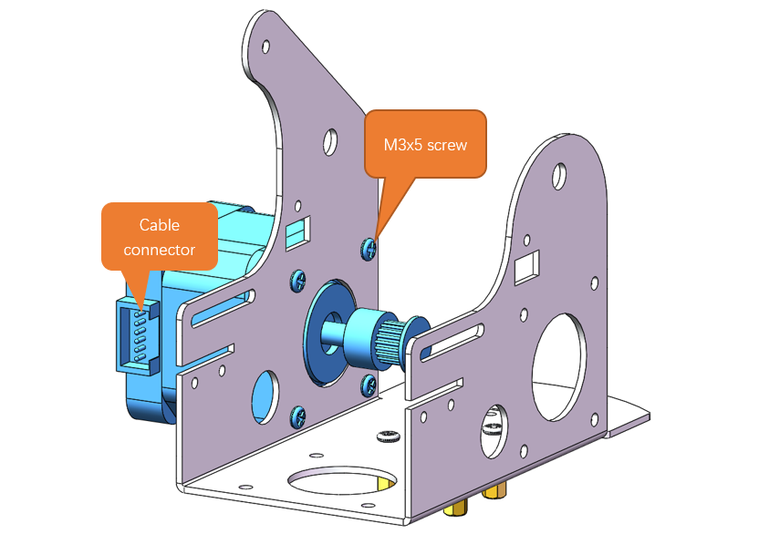
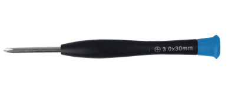
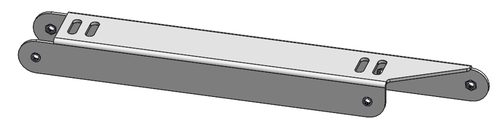
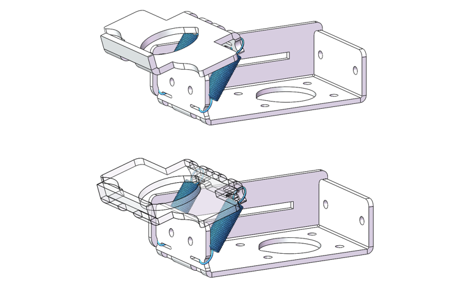

##############################################################################
Chapter 2 Assembly of the Robot Arm
##############################################################################

**If you have any concerns, please feel free to contact us at** support@freenove.com

It is recommended to assemble and use the robot arm according to the tutorial. Otherwise, there may be installation errors, device damage, etc. 

Numbering of the Assembly Components
***********************************************************

Before assembling the arm, we number the assembly parts of the robot arm to facilitate the assembly.

**If there are wrong/missing parts in your kit, please contact us:** support@freenove.com

Step 1 Mounting the Timing Pulleys to the Stepper Motor
*******************************************************

Materials Needed
===========================

+------------------+--------------------------------------------------+
|Stepper Motor X3  |Timing Pulley -2GT-16 X3                          |
|                  |                                                  |
| |Assembly03|     | |Assembly04|                                     |
+------------------+--------------------------------------------------+
| Allen Key                                                           |
|                                                                     |
| |Assembly05|                                                        |
+---------------------------------------------------------------------+

.. note:: Please Note That Each Timing Pulley Has 2 Bolts.

Installation Steps
===========================

1.	Mount the timing pulleys to the rotating axle of the stepper motors. Make sure the timing pulley is flush with the axle.  

2.	Adjust the bolts on the timing pulley with the Allen key to fix the part.

Step 2 Mounting the Stepper Motors to the No.1 Assembly Part
*************************************************************

Materials Needed
===========================

+-------------------------+-------------------+-------------------+
| No.1 Assembly Component | Stepper Motor X3                      |
|                         |                                       |
| |Assembly07|            | |Assembly08|                          |
+-------------------------+-------------------+-------------------+
| M3x5 Screws X16         | M3x13 Double-Pass | Cross Screwdriver |
|                         |                   |                   |
|                         | Brass Standoff X4 | (3mm) X1          |
|                         |                   |                   |
| |Assembly09|            | |Assembly10|      |  |Assembly11|     |
+-------------------------+-------------------+-------------------+

Installation Steps
===========================

1.	Use four M3x5 screws to fasten the four M3x13 double-pass brass standoffs onto the No.1 assembly component. (Infrared sensos are not shown in the diagrams below.)

2.	Fix one stepper motor to the left of the No.1 assembly part with four M3x5 screws. Pay attention to the position of the cable connector of the motor.

3.	Fix another stepper motor to the right of the No.1 assembly part with four M3x5 screws. Pay attention to the position of the cable connector of the motor.

4.	Fix the third stepper motor to the middle of the No.1 assembly component with four M3x5 screws. Pay attention to the position of the cable connector of the motor.

Step 3 Mounting the Infrared Sensors
**************************************

Materials need
===========================

+--------------------+----------------------------+
| Robot Arm Assembly | Infrared Sensors X3        |
|                    |                            |
| |Assembly16|       | |Assembly17|               |
+--------------------+----------------------------+
| M3x3x5 Screws X3   | Cross Screwdriver (3mm) X1 |
|                    |                            |
| |Assembly18|       | |Assembly19|               |
+--------------------+----------------------------+

Installation Steps
===========================

Mount two infrated sensors to the No.1 assembly part wih two M3x3x5 screws, as shown below.

Mount the other infrared sensor to No.1 assembly component with an M3x3x5 screw, as shown below.

Step 4: Installing the Bottom Transmission Device
**************************************************

Material needed
===========================

+----------------------------+---------------------------------------+
| Robot Arm Assembly         | Plane Thrust Bearing (51106-30x47x11) |
|                            |                                       |
| |Assembly22|               | |Assembly23|                          |
+----------------------------+---------------------------------------+
| M3x12 Screws X4            | M3x3x7 Screws X1                      |
|                            |                                       |
| |Assembly24|               | |Assembly25|                          |
+----------------------------+---------------------------------------+
| No.13 Assembly Component   | No. 19 Assembly Component             |
|                            |                                       |
| |Assembly26|               | |Assembly27|                          |
+----------------------------+---------------------------------------+
| No.3 Assembly Component X1 | No. 3 Assembly Component X1           |
|                            |                                       |
| |Assembly28|               | |Assembly29|                          |
+----------------------------+---------------------------------------+
| Allen Key                  | Cross Screwdriver (3mm) X1            |
|                            |                                       |
| |Assembly30|               | |Assembly31|                          |
+----------------------------+---------------------------------------+

.. |Assembly22| image:: ../_static/imgs/2_Assembly_of_the_Robot_Arm/Assembly22.png

.. |Assembly29| image:: ../_static/imgs/2_Assembly_of_the_Robot_Arm/Assembly29.png
.. |Assembly30| image:: ../_static/imgs/2_Assembly_of_the_Robot_Arm/Assembly30.png

Installataion Steps
===========================

1.	Mount the M3x3x7 screw to the No.23 assembly component, as shown below.

The No.23 assembly component is similar to the No.3 one; please do not mix them up.

2.	Use 4 M3x12 screws to secure the plane thrust bearing and Assembly Components No.23, No.3, and No.19 onto the double-pass copper standoff of Assembly Component No.1.

After the assembly is completed, it should look as shown in the figure below.
 

Step 5 Installing the Timing Belt
**********************************

Materials needed
===========================

+--------------------+---------------------+
| Robot Arm Assembly | 2GT-214 Timing Belt |
|                    |                     |
| |Assembly73|       | |Assembly62|        |
+--------------------+---------------------+
| Allen Key                                |
|                                          |
| |Assembly65|                             |
+------------------------------------------+

Installation Steps
===========================

1.	Use the Allen key to loosen the bolts on the 2GT timing pulley.

2.	Position the timing belt over the 2GT timing pulley and the No.19 assembly component.

Tip: When installing the timing belt, it is easier to install if you rotate the large gear.

3.	Gently rotate the large gear back and forth by hand several times. This motion will allow the timing belt to guide the 2GT timing pulley to the optimal position. 

After the pulley has settled into place, use an Allen key to tighten the bolts on the 2GT timing pulley, ensuring it is securely fastened to the shaft.

Step 6 Assembling the Base
*****************************

Material needed
===========================

+-------------------------+----------------------------+
| Robot Arm Assembly      | Robot Arm Assembly         |
|                         |                            |
| |Assembly38|            | |Assembly39|               |
+-------------------------+----------------------------+
| No.2 Assembly Component                              |
|                                                      |
| |Assembly40|                                         |
+-------------------------+----------------------------+
| M3x18 Screws X4         | Cross Screwdriver (3mm) X1 |
|                         |                            |
| |Assembly41|            | |Assembly42|               |
+-------------------------+----------------------------+

Installation Steps
===========================

Secure two Assembly Components No. 3 and one Assembly Component No. 2 to the large gear using four M3x18 screws.

After the assembly is completed, it should look as shown in the figure below.

Step 7 Mounting Assembly Components No.8 and No.17 
****************************************************

Materials needed
===========================

+---------------------------+----------------------------+
| M3x5 Screw X3             | M3x3x7 Screw X1            |
|                           |                            |
| |Assembly45|              | |Assembly46|               |
+---------------------------+----------------------------+
| No.8 Assembly Component   | Cross Screwdriver (3mm) X1 |
|                           |                            |
| |Assembly47|              | |Assembly48|               |
+---------------------------+----------------------------+
| Assembly Component No. 17                              |
|                                                        |
| |Assembly49|                                           |
+--------------------------------------------------------+

.. |Assembly45| image:: ../_static/imgs/2_Assembly_of_the_Robot_Arm/Assembly45.png

Assembly steps
===========================

Attach the Assembly Component No.8 to the Component No.17 with three M3x5 screws, and install one M3x7 black screw into the Component No.8. Ensure the correct alignment and orientation of the components with respect to each other.

.. image:: ../_static/imgs/2_Assembly_of_the_Robot_Arm/Assembly45.png
    :align: center

Step 8 Mounting Assembly Components No.7 and No.9 
*******************************************************

Materials needed
===========================

+----------------------------+-------------------------+
| M3x8 Screw X3              | M3x3x7 Screw X1         |
|                            |                         |
| |Assembly50|               | |Assembly51|            |
+----------------------------+-------------------------+
| Assembly Component No.7    | Assembly Component No.9 |
|                            |                         |
| |Assembly52|               | |Assembly53|            |
+----------------------------+-------------------------+
| Cross Screwdriver (3mm) x1                           |
|                                                      |
| |Assembly54|                                         |
+------------------------------------------------------+

.. |Assembly54| image:: ../_static/imgs/2_Assembly_of_the_Robot_Arm/Assembly54.png

Installation Steps
===========================

Use three M3x8 screws to secure the Component No.9 onto the No.7 one, and apply one M3x3x7 black screw to fasten it onto the Component No.7. Carefully check the alignment and the correct orientation of the components in relation to one another.

Please note that the M3x3x7 black screw and the Assembly Component No. 9 are not on the same plane as the No.7 part.

Step 9: Assemble the Left and Right Transmission Devices
**********************************************************

Materials needed
===========================

+-------------------------------------+--------------------------------------------------+
| Assembly Part 1                     | Assembly Part 2                                  |
|                                     |                                                  |
| |Assembly56|                        | |Assembly57|                                     |
+-------------------------------------+------------------------+-------------------------+
| M6x9x12 Hollow Column X1            |                        |                         |
|                                     |                        |                         |
| M6x9x14 Hollow Columnx1             | M6x30 Screw x2         | M6x9x0.5 Flat Gasket x3 |
|                                     |                        |                         |
| M6x12 Double-Pass Brass Standoff X1 |                        |                         |
|                                     |                        |                         |
| |Assembly58|                        | |Assembly59|           | |Assembly60|            |
+-------------------------------------+------------------------+-------------------------+
| Robot Arm Assembly                  | 2GT-214 Timing Belt x2                           |
|                                     |                                                  |
| |Assembly61|                        | |Assembly62|                                     |
+-------------------------------------+------------------------+-------------------------+
| Cross Screwdriver (3mm) x1          | 8mm Open-end Wrench    | Allen Key               |
|                                     |                        |                         |
| |Assembly63|                        | |Assembly64|           | |Assembly65|            |
+-------------------------------------+------------------------+-------------------------+

.. |Assembly60| image:: ../_static/imgs/2_Assembly_of_the_Robot_Arm/Assembly60.png

.. |Assembly65| image:: ../_static/imgs/2_Assembly_of_the_Robot_Arm/Assembly65.png

Installation Steps
===========================

1.	Secure the Assembly Part 1 and Assembly Part 2 to the right side of the main body with one M6x30 screw, one M6x12 double-pass brass standoff, one M6x9x12 hollow standoff, and two M6x9x0.5 gasket. The timing belt should be placed around the large gear on the right side, as shown in the figure below.

.. note::

    1. Before starting the assembly process, ensure that the timing belt is already fitted around the large gear of Assembly Part 2.

    2. Pay attention to the orientation of the body, Assembly Part 1, and Assembly Part 2 to avoid installation errors.

    3. This step is relatively complex, and irrelevant parts have been hidden in the simulation diagram to avoid obstructing the view of the simulation.

    4. Do not tighten the M6x30 screws first.

2.	Mount Assembly Part 1 to the left side of the main body wtih one M6x30 screw, one M6x9x14 hollow standoff, and one M6x9x0.5 gasket, as shown in the figure below.

.. note::

    1.	Before starting the assembly process, ensure that the timing belt is already fitted around the large gear of Assembly Part 1.

    2.	Pay attention to the orientation of the body, Assembly Part 1, and Assembly Part 2 to avoid installation errors.

    3.	This step is relatively complex, and irrelevant parts have been hidden in the simulation diagram to avoid obstructing the view of the simulation.

    4.	Tighten two M6x30 screws.

3.	Use an Allen key to adjust the bolts on the timing pulley, allowing the pulley to move left and right. Slide the timing belt onto the timing pulley and rotate the large gear back and forth to ensure proper positioning of the belt. Once the belt is correctly seated, tighten the bolts to secure the timing pulley in place.

Two approaches can be considered for installing the timing belt:

1. **Loosening and Positioning Approach**
   
   - Start by using an Allen key to loosen the bolts on the timing pulley, allowing for some movement.
   
   - First, position the timing belt around the large gear of the assembly part.
   
   - Next, slide the other end of the timing belt onto the timing pulley.
   
   - Once both ends of the belt are in place, tighten the bolts to secure the timing pulley.

2. **Pre-Routing and Adjustment Approach:**
   
   - Begin by placing the timing belt on the timing pulley.
   
   - Then, route one end of the timing belt to the large gear of the assembly part.
   
   - After most of the belt has been positioned around the large gear, rotate the large gear on the assembly part.
   
   - This action will guide the timing belt into place on both the large gear and the timing pulley.

Step 10 Mounting Assembly Components No.10 and No.12
****************************************************

Before we begin, let's clarify the differences between Assembly Components n 10, 11, and 12:

Components 10 and 11: The two bearings orient in the same direction.

Component 12: The two bearings orient to opposite directions.

Material Needed
===========================

+--------------------+----------------------------------------------------------------------------------+
| M3x5 screws x3     | M3x7 standoff x1、M3x8+5 standoff x1,M3x9 standoff x1                            |
|                    |                                                                                  |
| |Assembly71|       | |Assembly72|                                                                     |
+--------------------+-------------------------------------------------------+--------------------------+
| Robot Arm Assembly | Assembly Component No.10                              | Assembly Component No.12 |
|                    |                                                       |                          |
| |Assembly74|       | |Assembly75|                                          | |Assembly76|             |
+--------------------+-------------------------------------------------------+--------------------------+

Installation Steps
===========================

1.	Affix Assembly Component No. 12 to the left side of the robotic arm's main structure using a M3x5 screw, an M3x7 standoff, and an M3x8+5standoff, as depicted in the accompanying diagram.

:red:`Please note that the end of Assembly Component No. 12 with the protrusion should face to the right, as illustrated in the figure below.`

2.	Affix Assembly Component No. 10 to the right side of the robotic arm's main structure using two M3x5 screws and an M3x9 standoff, as depicted in the accompanying diagram.

:red:`Please note that the end of Assembly Component No. 10 with the protrusion should face to the right, as illustrated in the figure below.`

Step 11 Mounting Assembly Components No.11, No.4 and No.18
************************************************************

Materials Needed
===========================

+--------------------------+-------------------------+--------------------+
| M3x5 Screw x4            | M3x8 Screw x1           | M3x5x0.5 Gasket x1 |
|                          |                         |                    |
| |Assembly81|             | |Assembly82|            | |Assembly83|       |
+--------------------------+-------------------------+--------------------+
| Robot Arm Assembly       | Assembly Component No.4                      |
|                          |                                              |
| |Assembly84|             | |Assembly85|                                 |
+--------------------------+----------------------------------------------+
| Assembly Component No.11                                                |
|                                                                         |
| |Assembly86|                                                            |
+-------------------------------------------------------------------------+
| Assembly Component No.18                                                |
|                                                                         |
| |Assembly87|                                                            |
+-------------------------------------------------------------------------+

Installation Steps
===========================

1.	Mount Assembly Component No.18 to the robot arm assembly with two M3x5 screws.

2.	Mount Component No. 4 to the robotic arm assembly with one M3x5 screw, one M3x8 screw, and one M3x5x0.5 gasket. **Please ensure the correct orientation of Component No. 4.**

**Diagram of the completed assembly). Please pay attention to the installation of the positions circled in the figure below.**

3.	Attach Assembly Component No. 11 to Component No. 4 with one M3x5 screw. Please ensure the correct orientation of Component No. 11.

Step 12 Mounting Assembly Component No.20
******************************************

Materials Needed
===========================

+--------------------+--------------------------+
| Robot Arm Assembly | Assembly Component No.20 |
|                    |                          |
|                    | |Assembly93|             |
|                    +--------------------------+
|                    | M3x5 Screws x3           |
|                    |                          |
| |Assembly92|       | |Assembly94|             |
+--------------------+--------------------------+

Installation Steps
===========================

Attach the Assembly Component No. 20 to Components No.11 and No.18 with three M3x5 screws.

Step 13 Mounting Raspberry Pi to Robot Arm Board
****************************************************

Materials Needed
===========================
+---------------------+---------------------+---------------------+--------------------+
| M2.5x8 Screws x4    | M2.5x13+6 Brass     | M2.5x11+6 Brass     | M2.5x25 Brass      |
|                     |                     |                     |                    |
|                     | Standoffs x4        | Standoffs x4        | Standoff x4        |
|                     |                     |                     |                    |
| |Assembly96|        | |Assembly97|        | |Assembly98|        | |Assembly99|       |
+---------------------+------------+--------+---------------------+--------------------+
| Robot Arm Board                  | Raspberry Pi (Not included in the kit.            |
|                                  |                                                   |
|                                  | Please prepare one yourself.)                     |
|                                  |                                                   |
|                                  | |Assembly101|                                     |
|                                  +---------------------------------------------------+
|                                  | Cross Screwdriver (3mm) x1                        |
|                                  |                                                   |
| |Assembly100|                    | |Assembly102|                                     |
+----------------------------------+---------------------------------------------------+
| Assembly Component No.14         | Heat Sinks x3                                     |
|                                  |                                                   |
|                                  | |Assembly104|                                     |
|                                  +---------------------------------------------------+
|                                  | Stepper Motor Driver Modules x3                   |
|                                  |                                                   |
| |Assembly103|                    | |Assembly105|                                     |
+----------------------------------+---------------------------------------------------+

.. |Assembly96| image:: ../_static/imgs/2_Assembly_of_the_Robot_Arm/Assembly96.png

Installation Steps
===========================

Fix four M2.5x13+6 brass standoffs to Assembly Component NO.14 with four M2.5x8 screws.

**Please note: Ensure that you do not install the screws into the wrong holes. The hole positions are shown in the figure below.**

Mount the Raspberry Pi with four M2.5x11+6 standoffs. Pay attention to the orientation of the Raspberry Pi.

Peel off the adhesive backing from the back of the heatsink and adhere it to the chip on the stepper motor driver module. Please be careful not to touch the pins on either side. 

Top View

Plug the three stepper motor driver module onto Robot Arm Board.

.. note::

   :red:`1. The orientation of the stepper motor driver module must not be reversed, as it may damage the circuit board.`

   :red:`2. Using a screwdriver, rotate the resistors on all three stepper motor driver modules to the position shown in the diagram above.`

Mount the Robot Arm Board to Raspberry Pi with four M2.5x8 screws.

.. note::

   :red:`1. Please pay attention to the orientation of the Robot Arm Board.`

   :red:`2. Ensure that the pins between the Robot Arm Board and the Raspberry Pi are connected one-to-one.`

Step 14 Installing the Battery Holder
*******************************************************************************

Materials Needed
===========================

+-----------------------------------------+----------------+
| Assembly Component No.14                | Battery Holder |
|                                         |                |
| |Assembly113|                           | |Assembly114|  |
+-----------------------------------------+----------------+
| Cross Recessed Countersunk Screw(M3x12) | Tailboard  x1  |
|                                         |                |
| |Assembly115|                           | |Assembly116|  |
+-----------------------------------------+----------------+

.. |Assembly116| image:: ../_static/imgs/2_Assembly_of_the_Robot_Arm/Assembly116.png

Installation Steps
===========================

Attached the battery holder, tailed acrylic board to the robot arm assembly with four M3x12 screws.

Diagram of the completed assembly

Step 15 Mouting Assembly Components No. 14
*******************************************************************************

Materials Needed
===========================

+--------------------+--------------------------+
| Robot Arm Assembly | Assembly Component No.14 |
|                    |                          |
|                    | |Assembly120|            |
|                    +--------------------------+
|                    | M3x5 Screws x4           |
|                    |                          |
| |Assembly119|      | |Assembly121|            |
+--------------------+--------------------------+
| Cable for Stepper Motor x1                    |
|                                               |
| |Assembly122|                                 |
+-----------------------------------------------+

Installation Steps
===========================

For easier wiring in the future, we recommend that you first connect a wire to the stepper motor.

Use two M3x5 screws to secure the left side of Assembly Component No. 14 onto the robotic arm assembly

Use two M3x5 screws to secure the right side of Assembly Component No. 14 onto the robotic arm assembly. 

Step 16 Assembling the Pen Clip
********************************************************************************

Materials Needed
===========================

+----------------------------+----------------------------+
| M3x3x5 Screw x4            | Assembly Component No.25   |
|                            |                            |
| |Assembly126|              | |Assembly127|              |
+----------------------------+----------------------------+
| 0.5x5x25 Tension Spring x2 | Cross screwdriver (3mm) x1 |
|                            |                            |
| |Assembly128|              | |Assembly129|              |
+----------------------------+----------------------------+
| Assembly Component No.15   | Assembly Component No.16   |
|                            |                            |
| |Assembly130|              | |Assembly131|              |
+----------------------------+----------------------------+

Installation Steps
===========================

Secure one end of two tension springs to Component No. 25 as shown in the figure below.

Secure one end of two tension springs to Component No. 16 as shown in the figure below.

Mount Component No.25 to Component No.16, as shown below.

As shown in the figure below, slide Assembly Component No.15 from the right side of Component No. 16 by translating it horizontally.

.. image:: ../_static/imgs/2_Assembly_of_the_Robot_Arm/Assembly136.png
    :align: center

Fix Components No.15 and No.16 with four M3x3x5 screws.

.. image:: ../_static/imgs/2_Assembly_of_the_Robot_Arm/Assembly137.png
    :align: center

Step 17 Installing the Pen Clip
********************************************************************************

We have provided two types of clamping fixtures, please install the appropriate fixture according to your personal needs. Note that only one type of fixture is supported for installation at a time.

Materials Needed
===========================

+---------------------+--------------------------------------------------+
| Robot Arm Assembly  | Pen Clip                                         |
|                     |                                                  |
| |Assembly138|       | |Assembly139|                                    |
+---------------------+---------------------+----------------------------+
| 5mm Open-end Wrench | 7mm Open-end Wrench | Cross Screwdriver (3mm) x1 |
|                     |                     |                            |
| |Assembly140|       | |Assembly141|       | |Assembly142|              |
+---------------------+---------------------+----------------------------+
| M3x5x0.5 Gasket x4  | M6x9x0.5 Gasket x4  | Spring Plunger x2          |
|                     |                     |                            |
| |Assembly143|       | |Assembly144|       | |Assembly145|              |
+---------------------+---------------------+----------------------------+

.. |Assembly142| image:: ../_static/imgs/2_Assembly_of_the_Robot_Arm/Assembly142.png

Installation Steps
===========================

As shown in the figure below, place four M3x5x0.5 gaskets between the spring plunger and the pen clip. Use a 5mm wrench to install the springplunfer onto the pen clip.

Diagram of the completed assembly

As illustrated in the figure below, space four M6x9x0.5 gasket between the spring plunger and the end of the robotic arm assembly, and use a 7mm wrench to fix them. 

Step 18 Assembling the Servo Clamp
*********************************************************************************

We have provided two types of clamping fixtures, please install the appropriate fixture according to your personal needs. Note that only one type of fixture is supported for installation at a time.

If you have assembled the pen clip, please skip this chapter and the following chapter.

If you want to use the servo clamp, please disassemble the pen clip first.

Materials Needed
===========================

+----------------------------+----------------------------+
| Assembly Conponent No.21   | Assembly Conponent No.22   |
|                            |                            |
| |Assembly149|              | |Assembly150|              |
+----------------------------+----------------------------+
| Assembly Conponent No.5    | Assembly Conponent No.6    |
|                            |                            |
| |Assembly151|              | |Assembly152|              |
+----------------------------+----------------------------+
| Assembly Conponent No.24   | Servo package x1           |
|                            |                            |
| |Assembly153|              | |Assembly154|              |
+----------------------------+----------------------------+
| M2x7 Screws x2、M2 Nuts x2 | M3x8 Screws x4             |
|                            |                            |
| |Assembly155|              | |Assembly156|              |
+----------------------------+----------------------------+
| M1.4x5 Screws x8           | Cross Screwdriver (3mm) x1 |
|                            |                            |
| |Assembly157|              | |Assembly158|              |
+----------------------------+----------------------------+

Installation Steps
===========================

Fix the disk servo horn to Assembly Component No.21 with four M1.4x5 screws. Pay attention to the orientation of the component. The figure below shows the front and back views of the installed component.

.. note:: **Do not use the M1.4*7 screws in the servo bag even if there is any.**

Attached the servo to Assembly Component No.6 with two M2x7 screws and M2 nuts.

Attached Components No.5, No.6 and No.24 together with four M3x8 screws.

Connect the servo wire to the GPIO13 pin marked below. Connect power supply and turn ON both two switches.

.. note:: S connects to the signal wire of the servo (orange cable), V to positive (red), and G to negative (black).

Simultated Image of the Servo

.. image:: ../_static/imgs/2_Assembly_of_the_Robot_Arm/Assembly163.png
    :align: center

Servo wiring

.. list-table:: 
    :header-rows: 1

    * - Board
      - Servo

    * - 13
      - 1
    
    * - V
      - 2
    
    * - G
      - 3

Run the commands on Raspberry Pi Terminal

.. code-block:: console

    cd ~
    cd Freenove_Robot_Arm_Kit_for_Raspberry_Pi/Server/Code/
    sudo python servo.py 0 0

You can see the servo rotates to the position of 0 degree.

Keep the servo powered. Attached the Component No.21 to the servo with a M2x4 screw.

Attach Component No.22 to Component No.22 with an M3x5 screw, as shown below.

.. image:: ../_static/imgs/2_Assembly_of_the_Robot_Arm/Assembly166.png
    :align: center

Verify assembly.

Run the commands on Raspberry Pi terminal.

.. code-block:: console

    cd ~
    cd Freenove_Robot_Arm_Kit_for_Raspberry_Pi/Server/Code/
    sudo python servo.py 0 90

This results in the servo rotating to 90 degrees.

.. image:: ../_static/imgs/2_Assembly_of_the_Robot_Arm/Assembly168.png
    :align: center

Step 19 Installing the Servo Clamp
*******************************************************************************

Here are two mounting options for the servo clamp. You can choose the most suitable method based on your specific application scenario. 

Materials Needed
===========================

+--------------------+----------------------------+
| Robot Arm Assembly | Servo Clamp                |
|                    |                            |
| |Assembly169|      | |Assembly170|              |
+--------------------+----------------------------+
| M3x5 Screws x4     | Cross Screwdriver (3mm) x1 |
|                    |                            |
| |Assembly171|      | |Assembly172|              |
+--------------------+----------------------------+

Mounting Options 1
=================================

As shown in the figure below, use two M3x5 screws to secure the servo clamp onto the robotic arm assembly.

Diagram of completed assembly

Mounting Options 2  
====================================

As depicted in the figure below, install the servo clamp onto the end of the robotic arm assembly with four M3x5 screws.

Step 20 Wiring of Stepper Motor and Sensors
********************************************************************************

Materials Needed
===========================

+----------------------------------+
| 20cm 3Pin cable (same direction) |
|                                  |
| |Assembly176|                    |
+----------------------------------+
| Cable for Stepper Motor x2       |
|                                  |
| |Assembly177|                    |
+----------------------------------+

Installation Steps
===========================

the Stepper Motors to Robot Arm Board with the cables.

Please be aware that the motor interfaces on the board are clearly labeled; ensure that you do not mistakenly connect the wires to the wrong terminals.

Conenect the sensors to Robot Arm Board with three 20cm 3Pin Cable.

Please note that the corresponding sensor interfaces are already labeled on the board—ensure that you do not mistakenly connect the wires to the incorrect terminals.

Step 21 Installing the LED Module
********************************************************************************

Material Needed
============================

+------------------+------------------+--------------------------------+
| LEDPixel x1      | Top Acrylic Plate| LED Module Mounting Plate      |
|                  |                  |                                |
| |Assembly182|    | |Assembly183|    | |Assembly184|                  |
+------------------+------------------+--------------------------------+
| M3x3x5 Screws x4 | M2.5x8 Screws x4 | Cross Screwdriver (3mm) x1     |
|                  |                  |                                |
| |Assembly185|    | |Assembly186|    | |Assembly187|                  |
|                  |                  +--------------------------------+
|                  |                  | 10cm 3Pin Cable to Jumper Wire |
|                  |                  |                                |
|                  |                  | |Assembly188|                  |
+------------------+------------------+--------------------------------+

Installation Steps
==============================

Attach the LEDpixel module to the fixing board with four M3x3x5 screws, as shown below.

Connect the LEDPixel and Robot Arm Board with the 10cm 3Pin cable to Jumper wire

Cable sequence

.. list-table:: 
    :header-rows: 1

    * - Board
      - LedPixel

    * - IO18
      - S
    
    * - 5V
      - V
    
    * - GND
      - G

LEDPixel

Use four M2.5x8 screws to mount the acrylic top plate and the LED mounting plate onto four M2.5x25 standoffs.

Step 22 Adjustment of the Sensor Sensibility
*********************************************************************************

Before using the robotic arm, it is necessary to calibrate the sensors to ensure the smooth and proper functioning of the mechanical system.

Power the robot board. Press the switch circled below, and you'll see the indicator ON1 light up.

The indicators of the three sensors on the robot arm will also light up.

Adjust the middle sensor.

Rotate the robotic arm's main body so that the sensor passes back and forth over the M3x3x7 black screws. Observe the indicator light on the sensor during this process.

When the sensor is positioned above the black screws, the indicator light on the sensor should go out. If the light stays ON, adjust the dial on the sensor using a screwdriver. Do not rotate the dial by more than half a turn.

Adjust the sensor on the left side.

Rotate Assemblyl Component No.17 so that the sensor moves back and forth over the M3x3x7 black screws. Observe the indicator light on the sensor as you do so.

When the sensor is positioned above the black screws, the indicator light on the sensor should go out. If the light stays ON, adjust the dial on the sensor using a screwdriver. Do not rotate the dial by more than half a turn.

Adjust the sensor on the left side.

Rotate Assemblyl Component No.18 so that the sensor moves back and forth over the M3x3x7 black screws. Observe the indicator light on the sensor as you do so.

When the sensor is positioned above the black screws, the indicator light on the sensor should go out. If the light stays ON, adjust the dial on the sensor using a screwdriver. Do not rotate the dial by more than half a turn.

