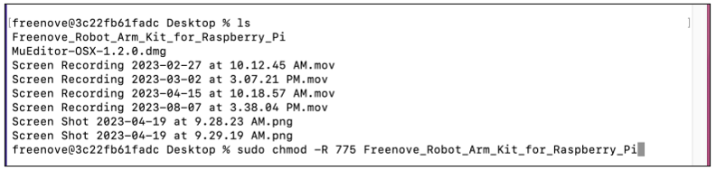

##############################################################################
Chapter 3 Installation, Launch, and Packaging of Robotic Arm Control Software
##############################################################################

Libraries Installation
**********************************

We offer quick installation methods for libraries across three major platforms. Please select and install the appropriate libraries based on your computer's operating system platform.

Install python3
==================================

Download the installation file:

https://www.python.org/downloads/windows/

Click Latest Python 3 Release - Python 3.8.1

Choose and download Windows x86 executable installer. After downloading successfully, install it.

Select “ **Add Python 3.8 to PATH** ”. You can choose other installation features.

Select all options and click “Next”.

Here, my install location is D. You can also choose other location. Then click “Install”.

Wait installing.

Now, installation is completed.

Windows
-------------------------------

Open the folder “Freenove_Robot_Arm_Kit_for_Raspberry_Pi/Client/Arm_Software_Setup” and type in “cmd” on the search bar.

Run the following command and wait for the libraries to install automatically. Once the installation is complete, you should see a confirmation similar to the illustration shown below.

.. code-block:: console
    
    python setup_window.py

.. note::

   1. **Proxy Settings:** Proxy configurations can cause the installation of libraries to fail. If you have a proxy enabled on your computer, please disable it and then attempt the installation again.

   2. **Network Connectivity:** Poor network conditions may also lead to installation failures. Ensure that you have a stable internet connection, and if necessary, retry the installation several times until it is successful.

Mac
---------------------------------

Open the Terminal.

Find the “Freenove_Robot_Arm_Kit_for_Raspberry_Pi” on your Mac. We place it on the desktop, as shown below:

Run the following command to modify the permission, allowing the code to run normally.

.. code-block:: console
    
    sudo chmod -R 775 Freenove_Robot_Arm_Kit_for_Raspberry_Pi

Run the following command to enter the directory.
    
.. code-block:: console
    
    cd Freenove_Robot_Arm_Kit_for_Raspberry_Pi/Client/Arm_Software_Setup

Run the command to install the libraries.

.. code-block:: console
    
    sudo python3 setup_mac.py

Once the installation is complete, you should see a confirmation similar to the illustration shown below.

.. note::

   1. **Proxy Settings:** Proxy configurations can cause the installation of libraries to fail. If you have a proxy enabled on your computer, please disable it and then attempt the installation again.

   2. **Network Connectivity:** Poor network conditions may also lead to installation failures. Ensure that you have a stable internet connection, and if necessary, retry the installation several times until it is successful.

Linux
----------------------------------

Open the Terminal.

Find the “Freenove_Robot_Arm_Kit_for_Raspberry_Pi” folder on your computer. We place it under the home directory, as shown below:

Run the command to enter the folder.S

.. code-block:: console
    
    cd Freenove_Robot_Arm_Kit_for_Raspberry_Pi/Client/Arm_Software_Setup

Run the command to install the libraries.

.. code-block:: console
    
    sudo python3 setup_linux.py

Once the installation is complete, you should see a confirmation similar to the illustration shown below.

.. note::

   1. **Proxy Settings:** Proxy configurations can cause the installation of libraries to fail. If you have a proxy enabled on your computer, please disable it and then attempt the installation again.

   2. **Network Connectivity:** Poor network conditions may also lead to installation failures. Ensure that you have a stable internet connection, and if necessary, retry the installation several times until it is successful.

Robot Arm Controlling Software
*******************************************************

Windows
=======================================================

Open the folder “Freenove_Robot_Arm_Kit_for_Raspberry_Pi/Client/Arm_Software_Codes”, type in “cmd” on the search bar.

Run the command to start the software.

.. code-block:: console
    
    python main.py

 
The interfaces as shown below:

.. note::

   1. The use of a proxy or other network tools may result in the robotic arm control software obtaining an incorrect network IP address.

   2. Make sure your computer and Raspberry Pi are connected to the same local network to avoid communication failures.

Once you have learned how to open the software for controlling the robotic arm, please proceed to the next step by clicking :ref:`here <Software>`.

Mac
=======================================================

Open the Terminal.

Find the folder “Freenove_Robot_Arm_Kit_for_Raspberry_Pi” on your computer. We place in on the desktop, as shown below.

Enter the folder with the command:

.. code-block:: console
    
    cd Freenove_Robot_Arm_Kit_for_Raspberry_Pi/Client/Arm_Software_Codes

Run the command to start the software.

.. code-block:: console
    
    sudo python3 main.py

The interfaces are as shown below.

.. note::

   1. The use of a proxy or other network tools may result in the robotic arm control software obtaining an incorrect network IP address.

   2. Make sure your computer and Raspberry Pi are connected to the same local network to avoid communication failures.

Once you have learned how to open the software for controlling the robotic arm, please proceed to the next step by clicking :ref:`here <Software>`.

Linux
=======================================================

Open the Terminal.

Open the folder “Freenove_Robot_Arm_Kit_for_Raspberry_Pi”. We place it under the home directory, as shown below:

Enter the folder with the following command.

.. code-block:: console
    
    cd Freenove_Robot_Arm_Kit_for_Raspberry_Pi/Client/Arm_Software_Codes

Run the command to start the software.

.. code-block:: console
    
    sudo python3 main.py

The interfaces are as shown below.

.. note::

   1. The use of a proxy or other network tools may result in the robotic arm control software obtaining an incorrect network IP address.

   2. Make sure your computer and Raspberry Pi are connected to the same local network to avoid communication failures.

Once you have learned how to open the software for controlling the robotic arm, please proceed to the next step by clicking :ref:`here <Software>`.

Packaging of Robotic Arm Control Software
******************************************************

If you prefer to run programs directly without having to run the code each time, you can execute the following packaging command to bundle the entire software into a single executable file.

This example will be based on the Windows operating system, but the operation is analogous for other systems.

1.	Enter the directory where the software code locates.

**Freenove_Robot_Arm_Kit_for_Raspberry_Pi/Client/Arm_Software_Codes**

2.	Type in cmd on the search bar to enter the terminal.

3.	Run the following command and wait for the packaging process to complete.

.. code-block:: console
    
    pyinstaller -F main.py

Or this command:

.. code-block:: console
    
    sudo pyinstaller -F main.py

4.	Once the packaging is complete, the executable file will be saved in the 'dist' folder.

.. note:: If the packaging fails, you can delete the 'dist' folder and try the process again. Repeat the attempt several times until it is successful.