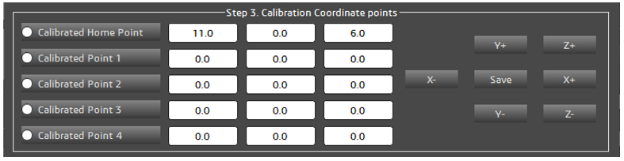
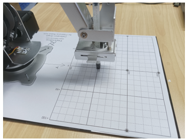

.. _Software:

##############################################################################
Chapter 4 Usage of the Software
##############################################################################

Connecting to the Robot Arm
******************************************************************************

1.	Open Raspberry Pi Terminal.

2.	Enter the folder Freenove_Robot_Arm_Kit_for_Raspberry_Pi/Server/Code.

.. code-block:: console
    
    cd Freenove_Robot_Arm_Kit_for_Raspberry_Pi/Server/Code

3.	Run the server.

.. code-block:: console
    
    sudo python main.py

You can see the IP address of your Raspberry Pi printed. 

4.	Make sure your computer and the Raspberry Pi are connected to the same local network. Open the software.

5.	Enter the IP address of your Raspberry Pi printed above to the bar on the software. 

6.	Click the Connect button and the software will establish communication with Raspberry Pi via WiFi.

.. image:: ../_static/imgs/4_Usage_of_the_Software/Software05.png
    :align: center

Configuring Parameters for Robot Arm
*************************************

Before using the robotic arm, please keep the following precautions in mind. They will help you use the mechanical arm more effectively:

Precautions for Use

1. Initial Calibration: The robotic arm does not contain calibration parameters when used for the first time. Therefore, a calibration configuration operation is necessary to ensure optimal performance. The calibration configuration information is recorded in a JSON file.

2. Environment Changes: If there is a change in the working environment of the robotic arm, please perform the calibration configuration again to adapt to the new environment.

3. No Repeated Calibration: If the working environment of the robotic arm does not change, the arm only requires a single calibration to function properly. There is no need to repeat the calibration configuration operation each time.

4. Emergency Stop: In case of abnormal operation of the robotic arm, you can force stop the arm using the "Stop Arm" button in the software. This will forcefully shut down all threads of the robotic arm and disable the motors, protecting both the motors and the circuit board. Alternatively, you can physically cut off the power supply to the motors by pressing the "Load" switch on the Raspberry Pi robotic arm's mainboard.

5. Sensor Position Check: Before using the software to control the robotic arm each time, ensure that the arm is set to the midpoint position detected by the sensor.

6. Motor Activation for Calibration: The calibration configuration operation requires the cooperation of the motors; thus, if the motors are not enabled first, it will not be possible to open the calibration configuration interface.

Robotic Arm Configuration Parameters

Each time the robotic arm is powered up, it undergoes a series of complex checks, as illustrated in the figure below. 

If this is the first time the robotic arm is being powered on, it's essential to perform a calibration configuration to ensure optimal operation. Below is the configuration process for the robotic arm, which we will explain step by step, following the flowchart provided.

Enable Motors
==============================

In its default state, the robotic arm is in a condition where the motors are disabled to ensure safety. Therefore, the first step is to enable the motors by clicking the "Load Motor" button in the software. This action will energize the motors and prepare them for the calibration sequence that follows. 

Open the Configuration Interface
=================================

Ensure that you have clicked "Load Motor" first, as this is a prerequisite for enabling the motors. Once the motors are enabled, you can proceed to click on "Configuration." Doing so will open the robotic arm's configuration interface.

The interface is as illustrated below.

As illustrated in the above figure, the configuration interface has been divided into four sections. Below, we will explain the configuration of the robotic arm step by step, covering each of these sections.

Step 1. Calibrated Sensor
-------------------------------

The sensors on the robotic arm are crucial for assisting the arm in positioning its own range of motion. Without them, the robotic arm would not be able to determine its true coordinate position. Therefore, for the robotic arm to function properly and stably, the calibration of the sensors is extremely important.

**At the first use of the robot arm, please click the Calibrated Sensor Point button to calibrate the sensors.**

**Calibrated Sensor Point** is used for calibrating the sensors on the robotic arm. This process involves moving the arm back and forth three times across the sensor. The purpose of this movement is to calculate the offset value where the arm rotates to the center of the sensor. By determining this offset, the system can adjust the arm's movements to ensure it accurately positions itself at the sensor's midpoint.

Goto Sensor Point is designed to return the robotic arm to the center position of the sensor. The behavior of this function depends on whether the sensors have been calibrated:

- Uncalibrated Condition: If the sensors have not been calibrated and you click on "Goto Sensor Point," the robotic arm will move to the edge position of the sensor. 

- Calibrated Condition: Once the sensors have been calibrated and you click on "Goto Sensor Point," the robotic arm will accurately move to the center position of the sensor. 

- For the initial setup of the robotic arm, please click "Calibrated Sensor Point", rather than "Goto Sensor Point".

- From the second time onwards, after the sensors have been calibrated, you can directly use the "Goto Sensor Point" function. 

**Reset UI Parameters** is to restore all parameters on the user interface to their default settings. 

**Send Step 2 Parameters** is used to transmit the configuration information from Step 2 of the setup process to the robotic arm. 

Step 2. Set Arm Parameters
-------------------------------

Building upon the first step, we proceed to configure Step 2. You can adjust these values using sliders or buttons within the user interface. These parameters are crucial for the proper functioning of the robotic arm, so it's important to set them carefully. Please refer to the recommended values provided in the documentation.

**Ground Height** refers to the height of the base of the robotic arm from the plane of the coordinate system. 

**Clamp Length** is the length of the end effector, such as a clamp or clamp, at the end of the robotic arm. 

**Clamp Height** is the height of the end effector from the ground.

**Pen Height** is the distance from the ground to the pen clip when the robotic arm is equipped with a pen clip.

The robotic arm operates in four distinct states based on its end effector configuration: No End Effector, Pen clip Installed, Clamp Installed (Horizontal), and Clamp Installed (vertical).

+--------------------+-----------------------------------------------------------+
| No End Effector    | Locating Post                                             |
|                    |                                                           |
| |Software18|       | |Software19|                                              |
+--------------------+------------------------------+----------------------------+
| pen clip installed | Clamp Installed (Horizontal) | Clamp Installed (vertical) |
|                    |                              |                            |
| |Software20|       | |Software21|                 | |Software22|               |
+--------------------+------------------------------+----------------------------+

The recommended parameters are as follows:

+--------------------+---------------+----------------+--------------+-----------------------+
| Mode               | Ground Height | Clamp Length   | Clamp Height | Pen Height            |
+--------------------+---------------+----------------+--------------+-----------------------+
| No End Effector    | 0mm           | 0mm            | 10mm         | 0mm                   |
+--------------------+---------------+----------------+--------------+-----------------------+
| Locating Post      | 0mm           | 0mm            | 10mm         | 30mm                  |
+--------------------+---------------+----------------+--------------+-----------------------+
| Pen Clip Installed | 0mm           | 15mm(10.5+     | 45mm         | 30mm(Recommended      |
|                    |               |                |              |                       |
|                    |               | radius of pen) |              | value for pen height) |
+--------------------+---------------+----------------+--------------+-----------------------+
| Clamp Installed    | 0mm           | 70mm           | 24mm         | 0mm                   |
|                    |               |                |              |                       |
| (Horizontal)       |               |                |              |                       |
+--------------------+---------------+----------------+--------------+-----------------------+
| Clamp Installed    | 0mm           | 47mm           | 85mm         | 0mm                   |
|                    |               |                |              |                       |
| (vertical)         |               |                |              |                       |
+--------------------+---------------+----------------+--------------+-----------------------+

No End Effector Mode
============================

After you have finished configuring the parameters for Step 2, proceed to click on the "Send Step 2 Parameters" button located in Step 1. For this example, let's assume you are working in the "No End Effector" mode, which means the robotic arm is not equipped with any additional tools or clamps. The configurations are as shown below.

Home Point Calibration
------------------------------

Once Step 2 of the configuration is complete, the robotic arm should be able to operate normally. However, you might notice that the arm's movements are not as precise as expected. This lack of accuracy can be attributed to mechanical deviations. To address these deviations, we can configure to calculate the mechanical angle deviations and apply compensatory adjustments to the angles used by the control system. 

To proceed with the calibration process, you will need to locate the calibration paper. If you cannot find the calibration paper, you can print it out using an A4 sheet from a printer. The location of the calibration paper file is **Freenove_Robot_Arm_Kit_for_Raspberry_Pi/Calibration graph.pdf**

Place the robot arm to the Calibration graph. Align the base to the diagram. Pay attention to the position of the black screw.

Click on "Calibrated Home Point” under Step 3. Use the buttons on the right to adjust the position of the robotic arm, guiding it to move to the (0, 200) coordinates marked on the calibration paper. Once the arm is correctly positioned, click the "Save" button to record this calibrated position.

Position the robotic arm's end so that the alignment hole at the tip moves to the (0, 200) coordinates on the calibration paper. 

Z Axis Calibration
-----------------------------

Structural imperfections can sometimes lead to minor inaccuracies in the z-axis coordinate of the robotic arm when it moves to different positions on the calibration paper. To correct for this, we utilize the Calibrated Points 1-4 as part of Step 3.

Select the corresponding calibration point, fine-tune the robotic arm through the buttons on the right, move the robotic arm to the corresponding point, and then click Save. Calibrate these 4 points from top to bottom.

Point 1

Point 2

Point 3

Point 4

At this point, the calibration of the robotic arm is completed. You can choose to close this interface and return to the main interface to control the robotic arm.

Locating Post Mode
=====================

Installing the Locating Post
------------------------------

After you have finished configuring the parameters for Step 2, proceed to click on the "Send Step 2 Parameters" button located in Step 1. For this example, let's assume you are working in the " Locating Post " mode, means that the arm needs to be fitted with a locating Post. 

Please find the Locating Post for the M6x30 from the Machinery Parts.

Using one M3x5 screw, secure it to the end of the arm. As shown in the following picture.

The configurations are as shown below.

Home Point Calibration
------------------------------

Once Step 2 of the configuration is complete, the robotic arm should be able to operate normally. However, you might notice that the arm's movements are not as precise as expected. This lack of accuracy can be attributed to mechanical deviations. To address these deviations, we can configure to calculate the mechanical angle deviations and apply compensatory adjustments to the angles used by the control system. 

To proceed with the calibration process, you will need to locate the calibration paper. If you cannot find the calibration paper, you can print it out using an A4 sheet from a printer. The location of the calibration paper file is **Freenove_Robot_Arm_Kit_for_Raspberry_Pi/Calibration graph.pdf**

Place the robot arm to the Calibration graph. Align the base to the diagram. Pay attention to the position of the black screw.

Click on "Calibrated Home Point” under Step 3. Use the buttons on the right to adjust the position of the robotic arm, guiding it to move to the (0, 200) coordinates marked on the calibration paper. Once the arm is correctly positioned, click the "Save" button to record this calibrated position.

Position the robotic arm's end so that the alignment hole at the tip moves to the (0, 200) coordinates on the calibration paper. 

Z Axis Calibration
----------------------

Structural imperfections can sometimes lead to minor inaccuracies in the z-axis coordinate of the robotic arm when it moves to different positions on the calibration paper. To correct for this, we utilize the Calibrated Points 1-4 as part of Step 3.

Select the corresponding calibration point, fine-tune the robotic arm through the buttons on the right, move the robotic arm to the corresponding point, and then click Save. Calibrate these 4 points from top to bottom.

Point 1

Point 2

Point 3

Point 4

At this point, the calibration of the robotic arm is completed. You can choose to close this interface and return to the main interface to control the robotic arm.

Motor Pulse Frequency Setting
======================================

As previously mentioned, the rotation speed of stepper motors is determined by the frequency of the pulse signals. Higher frequencies result in faster motor speeds, while lower frequencies lead to slower speeds. By default, the pulse frequency for stepper motors is set at 1000 Hz (pulses per second). Generally, it is not recommended to change this default setting.

Robot Arm Control
**************************************

Robot Arm Movements
====================================

You can move the robot arm by clicking the buttons marked below.

+--------------+----------------------------------------------------------------------------------+
| Sensor Point | After every time you click "Load Motor," or when the stepper motor experiences a |
|              |                                                                                  |
|              | missed step action, please click the designated button. This button will return  |
|              |                                                                                  |
|              | the robotic arm to the middle position of the sensor, effectively resetting the  |
|              |                                                                                  |
|              | robotic arm's positional coordinate information.                                 |
+--------------+----------------------------------------------------------------------------------+
| Step: X10    | This feature is designed to adjust the distance that the robotic arm moves with  |
|              |                                                                                  |
|              | each action. By pressing the X, Y, or Z buttons, the robotic arm will move 10mm. |
|              |                                                                                  |
|              | When you click this button, it allows you to toggle between 1mm and 10mm as the  |
|              |                                                                                  |
|              | step size for each movement.                                                     |
+--------------+----------------------------------------------------------------------------------+
| Home         | Control the robot arm to move to the Home point coordinates                      |
+--------------+----------------------------------------------------------------------------------+
| Home Up      | Control the robot arm to move above the Home point coordinates                   |
+--------------+----------------------------------------------------------------------------------+
| X、Y、Z      | Control the robotic arm to move up, down, left, right, and back.                 |
+--------------+----------------------------------------------------------------------------------+

Rotation range
==========================

Due to the physical constraints of the structure of the robot arm, there are certain coordinates that the robot arm cannot reach. Therefore, we have implemented an angular limit range for the movement of the robotic arm, as shown in the figure below.

+-------------------------------------------------+------------------------------------------------+
| Rotation limit Angle of the left-motor 1: 0°    | Rotation limit Angle of the left-motor 2: 110° |
|                                                 |                                                |
| |Software49|                                    | |Software50|                                   |
+-------------------------------------------------+------------------------------------------------+
| Rotation limit Angle of the right-motor 1: -12° | Rotation limit Angle of the right-motor 2: 98° |
|                                                 |                                                |
| |Software51|                                    | |Software52|                                   |
+-------------------------------------------------+------------------------------------------------+
| Minimum Angle between the two sides: 26°        | Maximum Angle between the two sides: 150°      |
|                                                 |                                                |
| |Software53|                                    | |Software54|                                   |
+-------------------------------------------------+------------------------------------------------+

The motion range of the robot arm is shown in the figure below.

The motion range of the robot arm is shown in the figure below.

Robot Clamp Control
==============================

Before using the software to control the robot clamp, please ensure that the clamp is properly installed.

As shown in the figure below, you can use the buttons depicted in the diagram to control the clamp of the robotic arm. 

Before you begin controlling the servo with the software, it's important to verify which interface it is connected to. For instance, if you have connected the servo to GPIO pin 13, you should select 13 in the software. Similarly, if your servo is connected to GPIO pin 16, choose 16 in the software.

.. image:: ../_static/imgs/4_Usage_of_the_Software/Software58.png
    :align: center

When operating the clamp via the software, the functionality of the control buttons is straightforward:

Clicking the "+" button will cause the clamp to open, expanding its jaws to release any held objects.

Clicking the "-" button will make the clamp close, clamping down on whatever is held between its jaws.

It is important to be mindful of the angle at which you use the clamp to pick up items. For instance, if the clamp has rotated to 30 degrees and the item is securely grasped, it is not advisable to continue tightening the clamp. Doing so could result in the servo exerting more power than necessary to hold the item, which could potentially damage both the servo and the object being gripped.

Instructions Recording Mode
**********************************

To enhance the interactivity and fun of using the robotic arm, we've incorporated an instruction recording mode within the software. 

+---------+------------------------------------------------------------------------------+
| Record  | Each time Record is clicked, the software will record the last executed      |
|         |                                                                              |
|         | operation instruction and display it in the display area on the right.       |
+---------+------------------------------------------------------------------------------+
| Undo    | Each time Undo is clicked, the software will cancel the last command         |
|         |                                                                              |
|         | recorded in the display area on the right                                    |
+---------+------------------------------------------------------------------------------+
| Execute | Each time Execute is clicked, the robot arm will execute the contents        |
|         |                                                                              |
|         | of the right display area from top to bottom.                                |
+---------+------------------------------------------------------------------------------+
| Import  | Each time Import is clicked, the user selects a local file, and the software |
|         |                                                                              |
|         | loads the instructions in the local file into the display area on the right. |
+---------+------------------------------------------------------------------------------+
| Save    | Each time Save is clicked, the software writes the contents of the display   |
|         |                                                                              |
|         | area on the right to a local file.                                           |
+---------+------------------------------------------------------------------------------+

For example, to program the robotic arm to perform sensor calibration, move to the Home Point, then to Point 4, and finally return to the Home Point, you would follow these steps:

Each time Save is clicked, the content in the display area on the right will be saved in the form of date + time under the directory

**Freenove_Robot_Arm_Kit_for_Raspberry_Pi\Client\Arm_Software_Codes\record**

Similarly, each time Import is clicked, please upload the txt files under the directory 

**Freenove_Robot_Arm_Kit_for_Raspberry_Pi\\Client\\Arm_Software_Codes\\record**

Each time Execute is clicked, the content displayed on the right is sent to the robotic arm to be executed.

Please note that if the robot arm has not returned to the sensor center since it was started, please click Sensor Point before clicking Execute. If the robotic arm has not been centered and you attempt to execute commands without centering, the arm will use its buzzer to alert you. The number of beeps corresponds to the number of commands in the display area that are queued for execution. 

.. image:: ../_static/imgs/4_Usage_of_the_Software/Software63.png
    :align: center

Drawing Mode
***********************************

To make the experience with the robotic arm more engaging and entertaining, we utilize it for an attempt at drawing.

Firstly, ensure that the robotic arm is laid flat on a table surface and that the pen clip is properly installed.

Open the Configuration interface of the software. Configure the settings according to the provided configuration information, and then click on "Send Step 2 Parameters." 

You can see that the pen clip stays 30.0mm above the calibration paper.

Manipulate the spring-loaded clip of the pen holder to insert the pen into the clip. Please ensure that the pen is positioned to naturally stand vertically against the paper, just making contact with it. 

In actual use, please use the pen tip to calibrate, the result is more accurate.

If the pen clip at the end of your robotic arm is not at the Home Point position, as shown in the figure below,

then you need to readjust Home Point and Points 1-4 so that the end of the pen clip of the robotic arm can run parallel to the paper.

The actual configuration is as shown in the figure below.

Home Point

Points 1

Points 2

Points 3

Points 4

After the recalibration is complete, close the Configuration screen and return to the main interface.

The buttons of the drawing function is as illustrated below.

We can open the local folder by clicking the Import button and select the appropriate picture to load into the software. Usually we put the picture undet the directory

**Freenove_Robot_Arm_Kit_for_Raspberry_Pi\\Client\\Arm_Software_Codes\\picture**

Select the file “4.bmp” and click Open.

And you can see the picture is loaded to the software.

The original image cannot be used directly by the robotic arm. It requires a series of data processing and transformations to be converted into a format that the arm can utilize, as illustrated in the figure below.

Please follow the prompts and perform the operations on the software.

The effect of image processing is shown in the figure below.

+-------------------------------------------+---------------------------------------------+
| 1.Import an image                         | 2.Convert the image to grayscale image      |
|                                           |                                             |
| |Software80|                              | |Software81|                                |
+-------------------------------------------+---------------------------------------------+
| 3.Binarize the grayscale image            | 4.Convert the binary image to contour image |
|                                           |                                             |
| |Software82|                              | |Software83|                                |
+-------------------------------------------+---------------------------------------------+
| 5.Adjust the contour threshold,           | 6.Click Change.                             |
|                                           |                                             |
| Gaussian blur value, and sharpening       |                                             |
|                                           |                                             |
| value until the image effect is suitable. |                                             |
|                                           |                                             |
| |Software84|                              | |Software85|                                |
+-------------------------------------------+---------------------------------------------+
| 7.Click Sensor Point on the               | 8.Clikc Execute                             |
|                                           |                                             |
| bottom left of the software.              |                                             |
|                                           |                                             |
| **This step is important!**               |                                             |
|                                           |                                             |
| |Software86|                              | |Software87|                                |
+-------------------------------------------+---------------------------------------------+

.. |Software85| image:: ../_static/imgs/4_Usage_of_the_Software/Software85.png

You can also choose other modes and draw freely in the left margin, as shown below.

The steps for operating in the draw straight line mode are illustrated as shown in the figure below. 

Please note that we have incorporated a buzzer alert mechanism for incorrect operations within the robotic arm. 

Therefore, if your robotic arm has not undergone the Sensor Point operation after connecting to WiFi, and you omit Step 4 of the drawing function and directly proceed to Step 5, the program will not execute, but rather the buzzer will sound continuously as warnings. 

Curve pattern

Please note that we have incorporated a buzzer alert mechanism for incorrect operations within the robotic arm. 

Therefore, if your robotic arm has not undergone the Sensor Point operation after connecting to WiFi, and you omit Step 4 of the drawing function and directly proceed to Step 5, the program will not execute, but rather the buzzer will sound continuously as warnings. 

LED Module Control
********************************

There is an LED module assembled on the robot arm, which can also be controlled via the software.

First and foremost, please ensure that your RGB LED module is properly connected to the Robot Arm Board. Pay close attention to the wiring sequence on the LED module before installing it; incorrect wiring may result in the lights not illuminating.

+-----------------------------------------------+-----------------+
| Connect the LED module to the robot arm board | Wiring sequence |
|                                               |                 |
| with a 10cm 3Pin cable to Jumper wire.        | |Software92|    |
|                                               +-----------------+
|                                               | LedPixel        |
|                                               |                 |
| |Software91|                                  | |Software93|    |
+-----------------------------------------------+-----------------+

.. |Software91| image:: ../_static/imgs/4_Usage_of_the_Software/Software91.png
.. |Software92| image:: ../_static/imgs/4_Usage_of_the_Software/Software92.png
.. |Software93| image:: ../_static/imgs/4_Usage_of_the_Software/Software93.png

Open the software, connect it to Raspberry Pi and click the LED button.

The interface is as shown below.

You can use your mouse to move across the color palette and select your preferred color. As you move the mouse, the color data displayed at the top of the interface will change according to your selection. Simultaneously, the light ring on the robotic arm will change in real-time to match the color you have chosen. 

The LED module has six displaying modes. Its brightness can be adjusted by sliding the slider on the left.

1.	RGB Mode: In this mode, all the RGB lights will display a single color. You can change the color and brightness of the lights by using the color palette and sliders. 

2.	Following Mode: The RGB lights will continuously. You can use the color palette and sliders to change their color and brightness.

3.	Blink Mode: All lights continuously blink. You can use the color palette and sliders to change their color and brightness.

4.	Breathing Mode: All lights gradually turn from dim to bright and then from bright to dim, like they are breathing. You can use the color palette and sliders to change their color and brightness.

5.	Rainbow Mode: The whole LED module emits colors like rainbow and rotate slowly. In this mode, the color and brightness cannot be changed.

6.	Gradient Mode: The whole LED module emits a single color and slowly change into other colors. In this mode, the color and brightness cannot be changed.

