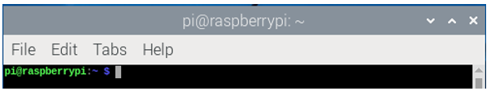
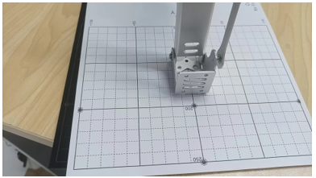
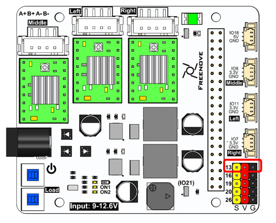
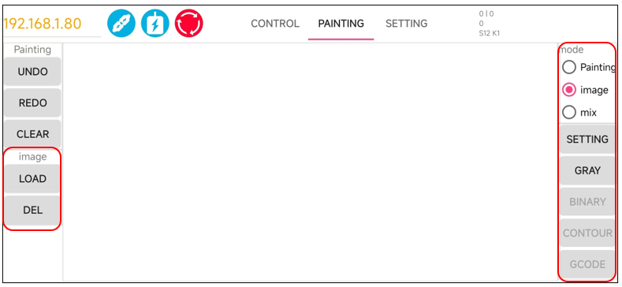
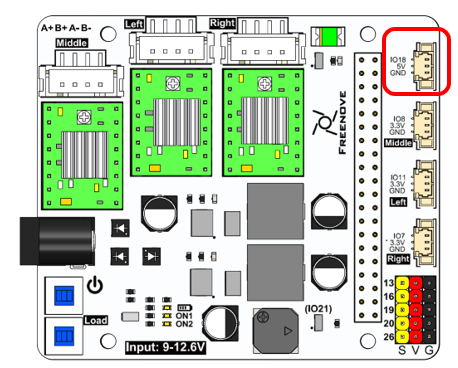
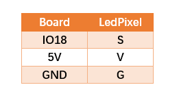
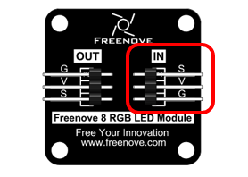

##############################################################################
Chapter 5 Introduction to the APP
##############################################################################

Connecting to the Robot Arm
*******************************

Open Raspberry Pi Terminal.

Enter the folder Freenove_Robot_Arm_Kit_for_Raspberry_Pi/Server

..  code-block:: console
    
    cd Freenove_Robot_Arm_Kit_for_Raspberry_Pi/Server/Code

Run the server code.

..  code-block:: console
    
    sudo python main.py

You can see the IP address of your Raspberry Pi printed. 

Make sure your phone and the Raspberry Pi are connected to the same local network. Open the Freenove APP.

Enter the IP address printed on Raspberry Pi Terminal.

Click the Connection button and the app will establish communication with Raspberry Pi via WiFi.

.. image:: ../_static/imgs/5_Introduction_to_the_APP/Introduction05.png
    :align: center

Configuring Parameters for Robot Arm
***************************************

Before using the robotic arm, please keep the following precautions in mind. They will help you use the mechanical arm more effectively:

Precautions for Use

1. **Initial Calibration:** The robotic arm does not contain calibration parameters when used for the first time. Therefore, a calibration configuration operation is necessary to ensure optimal performance. The calibration configuration information is recorded in a JSON file.

2. **Environment Changes:** If there is a change in the working environment of the robotic arm, please perform the calibration configuration again to adapt to the new environment.

3. **No Repeated Calibration:** If the working environment of the robotic arm does not change, the arm only requires a single calibration to function properly. There is no need to repeat the calibration configuration operation each time.

4. **Emergency Stop:** In case of abnormal operation of the robotic arm, you can force stop the arm using the "Stop Arm" button in the software. This will forcefully shut down all threads of the robotic arm and disable the motors, protecting both the motors and the circuit board. Alternatively, you can physically cut off the power supply to the motors by pressing the "Load" switch on the Raspberry Pi robotic arm's mainboard.

5. **Sensor Position Check:** Before using the software to control the robotic arm each time, ensure that the arm is set to the midpoint position detected by the sensor.

6. **Motor Activation for Calibration:** The calibration configuration operation requires the cooperation of the motors; thus, if the motors are not enabled first, it will not be possible to open the calibration configuration interface.

Robotic Arm Configuration Parameters
======================================

Each time the robotic arm is powered up, it undergoes a series of complex checks, as illustrated in the figure below. 

If this is the first time the robotic arm is being powered on, it's essential to perform a calibration configuration to ensure optimal operation. Below is the configuration process for the robotic arm, which we will explain step by step, following the flowchart provided.

Enable Motors
-------------------------------------

In its default state, the robotic arm is in a condition where the motors are disabled to ensure safety. Therefore, the first step is to enable the motors by clicking the "Load Motor" button in the software. This action will energize the motors and prepare them for the calibration sequence that follows. 

Open the Configuration Interface
--------------------------------------

Ensure that you have clicked "Load Motor" first, as this is a prerequisite for enabling the motors. Once the motors are enabled, you can proceed to click on "Setting." Doing so will open the robotic arm's configuration interface.

The interface is as shown below.

Below, we will explain the configuration of the robotic arm step by step, covering each of these sections.

Step 1. Calibrated Sensor
^^^^^^^^^^^^^^^^^^^^^^^^^^^^^^^^^^^^^^^

The sensors on the robotic arm are crucial for assisting the arm in positioning its own range of motion. Without them, the robotic arm would not be able to determine its true coordinate position. Therefore, for the robotic arm to function properly and stably, the calibration of the sensors is extremely important.

**At the first use of the robot arm, please click the Calibrated Sensor Point button to calibrate the sensors.**

Calibrated Sensor Point is used for calibrating the sensors on the robotic arm. This process involves moving the arm back and forth three times across the sensor. The purpose of this movement is to calculate the offset value where the arm rotates to the center of the sensor. By determining this offset, the system can adjust the arm's movements to ensure it accurately positions itself at the sensor's midpoint.

Goto Sensor Point is designed to return the robotic arm to the center position of the sensor. The behavior of this function depends on whether the sensors have been calibrated:

- Uncalibrated Condition: If the sensors have not been calibrated and you click on "Goto Sensor Point," the robotic arm will move to the edge position of the sensor. 

- Calibrated Condition: Once the sensors have been calibrated and you click on "Goto Sensor Point," the robotic arm will accurately move to the center position of the sensor. 

- For the initial setup of the robotic arm, please click "Calibrated Sensor Point", rather than "Goto Sensor Point".

- From the second time onwards, after the sensors have been calibrated, you can directly use the "Goto Sensor Point" function. 

+------------------+------------------+
| |Introduction13| | |Introduction14| |
+------------------+------------------+
| |Introduction15|                    |
+-------------------------------------+

.. |Introduction14| image:: ../_static/imgs/5_Introduction_to_the_APP/Introduction14.png

Step 2. Set Arm Parameters
^^^^^^^^^^^^^^^^^^^^^^^^^^^^^^^^^^^^^^^

Building upon the first step, we proceed to configure These parameters are crucial for the proper functioning of the robotic arm, so it's important to set them carefully. Please refer to the recommended values provided in the documentation.

**Click Edit to modify the values marked below.**

**Ground Height** refers to the height of the base of the robotic arm from the plane of the coordinate system. 

**Clamp Length** is the length of the end effector, such as a clamp or clamp, at the end of the robotic arm. 

**Clamp Height** is the height of the end effector from the ground.

**Pen Height** is the distance from the ground to the pen clip when the robotic arm is equipped with a pen clip.

The robotic arm operates in four distinct states based on its end effector configuration: No End Effector, Pen clip Installed, Clamp Installed (Horizontal), and Clamp Installed (vertical).

+--------------------+-----------------------------------------------------------+
| No End Effector    | Locating Post                                             |
|                    |                                                           |
| |Introduction18|   | |Introduction19|                                          |
+--------------------+------------------------------+----------------------------+
| pen clip installed | Clamp Installed (Horizontal) | Clamp Installed (vertical) |
|                    |                              |                            |
| |Introduction20|   | |Introduction21|             | |Introduction22|           |
+--------------------+------------------------------+----------------------------+

.. |Introduction21| image:: ../_static/imgs/5_Introduction_to_the_APP/Introduction21.png

The recommended parameters are as follows:

+--------------------+---------------+-----------------------+--------------+--------------------+
|        Mode        | Ground Height |     Clamp Length      | Clamp Height |     Pen Height     |
+====================+===============+=======================+==============+====================+
| No End Effector    | 0mm           | 0mm                   | 10mm         | 0mm                |
+--------------------+---------------+-----------------------+--------------+--------------------+
| Locating Post      | 0mm           | 0mm                   | 10mm         | 30mm               |
+--------------------+---------------+-----------------------+--------------+--------------------+
| Pen Clip Installed | 0mm           | 15mm                  | 45mm         | 30mm               |
|                    |               |                       |              |                    |
|                    |               | (10.5+ radius of pen) |              | (Recommended value |
|                    |               |                       |              |                    |
|                    |               |                       |              | for pen height)    |
+--------------------+---------------+-----------------------+--------------+--------------------+
| Clamp Installed    | 0mm           | 70mm                  | 24mm         | 0mm                |
|                    |               |                       |              |                    |
| (Horizontal)       |               |                       |              |                    |
+--------------------+---------------+-----------------------+--------------+--------------------+
| Clamp Installed    | 0mm           | 47mm                  | 85mm         | 0mm                |
|                    |               |                       |              |                    |
| (vertical)         |               |                       |              |                    |
+--------------------+---------------+-----------------------+--------------+--------------------+

No End Effector Mode
===================================================================================================

**Tap on the "Submit" button to send the data to the robot arm. **

For this example, let's assume you are working in the "No End Effector" mode, which means the robotic arm is not equipped with any additional tools or clamps. The configurations are as shown below.

Home Point Calibration
^^^^^^^^^^^^^^^^^^^^^^^^^^^^^^^^^^^^^^^^^

Once Step 2 of the configuration is complete, the robotic arm should be able to operate normally. However, you might notice that the arm's movements are not as precise as expected. This lack of accuracy can be attributed to mechanical deviations. To address these deviations, we can configure to calculate the mechanical angle deviations and apply compensatory adjustments to the angles used by the control system. 

To proceed with the calibration process, you will need to locate the calibration paper. If you cannot find the calibration paper, you can print it out using an A4 sheet from a printer. The location of the calibration paper file is Freenove_Robot_Arm_Kit_for_Raspberry_Pi/Calibration graph.pdf

.. image:: ../_static/imgs/5_Introduction_to_the_APP/Introduction24.png
    :align: center

Place the robot arm to the Calibration graph. Align the base to the diagram. Pay attention to the position of

Place the robot arm to the Calibration graph. Align the base to the diagram. Pay attention to the position of the black screw.

Tap P0*. Use the buttons on the right to adjust the position of the robotic arm, guiding it to move to the (0, 200) coordinates marked on the calibration paper. Once the arm is correctly positioned, click the "Save" button to record this calibrated position.

Position the robotic arm's end so that the alignment hole at the tip moves to the (0, 200) coordinates on the calibration paper. 

Z Axis Calibration
^^^^^^^^^^^^^^^^^^^^^^^^^^^^^^^^^^^^^^^^^

Structural imperfections can sometimes lead to minor inaccuracies in the z-axis coordinate of the robotic arm when it moves to different positions on the calibration paper. To correct for this, we utilize the Calibrated Points 1-4.

The corresponding potins of P1-P4 on the calibration graph is as shown below.

Point 1

Point 2

Point 3

Point 4

At this point, the calibration of the robotic arm is completed. You can choose to close this interface and return to the main interface to control the robotic arm.

Locating Post Mode
===========================================

Installing the Locating Post
----------------------------------------

After you have finished configuring the parameters for Step 2, proceed to click on the "Send Step 2 Parameters" button located in Step 1. For this example, let's assume you are working in the " Locating Post " mode, means that the arm needs to be fitted with a locating Post. 

Please find the Locating Post for the M6x30 from the Machinery Parts.

Using one M3x5 screw, secure it to the end of the arm. As shown in the following picture.

**Tap on the "Submit" button to send the data to the robot arm.**

The configurations are as shown below.

Home Point Calibration
--------------------------------------

Once Step 2 of the configuration is complete, the robotic arm should be able to operate normally. However, you might notice that the arm's movements are not as precise as expected. This lack of accuracy can be attributed to mechanical deviations. To address these deviations, we can configure to calculate the mechanical angle deviations and apply compensatory adjustments to the angles used by the control system. 

To proceed with the calibration process, you will need to locate the calibration paper. If you cannot find the calibration paper, you can print it out using an A4 sheet from a printer. The location of the calibration paper file is **Freenove_Robot_Arm_Kit_for_Raspberry_Pi/Calibration graph.pdf**

Place the robot arm to the Calibration graph. Align the base to the diagram. Pay attention to the position of

Place the robot arm to the Calibration graph. Align the base to the diagram. Pay attention to the position of the black screw.

Tap P0*. Use the buttons on the right to adjust the position of the robotic arm, guiding it to move to the (0, 200) coordinates marked on the calibration paper. Once the arm is correctly positioned, click the "Save" button to record this calibrated position.

Position the robotic arm's end so that the alignment hole at the tip moves to the (0, 200) coordinates on the calibration paper. 

Z Axis Calibration
-----------------------------------

Structural imperfections can sometimes lead to minor inaccuracies in the z-axis coordinate of the robotic arm when it moves to different positions on the calibration paper. To correct for this, we utilize the Calibrated Points 1-4.

The corresponding potins of P1-P4 on the calibration graph is as shown below.

Point 1

Point 2

Point 3

Point 4

At this point, the calibration of the robotic arm is completed. You can choose to close this interface and return to the main interface to control the robotic arm.

Robot Arm Control
***************************************

Robot Arm Movements
======================================

Click Control to jump to the robotic arm control interface. As shown in the figure below, you can control the movement of the robotic arm through the buttons in the figure below.

+-----------------+-----------------------------------------------------------------------+
| Sensor Point    | After every time you click "Load Motor," or when the stepper motor    |
|                 |                                                                       |
|                 | experiences a missed step action, please click the designated button. |
|                 |                                                                       |
|                 | This button will return the robotic arm to the middle position of the |
|                 |                                                                       |
|                 | sensor, effectively resetting the robotic arm's positional coordinate |
|                 |                                                                       |
|                 | information.                                                          |
+-----------------+-----------------------------------------------------------------------+
| 0.1, 1, 5, 10   | The robot arm will move with a step size corresponding to the number. |
+-----------------+-----------------------------------------------------------------------+
| Home Control    | the robot arm to move to the Home point coordinates.                  |
+-----------------+-----------------------------------------------------------------------+
| Home Up Control | the robot arm to move above the Home point coordinates.               |
+-----------------+-----------------------------------------------------------------------+
| X, Y, Z Control | the robotic arm to move up, down, left, right, and back.              |
+-----------------+-----------------------------------------------------------------------+

Rotation range
================================

Due to the physical constraints of the structure of the robot arm, there are certain coordinates that the robot arm cannot reach. Therefore, we have implemented an angular limit range for the movement of the robotic arm, as shown in the figure below.

+-------------------------------------------------+------------------------------------------------+
| Rotation limit Angle of the left-motor 1: 0°    | Rotation limit Angle of the left-motor 2: 110° |
|                                                 |                                                |
| |Introduction48|                                | |Introduction49|                               |
+-------------------------------------------------+------------------------------------------------+
| Rotation limit Angle of the right-motor 1: -12° | Rotation limit Angle of the right-motor 2: 98° |
|                                                 |                                                |
| |Introduction50|                                | |Introduction51|                               |
+-------------------------------------------------+------------------------------------------------+
| Minimum Angle between the two sides: 26°        | Maximum Angle between the two sides: 150°      |
|                                                 |                                                |
| |Introduction52|                                | |Introduction53|                               |
+-------------------------------------------------+------------------------------------------------+

The motion range of the robot arm is shown in the figure below.

The motion range of the robot arm is shown in the figure below.

Robot Clamp Control
===================================

Before using the software to control the robot clamp, please ensure that the clamp is properly installed.

Please note that when controlled with Phone APP, the GPIO pin of servo is fixed. Please connect the servo to GPIO13.

As shown in the figure below, you can control the clamp of the robotic arm through the buttons or slider as shown in the figure below.

When operating the clamp via the software, the functionality of the control buttons is straightforward:

Clicking the "+" button will cause the clamp to open, expanding its jaws to release any held objects.

Clicking the "-" button will make the clamp close, clamping down on whatever is held between its jaws.

If you want to change the value on the Close or Open button, please slide the slider to the appropriate angle position, and then long press the corresponding button, as shown in the figure below.

.. image:: ../_static/imgs/5_Introduction_to_the_APP/Introduction58.png
    :align: center

It is important to be mindful of the angle at which you use the clamp to pick up items. For instance, if the clamp has rotated to 30 degrees and the item is securely grasped, it is not advisable to continue tightening the clamp. Doing so could result in the servo exerting more power than necessary to hold the item, which could potentially damage both the servo and the object being gripped.

Instructions Recording Mode
*****************************************

To enhance the interactivity and fun of using the robotic arm, we've incorporated an instruction recording mode within the software. 

+--------+----------------------------------------------------------------------+
| Manual | Manual Recording Mode: In this mode, you actively record operational |
|        |                                                                      |
|        | commands by using the Record Once feature. Each time you click,      |
|        |                                                                      |
|        | the most recent App operation command is recorded and displayed on   |
|        |                                                                      |
|        | the right side of the interface.                                     |
+--------+----------------------------------------------------------------------+
| Auto   | Automatic Recording Mode: When this mode is active, any operation    |
|        |                                                                      |
|        | performed within the App is automatically recorded and displayed     |
|        |                                                                      |
|        | on the right side without the need for manual clicks.                |
+--------+----------------------------------------------------------------------+
| Record | Once Each time the button is clicked, the previous App operation     |
|        |                                                                      |
|        | instruction is recorded and displayed on the right.                  |
+--------+----------------------------------------------------------------------+
| Select | File time it is clicked, the user selects a local file, and the      |
|        |                                                                      |
|        | software loads the instructions in the local file into the display   |
|        |                                                                      |
|        | area on the right.                                                   |
+--------+----------------------------------------------------------------------+
| Play   | Each time it is clicked, the operation command displayed on the      |
|        |                                                                      |
|        | right is sent to the robot arm for execution.                        |
+--------+----------------------------------------------------------------------+

For example, to program the robotic arm to perform sensor calibration, move to the Home Point, then to Point 4, and finally return to the Home Point, you would follow these steps:

Refer to the steps above, follow the order below to operate.

Each time Play is tapped, the content displayed on the right is sent to the robotic arm to be executed.

Please note that if the robot arm has not returned to the sensor center since it was started, please click Sensor Point before tapping Play. If the robotic arm has not been centered and you attempt to execute commands without centering, the arm will use its buzzer to alert you. The number of beeps corresponds to the number of commands in the display area that are queued for execution. 

Each tiem Recore Mode is disabled, the contents shown on the right will be stored to local. Similarly, each time Select File is tapped, the App will open the directory /Document/Freenove.

Drawing Mode
*****************

To make the experience with the robotic arm more engaging and entertaining, we utilize it for an attempt at drawing.

Firstly, ensure that the robotic arm is laid flat on a table surface and that the pen clip is properly installed.

Open the Setting interface. Tap on Edit and configure as shown below. Tap on Submit.

You can see that the pen clip stays 30.0mm above the calibration paper.

Manipulate the spring-loaded clip of the pen holder to insert the pen into the clip. Please ensure that the pen is positioned to naturally stand vertically against the paper, just making contact with it. 

**In actual use, please use the pen tip to calibrate, the result is more accurate.**

If the pen clip at the end of your robotic arm is not at the P0* position, as shown in the figure below,

then you need to readjust P0* and Points 1-4 so that the end of the pen clip of the robotic arm can run parallel to the paper.

The configuration is as shown below.

+-------------------------------------+
| P0                                  |
|                                     |
| |Introduction69|                    |
+------------------+------------------+
| P1               | P2               |
|                  |                  |
| |Introduction70| | |Introduction71| |
+------------------+------------------+
| P3               | P4               |
|                  |                  |
| |Introduction72| | |Introduction73| |
+------------------+------------------+

After finishing calibration, tap on Painting to start drawing.

The buttons for painiting are as shown below.

+------------------+------------------------------------------------------------------------------+
| Freehand Mode    | In this mode, you can freely draw any content on the app.                    |
+------------------+------------------------------------------------------------------------------+
| |Introduction75|                                                                                |
+------------------+------------------------------------------------------------------------------+
| Image Mode       | By choosing this mode, you have the option to import any image into the app. |
+------------------+------------------------------------------------------------------------------+
| |Introduction76|                                                                               |
+------------------+------------------------------------------------------------------------------+
| Mixed Mode       | Selecting this mode allows you to import an image while drawing additional   |
|                  |                                                                              |
|                  | content directly on the interface                                            |
+------------------+------------------------------------------------------------------------------+
| |Introduction77|                                                                                |
+-------------------------------------------------------------------------------------------------+

Here we take the Image Mode as an example.

1. Select the Image Mode.

2. Tap the Load button on the left to open your local folder and browse through your files. From there, you can choose the desired image to load into the app. For demonstration purposes, let's select an image named "Hello."

3. If at any point you need to remove the image from the display area, you can use the Del button to delete the image, clearing the workspace for a new image or a different project. 

The original image cannot be used directly by the robotic arm. It requires a series of data processing and transformations to be converted into a format that the arm can utilize, as illustrated in the figure below.

Please operate on the app according to the sequence.

The effect of image processing is shown in the figure below.

+---------------------------------+--------------------------------------------------------+
| 1. Import an image              | 2. Convert the image to grayscale image                |
|                                 |                                                        |
| |Introduction81|                | |Introduction82|                                       |
+---------------------------------+--------------------------------------------------------+
| 3. Binarize the grayscale image | 4. Convert the binary image to contour image           |
|                                 |                                                        |
| |Introduction83|                | |Introduction84|                                       |
+---------------------------------+--------------------------------------------------------+
| 5. Click Gcode                  | Notes:                                                 |
|                                 |                                                        |
|                                 | 1. When you click Contour, you may sometimes           |
|                                 |                                                        |
|                                 | encounter display abnormalities. Please click          |
|                                 |                                                        |
|                                 | it again until it resolves a normal image.             |
|                                 |                                                        |
|                                 | 2. Before clicking Gcode, please make sure that        |
|                                 |                                                        |
|                                 | your robotic arm has executed Sensor Point before.     |
|                                 |                                                        |
|                                 | If not, please go to the Control interface and         |
|                                 |                                                        |
|                                 | click Sensor Point once to update the coordinate       |
|                                 |                                                        |
| |Introduction85|                | position of the robotic arm to avoid operation errors. |
+---------------------------------+--------------------------------------------------------+

Please take note of the following when using the image modes within the app:

1. Image Mode: The app will automatically resize the imported image to fit the screen size of your mobile device. 

2. Mixed Mode: In this mode, the app overlays the "Painting" layer on top of the "Image" layer. The "Image" layer will be stretched to match the size of the "Painting" layer. This may result in the image appearing distorted, as shown in the figure below. This distortion is a normal occurrence due to the layering and resizing process.

You can also select the Painting mode to paint as you like on the black area.

The operation of Pating Mode is similar to that of Image Mode. The process of Painting mode is as show below.

As illustrated below, there are four button on the left of the canvas.

+-------------+---------------------------------------+
| Button Name |               Functions               |
+=============+=======================================+
| Show        | Show the original contents of Pating. |
+-------------+---------------------------------------+
| Undo        | Undo the last action                  |
+-------------+---------------------------------------+
| Redo        | Restore the previous step             |
+-------------+---------------------------------------+
| Clear       | Clear the original Painting content   |
+-------------+---------------------------------------+

**If the canvas content is modified after each click on "Show," please re-click "Gray -> Binary -> Contour."**

Please note that if your robotic arm has not performed Sensor Point operations after connecting to WiFi and enabling the motors, clicking on "Gcode" will not cause the robotic arm to execute the corresponding actions. Instead, it will trigger a beeper alert. This is because the robotic arm has not undergone coordinate calibration, and at this moment, it is unaware of precise position of its end effector.

LED Module Control
**********************************

There is an LED module assembled on the robot arm, which can also be controlled via the software.

First and foremost, please ensure that your RGB LED module is properly connected to the Robot Arm Board. Pay close attention to the wiring sequence on the LED module before installing it; incorrect wiring may result in the lights not illuminating.

+-----------------------------------------------+-----------------+
| Connect the LED module to the robot arm board | Wiring sequence |
|                                               |                 |
| with a 10cm 3Pin cable to Jumper wire.        | |Software92|    |
|                                               +-----------------+
|                                               | LedPixel        |
|                                               |                 |
| |Software91|                                  | |Software93|    |
+-----------------------------------------------+-----------------+

Open the Freenove APP, connect to WiFi and click the LED button.

The interface is as below.

You can switch between the LED modes of the LED modes using the left and right arrow keys. Select the color for the lights using the color palette, and adjust the brightness of the lights with the slider. The RGB lights have six different display modes.

RGB Mode: In this mode, all the RGB lights will display a single color. You can change the color and brightness of the lights by using the color palette and sliders. 

Following Mode: The RGB lights will continuously. You can use the color palette and sliders to change their color and brightness.

Blink Mode: All lights continuously blink. You can use the color palette and sliders to change their color and brightness.

.. image:: ../_static/imgs/5_Introduction_to_the_APP/Introduction93.png
    :align: center

Breathing Mode: All lights gradually turn from dim to bright and then from bright to dim, like they are breathing. You can use the color palette and sliders to change their color and brightness.

Rainbow Mode: The whole LED module emits colors like rainbow and rotate slowly. In this mode, the color and brightness cannot be changed.

Gradient Mode: The whole LED module emits a single color and slowly change into other colors. In this mode, the color and brightness cannot be changed.

