##############################################################################
Chapter 7 Core Code Introduction
##############################################################################

Upon executing the main.py script located in the **Freenove_Robot_Arm_Kit_for_Raspberry_Pi/Server/Code** directory, a server thread is launched by the main.py through the messageThread.py module. This thread sets up a network server using the socket to monitor for and accept connections from devices intending to interface with the robot arm.

Subsequently, the server thread generates four additional threads to handle different operations. The first of these is the message processing thread to process commands from the App/Software. This thread employs the messageQueue.py and messageParser.py modules to efficiently parse these commands. Once a command has been deciphered, it is directed to the appropriate processing thread for further action.

The remaining three threads are assigned to specific functions: the robot arm motion thread, the LED control thread, and the buzzer control thread. Each thread is dedicated to processing events related to its assigned domain.

The sequence of operations for the robot arm is outlined below:

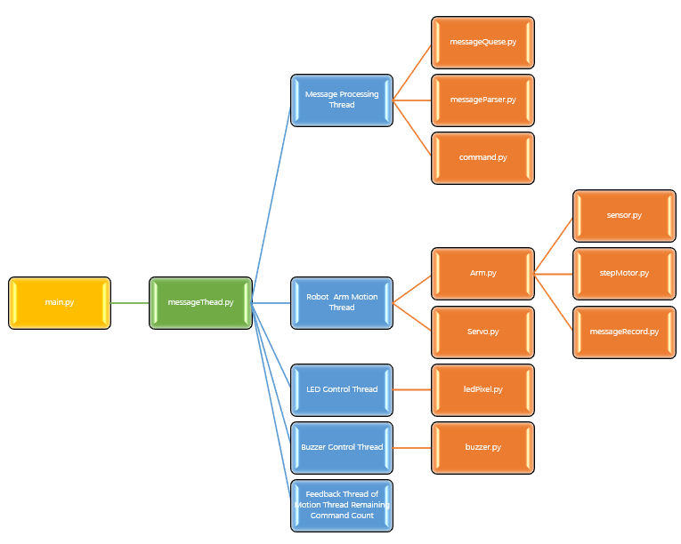

Code Introduction
*************************

Next, we will explain the code files one by one.

messageThread.py
==========================

We use this file to create and destroy thread objects. The code is as shown below.

.. literalinclude:: ../../../freenove_Kit/Server/Code/messageThread.py
    :linenos:
    :language: python
    :dedent:

Import function modules.

.. literalinclude:: ../../../freenove_Kit/Server/Code/messageThread.py
    :linenos:
    :language: python
    :lines: 4-7
    :dedent:

Create a function called create_thread that accepts a parameter thread and returns a threading.Thread object. It is used to create thread objects.

.. literalinclude:: ../../../freenove_Kit/Server/Code/messageThread.py
    :linenos:
    :language: python
    :lines: 22-23
    :dedent:

Create a function called stop_thread that accepts one parameter thread. It is used to close threads.

.. literalinclude:: ../../../freenove_Kit/Server/Code/messageThread.py
    :linenos:
    :language: python
    :lines: 25-27
    :dedent:

In the code, we create a test function to test whether the above code runs normally. We let it print a prompt message every 1 second.

.. literalinclude:: ../../../freenove_Kit/Server/Code/messageThread.py
    :linenos:
    :language: python
    :lines: 29-32
    :dedent:

Open a terminal and jump to the directory where the messageThread.py file is located.

Enter python messageThread.py and it will run the code below. In the code, the main process first creates a sub-thread test. This sub-thread prints a prompt message every 1 second. After 5 seconds, the main process closes the sub-thread test.

.. literalinclude:: ../../../freenove_Kit/Server/Code/messageThread.py
    :linenos:
    :language: python
    :lines: 34-39
    :dedent:

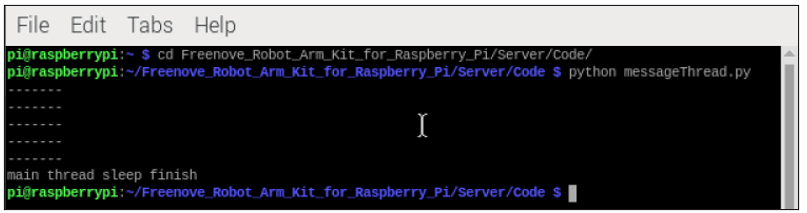

messageQueue.py
=====================================

This file is applied to access data. Each time the robot arm receives data, it calls this file to access the data in a unified format and execute the instructions one by one to make the system more stable. The code is as below.

.. literalinclude:: ../../../freenove_Kit/Server/Code/messageQueue.py
    :linenos:
    :language: python
    :dedent:

Write a message queue object, which is implemented through the list variable self.itens.

.. literalinclude:: ../../../freenove_Kit/Server/Code/messageQueue.py
    :linenos:
    :language: python
    :lines: 4-6
    :dedent:

Add a piece of data to the message queue.

.. literalinclude:: ../../../freenove_Kit/Server/Code/messageQueue.py
    :linenos:
    :language: python
    :lines: 8-9
    :dedent:

Use the get() function to get a data from the message queue. Use the gets() function to get all data from the message queue.

.. literalinclude:: ../../../freenove_Kit/Server/Code/messageQueue.py
    :linenos:
    :language: python
    :lines: 11-19
    :dedent:

Delete the data corresponding to the specified index number in the message queue.

.. literalinclude:: ../../../freenove_Kit/Server/Code/messageQueue.py
    :linenos:
    :language: python
    :lines: 21-23
    :dedent:

Get the number of data in the message queue and return it.

.. literalinclude:: ../../../freenove_Kit/Server/Code/messageQueue.py
    :linenos:
    :language: python
    :lines: 25-26
    :dedent:

Determine whether the message queue is empty.

.. literalinclude:: ../../../freenove_Kit/Server/Code/messageQueue.py
    :linenos:
    :language: python
    :lines: 28-30
    :dedent:

Clear all data in the message queue.

.. literalinclude:: ../../../freenove_Kit/Server/Code/messageQueue.py
    :linenos:
    :language: python
    :lines: 31-32
    :dedent:

Get the last data in the message queue.

.. literalinclude:: ../../../freenove_Kit/Server/Code/messageQueue.py
    :linenos:
    :language: python
    :lines: 34-36
    :dedent:

Open a terminal and jump to the directory where the messageQuese.py file is located.

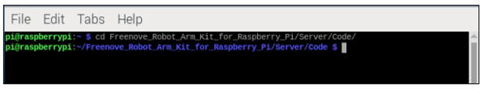

Enter python messageQuese.py and it will run the code below.

.. literalinclude:: ../../../freenove_Kit/Server/Code/messageQueue.py
    :linenos:
    :language: python
    :lines: 38-45
    :dedent:

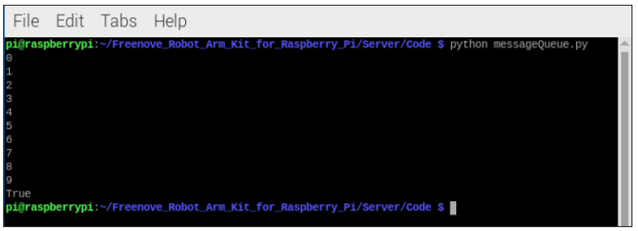

messageParser.py
=====================================

file is used to parse commands from an app or software. The code is as follows.

.. literalinclude:: ../../../freenove_Kit/Server/Code/messageParser.py
    :linenos:
    :language: python
    :dedent:

Write a message parsing object specifically used to parse app/software instructions.

.. literalinclude:: ../../../freenove_Kit/Server/Code/messageParser.py
    :linenos:
    :language: python
    :lines: 4-11
    :dedent:

The instruction parsing function sends the content that needs to be parsed into the function through parameters. After parsing the instruction, the content in different formats is stored in different variables.

.. literalinclude:: ../../../freenove_Kit/Server/Code/messageParser.py
    :linenos:
    :language: python
    :lines: 13-25
    :dedent:

Clear parsed content.

.. literalinclude:: ../../../freenove_Kit/Server/Code/messageParser.py
    :linenos:
    :language: python
    :lines: 27-33
    :dedent:

Open a terminal and jump to the directory where the messageParser.py file is located.

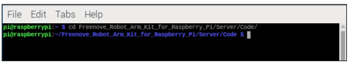

Enter python messageParser.py and it will run the code below.

.. literalinclude:: ../../../freenove_Kit/Server/Code/messageParser.py
    :linenos:
    :language: python
    :lines: 27-33
    :dedent:

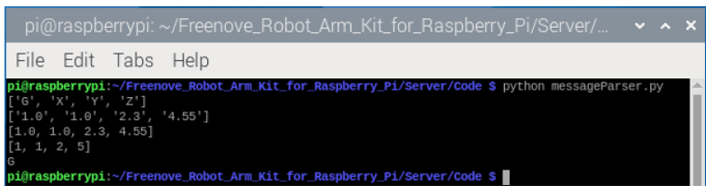

Command.py
=====================================

This file is utilized for defining the specifications of communication content between the robot arm and the app/software.

.. literalinclude:: ../../../freenove_Kit/Server/Code/Command.py
    :linenos:
    :language: python
    :dedent:

MessageRecord.py
=====================================

This file is used to store messages to a local file. The code is as follows.

.. literalinclude:: ../../../freenove_Kit/Server/Code/MessageRecord.py
    :linenos:
    :language: python
    :dedent:

Import json and os objects.

.. literalinclude:: ../../../freenove_Kit/Server/Code/MessageRecord.py
    :linenos:
    :language: python
    :lines: 4-5
    :dedent:

Write a local file storage object to store some important messages in local files.

.. literalinclude:: ../../../freenove_Kit/Server/Code/MessageRecord.py
    :linenos:
    :language: python
    :lines: 7-32
    :dedent:

Check if target object exists in json.

.. literalinclude:: ../../../freenove_Kit/Server/Code/MessageRecord.py
    :linenos:
    :language: python
    :lines: 34-39
    :dedent:

Delete the designated file.

.. literalinclude:: ../../../freenove_Kit/Server/Code/MessageRecord.py
    :linenos:
    :language: python
    :lines: 41-46
    :dedent:

Determine whether there is a json file in the local file, and whether the number in the json file is consistent with the number of self.jsonData. If they are consistent, read the json file content and assign it to self.jsonData. If the numbers are inconsistent or the json file does not exist, create a new json file and write the default parameters.

.. literalinclude:: ../../../freenove_Kit/Server/Code/MessageRecord.py
    :linenos:
    :language: python
    :lines: 48-59
    :dedent:

These two functions are used to read and write back and forth between json files and self.jsonData.

.. literalinclude:: ../../../freenove_Kit/Server/Code/MessageRecord.py
    :linenos:
    :language: python
    :lines: 61-69
    :dedent:

The readJsonObject function is used to read the parameters of the specified object from json. The writeJsonObject function is used to write the parameters of the specified object into json and update it to the local file.

.. literalinclude:: ../../../freenove_Kit/Server/Code/MessageRecord.py
    :linenos:
    :language: python
    :lines: 71-84
    :dedent:

Open a terminal and jump to the directory where the messageRecord.py file is located.

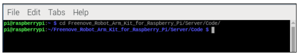

Run python messageRecord.py and it will run the following code.

.. code-block:: python
    :linenos:

    if __name__ == '__main__':
        ...

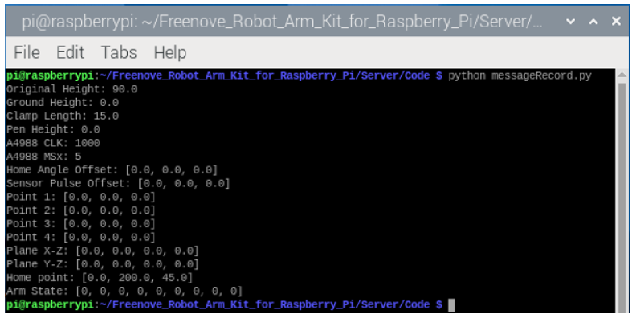

sensor.py
=====================================

This file is used to obtain sensor status information. The code is as below.

.. literalinclude:: ../../../freenove_Kit/Server/Code/sensor.py
    :linenos:
    :language: python
    :lines: 1-67
    :dedent:

Import pigpio obeject to control the pins of Raspberry Pi.

.. literalinclude:: ../../../freenove_Kit/Server/Code/sensor.py
    :linenos:
    :language: python
    :lines: 4-4
    :dedent:

Write a sensor object and set all sensor pins to input mode.

.. literalinclude:: ../../../freenove_Kit/Server/Code/sensor.py
    :linenos:
    :language: python
    :lines: 6-12
    :dedent:

Read the sensor value and return it.

.. literalinclude:: ../../../freenove_Kit/Server/Code/sensor.py
    :linenos:
    :language: python
    :lines: 13-18
    :dedent:

Read the data of the three sensors and return them.

.. literalinclude:: ../../../freenove_Kit/Server/Code/sensor.py
    :linenos:
    :language: python
    :lines: 19-23
    :dedent:

Open the terminal and jump to the directory where the sensor.py file is located.

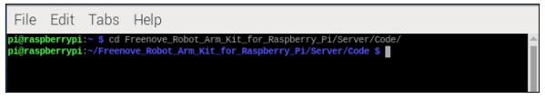

Run sudo python sensor.py and it will run the following code.

.. code-block:: python
    :linenos:

    if __name__ == '__main__':
        ...
    
When the sensor recognizes the black screw on the robot arm, the indicator light on the sensor goes out and the value 1 is returned.

When the sensor cannot recognize the black screw on the robot arm, the indicator light on the sensor lights up and a value of 0 is returned.

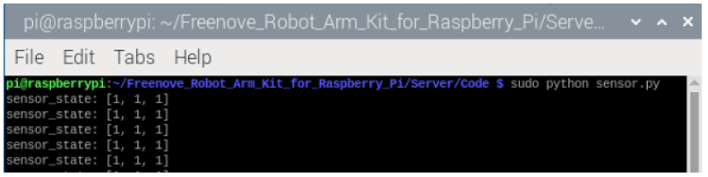

stepMotor.py
===================================

This file is used to control the stepper motor. The code is as below.

.. literalinclude:: ../../../freenove_Kit/Server/Code/stepMotor.py
    :linenos:
    :language: python
    :lines: 1-524
    :dedent:

Import function modules.

.. literalinclude:: ../../../freenove_Kit/Server/Code/stepMotor.py
    :linenos:
    :language: python
    :lines: 4-9
    :dedent:

Write a stepper motor object that allows us to control the stepper motor.

.. code-block:: python
    :linenos:

    class StepMotor:
        def __init__(self):
            ...

From the stepper motor test section in Chapter 1, we know that the Raspberry Pi does not directly connect to the stepper motor, but controls it through the stepper motor driver module. The stepper motor module we use is A4988, so we write a function to initialize the pins connected to the A4988 module.

.. code-block:: python
    :linenos:

    class StepMotor:
        def initA4988(self):
            ...

Write a function to manage the power supply to the stepper motor through its driver module. The motor should be energized and operational when `enable` is set to 0, and it should be de-energized and inactive when `enable` is set to 1.

.. code-block:: python
    :linenos:

    class StepMotor:
        def setA4988Enable(self, enable):
            ...

The “setA4988MSx” function is used to adjust the microstepping of the stepper motor by controlling the MS1 and MS2 pins. The `readA4988Msx` function is used to read the current microstepping setting of the stepper motor. The `setA4988MsxMode` function further encapsulates the “setA4988MSx” function. The `mode` parameter ranges from 1 to 5. When the parameter is 1, the stepper motor operates without microstepping, requiring 200 pulses to complete one rotation, with each pulse corresponding to an angle of 1.8 degrees. When the parameter is 5, the stepper motor is set to 16 microsteps, requiring 3200 pulses for one rotation, with each pulse corresponding to an angle of 0.1125 degrees. The default setting for the robotic arm is 16 microsteps.

.. code-block:: python
    :linenos:

    def setA4988MSx(self, ms1, ms2, ms3):
        ...
    def readA4988Msx(self):
        ...
    def setA4988MsxMode(self, mode):
        ...

Set the pulse frequency of the stepper motor that determines how quickly the Raspberry Pi sends control signals, which in turn affects the speed at which the robotic arm rotates. A higher pulse frequency results in faster control signal transmission and quicker arm movement, while a lower frequency slows down both the signal sending and the arm's rotational speed. It is recommended that the `frequency` parameter be set within the range of 100 to 16000 Hz.

.. code-block:: python
    :linenos:

    def myDelay(self, second):
        ...

The stepper motor operation function is used to control the rotation of the stepper motor. `motor_number` indicates the identifier of the motor, with a range of 1-3. `direction` signifies the direction of rotation of the motor, with a range of 0 and 1. `pulse_count` represents the number of pulses; with 16 microstepping, a pulse count of 3200 will result in one complete rotation of the motor. `pulse_frequency` denotes the pulse frequency; the higher the frequency, the faster the stepper motor rotates, and the lower the frequency, the slower it rotates, with a range of 100-16000.

.. code-block:: python
    :linenos:

    def motorRun(self, motor_number, direction, pulse_count, pulse_frequency):
        ...

The `gotoMidSensorPointx` function is designed to calculate the number of pulses required for the stepper motor to rotate from the edge of the sensor to the center of the sensor, and it returns this value. 

The `caliSensorPoint` function calls `gotoMidSensorPointx` to rotate the robot arm to the center position of the sensor and returns the pulse counts for each motor as it moves to the center.

The `gotoSensorPoint` function is used to directly rotate the robotic arm to a position that is `pulse_count` pulses away from the edge of the sensor. 

Typically, we first call the `caliSensorPoint` function to rotate the robotic arm to the center of the sensor and record the returned value. Later, if we want the robotic arm to directly rotate to the center position of the sensor, we simply call the `gotoSensorPoint` function with the return value of `caliSensorPoint` as the argument.

.. code-block:: python
    :linenos:

    def  gotoMidSensorPoint1(self):
        ...
    def  gotoMidSensorPoint2(self):
        ...
    def  gotoMidSensorPoint3(self):
        ...
    def  caliSensorPoint(self):        
        ...
    def  gotoSensorPoint(self, pulse_count):   
        ...

The large gear on the robot arm has 96 teeth, and the synchronous gear on the stepper motor has 16 teeth, giving a gear ratio of 6:1.

With the default microstepping of 16 for the robot arm, the number of pulses required for the joint to rotate one full circle is calculated as 200 (pulses per motor step) times 16 (microsteps) times 6 (gear ratio), which equals 19,200 pulses.

Therefore, to calculate how many degrees are corresponded by a certain number of pulses (`pulse_count`), we simply divide `pulse_count` by 19,200 pulses and then multiply by 360 degrees to get the corresponding angle in degrees.

Similarly, to calculate the pulse value needed for a certain angle of rotation, we divide the angle value by 360 degrees and then multiply by 19,200 to obtain the pulse value corresponding to that angle.

.. literalinclude:: ../../../freenove_Kit/Server/Code/stepMotor.py
    :linenos:
    :language: python
    :lines: 431-441
    :dedent:

Calling the 'angleToStepMotorParameter' function can calculate the number of pulses and the direction of rotation required by the stepper motor to rotate the robot arm to the target angle.

.. literalinclude:: ../../../freenove_Kit/Server/Code/stepMotor.py
    :linenos:
    :language: python
    :lines: 442-452
    :dedent:

The `moveStepMotorToTargetAngle` function is the core function of the entire robot arm. Each time we have the arm to rotate by a certain angle, the code converts these angle values into pulse counts.

However, for stepper motors, pulse counts are integers, and sometimes the calculated values are floating-point numbers. If we simply truncate the decimal part, over time this could lead to significant inaccuracies in the movement of the robot arm.

Therefore, we use `pulse_int_value` to store the integer part of the pulse count resulting from the angle-to-pulse conversion, and `pulse_margin` to store the decimal part, along with the direction of rotation.

When this function is called again, it adds the previous `pulse_margin` to the calculation, ensuring that the decimal part of the data is not lost. This allows the robotic arm to accurately move to each desired position.

.. literalinclude:: ../../../freenove_Kit/Server/Code/stepMotor.py
    :linenos:
    :language: python
    :lines: 454-484
    :dedent:

Enter sudo python stepMotor.py, and it will run the code below. The three motors on the robotic arm rotate back and forth in small increments.

.. literalinclude:: ../../../freenove_Kit/Server/Code/stepMotor.py
    :linenos:
    :language: python
    :lines: 486-524
    :dedent:

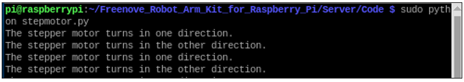

Please be aware: In the context of the stepper motor testing section in Chapter 1, the stepper motor is not mounted on the robo arm. At that stage, it is possible to use commands with parameters to control motor to spin continuously in a single direction. However, in the current chapter, with the stepper motor now integrated into the robot arm, employing commands with parameters that result in continuous rotation could cause mechanical structural conflicts. Consequently, do not use parameterized commands to avoid any potential damage to the robot arm.

arm.py
===========================

This file is used to control the robot arm. The code is as below.

.. literalinclude:: ../../../freenove_Kit/Server/Code/arm.py
    :linenos:
    :language: python
    :lines: 1-419
    :dedent:

We can use the coordinateToAngle function to convert the end coordinates into the rotation angles of the three motors of the robotic arm.

.. literalinclude:: ../../../freenove_Kit/Server/Code/arm.py
    :linenos:
    :language: python
    :lines: 313-330
    :dedent:

1.	Calculate angle0 based on the x, y coordinates of the end of the robot arm, and convert the three-dimensional model into a two-dimensional model.

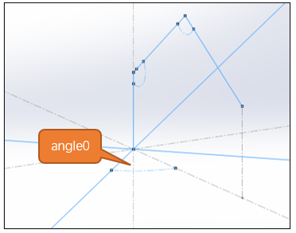

2.	Calculate the values of d1Plane and zHeight, and based on these two values, calculate the value of dHypotenuse based on the Pythagorean Theorem (a*a+b*b=c*c).

3.	Calculate the value of angle1 from the three-sided formula. (cosA = (b*b+c*c-a*a)/2bc)

4.	According to the cotangent function in trigonometric functions, directly find the value of angle2.

5.	If the coordinates of the end of the robot arm are lower than the height of d1Plane, then angle3=angle1-angle2, otherwise, then angle3=angle1+angle2.

6.	Since L1=L2, the triangle formed by dHypotenuse, L1, and L2 is an isosceles triangle. Therefore, angle4 =180-(2*angle1)

7.	Finally, as can be seen from the figure, angle5+angle3+angle4=180°, solve angle5.

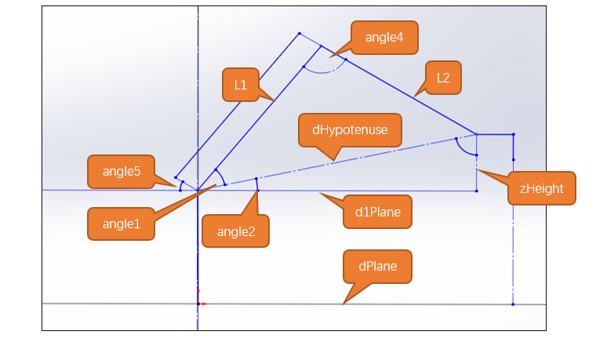

Similarly, based on the model mentioned above, we can deduce the function `angleToCoordinate()` which converts angles to coordinates.

.. code-block:: python
    :linenos:
    
    #Convert angles to coordinates
    def angleToCoordinata(self, angle):   
        ...

The moveStepMotorToTargetAxis function is used to control the movement of the robotic arm's end effector to a target coordinate position.

.. code-block:: python
    :linenos:
    
    #Control the robot arm to move to the corresponding coordinates
    def moveStepMotorToTargetAxis(self, axis, mode=0):
        ...

Run sudo python arm.py and the following code will be executed. The robot arm will perform a sensor calibration action and print out the pulse values.

.. literalinclude:: ../../../freenove_Kit/Server/Code/arm.py
    :linenos:
    :language: python
    :lines: 411-419
    :dedent:

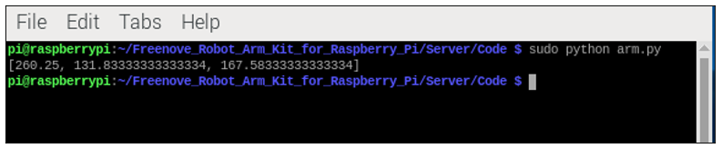

servo.py
===============================

This file is used to control servos.

.. literalinclude:: ../../../freenove_Kit/Server/Code/servo.py
    :linenos:
    :language: python
    :lines: 1-73
    :dedent:

Import the pigpio object to control the pins of Raspberry Pi.

.. literalinclude:: ../../../freenove_Kit/Server/Code/servo.py
    :linenos:
    :language: python
    :lines: 4-5
    :dedent:

Servo interface initialization function. The range of `index` is 0-4, corresponding to these 5 GPIOs: 13, 16, 19, 20, 23.

.. literalinclude:: ../../../freenove_Kit/Server/Code/servo.py
    :linenos:
    :language: python
    :lines: 19-28
    :dedent:

The setServoAngle function is used to control the specified servo to rotate to any angle. `index` is the servo index number, ranging from 0 to 4. `angle` is the angle to which the servo should rotate, ranging from 0 to 180 degrees.

.. literalinclude:: ../../../freenove_Kit/Server/Code/servo.py
    :linenos:
    :language: python
    :lines: 29-35
    :dedent:

The servo disable function, when called, releases the torque on the specified servo. `index` is the servo index number, with a range of 0 to 4.

.. literalinclude:: ../../../freenove_Kit/Server/Code/servo.py
    :linenos:
    :language: python
    :lines: 36-38
    :dedent:

Open a terminal and jump to the directory where the servo.py file is located.

Run sudo python servo.py and it will run the following code.

.. code-block:: python
    :linenos:

    # Main program logic follows:
    if __name__ == '__main__':
        ...

The following commands are for your reference.

+----------------------------+----------------------------------------------------+
| Commands                   | Explanations                                       |
+----------------------------+----------------------------------------------------+
| sudo python servo.py       | Simultaneously controls five channels of servos    |
|                            |                                                    |
|                            | to rotate back and forth repeatedly.               |
+----------------------------+----------------------------------------------------+
| sudo python servo.py 0     | Controls the servo of channel 0 (GPIO13) to rotate |
|                            |                                                    |
|                            | to 90 degress and stay at that position.           |
+----------------------------+----------------------------------------------------+
| sudo python servo.py 0 90  | Controls the servo of channel 0 (GPIO13) to rotate |
|                            |                                                    |
|                            | to 90 degress and stay at that position.           |
+----------------------------+----------------------------------------------------+
| sudo python servo.py 0 150 | Controls the servo of channel 0 (GPIO13) to rotate |
|                            |                                                    |
|                            | to 150 degress and stay at that position.          |
+----------------------------+----------------------------------------------------+
| sudo python servo.py 1 45  | Controls the servo of channel 1 (GPIO16) to rotate |
|                            |                                                    |
|                            | to 45 degress and stay at that position.           |
+----------------------------+----------------------------------------------------+

ledPixel.py
============================

This file is used to control the LED module. The code is as below.

.. literalinclude:: ../../../freenove_Kit/Server/Code/ledPixel.py
    :linenos:
    :language: python
    :lines: 1-206
    :dedent:

Import the RGB LED object to control the LED module.

.. literalinclude:: ../../../freenove_Kit/Server/Code/ledPixel.py
    :linenos:
    :language: python
    :lines: 4-5
    :dedent:

Designate colors to the LEDs one by one.

.. literalinclude:: ../../../freenove_Kit/Server/Code/ledPixel.py
    :linenos:
    :language: python
    :lines: 34-42
    :dedent:

Make the eight LEDs to emit designated colors at the same time.

.. literalinclude:: ../../../freenove_Kit/Server/Code/ledPixel.py
    :linenos:
    :language: python
    :lines: 44-51
    :dedent:

Display a rotating effect like flowing water, with the color customizable to any desired hue.

.. literalinclude:: ../../../freenove_Kit/Server/Code/ledPixel.py
    :linenos:
    :language: python
    :lines: 53-67
    :dedent:

The eight RGB lights blink, displaying a specified color.

.. literalinclude:: ../../../freenove_Kit/Server/Code/ledPixel.py
    :linenos:
    :language: python
    :lines: 69-80
    :dedent:

The eight RGB lights transition from dark to bright and then back to dark, with the color customizable to any desired shade.

.. literalinclude:: ../../../freenove_Kit/Server/Code/ledPixel.py
    :linenos:
    :language: python
    :lines: 82-94
    :dedent:

Color palette function that takes a value from 0 to 255 and returns a tuple containing the red, green, and blue color components.

.. literalinclude:: ../../../freenove_Kit/Server/Code/ledPixel.py
    :linenos:
    :language: python
    :lines: 96-115
    :dedent:

The eight RGB lights display colors like a rainbow and slowly rotate. The colors cannot be set manually.

.. literalinclude:: ../../../freenove_Kit/Server/Code/ledPixel.py
    :linenos:
    :language: python
    :lines: 117-125
    :dedent:

The eight RGB lights gradually transition from one color to another simultaneously, and this process cycles continuously, with the colors not being adjustable.

.. literalinclude:: ../../../freenove_Kit/Server/Code/ledPixel.py
    :linenos:
    :language: python
    :lines: 127-135
    :dedent:

The eight RGB lights display only a subset of the lights, with a symmetrical rotation pattern, and the color value can be specified to any desired color.

.. literalinclude:: ../../../freenove_Kit/Server/Code/ledPixel.py
    :linenos:
    :language: python
    :lines: 137-148
    :dedent:

Open the terminal and jump to the directory where the ledPixel.py file is located.

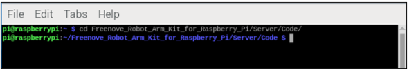

Run sudo python ledPixel.py and it will run the following code.

.. code-block:: python
    :linenos:

    # Main program logic follows:
    if __name__ == '__main__':
        ...

You can try the following commands.

+-------------------------------------+----------------------------------------------------+
|              Commands               |                    Explanation                     |
+=====================================+====================================================+
| sudo python ledPixel.py 1           | Customize the color of the RGB LED.                |
|                                     |                                                    |
|                                     | Without parameters, the color is red by default.   |
+-------------------------------------+----------------------------------------------------+
| sudo python ledPixel.py 1 0 0 255   | Customize the color, The parameters set            |
|                                     |                                                    |
|                                     | the red and green to 0 and the blue to 255,        |
|                                     |                                                    |
|                                     | so the LED module only emits blue light.           |
+-------------------------------------+----------------------------------------------------+
| sudo python ledPixel.py 2           | Repeatedly emits red, green and blue.              |
|                                     |                                                    |
|                                     | Paramters are not needed.                          |
+-------------------------------------+----------------------------------------------------+
| sudo python ledPixel.py 3           | Running water effect. Without parameters,          |
|                                     |                                                    |
|                                     | the color is red by default.                       |
+-------------------------------------+----------------------------------------------------+
| sudo python ledPixel.py 3 0 255 0   | Running water effect. The parameters set           |
|                                     |                                                    |
|                                     | the red and blue to 0 and the green to 255,        |
|                                     |                                                    |
|                                     | so the LED module only emits green light.          |
+-------------------------------------+----------------------------------------------------+
| sudo python ledPixel.py 4           | Gradient light, slowly changing in rainbow colors. |
|                                     |                                                    |
|                                     | Parameters are not needed.                         |
+-------------------------------------+----------------------------------------------------+
| sudo python ledPixel.py 5           | Rainbow lights, repeatedly turning the             |
|                                     |                                                    |
|                                     | rainbow colors. Parameters are not needed.         |
+-------------------------------------+----------------------------------------------------+
| sudo python ledPixel.py 6           | Breathing light.  Withouth parameters,             |
|                                     |                                                    |
|                                     | the color is red by default.                       |
+-------------------------------------+----------------------------------------------------+
| sudo python ledPixel.py 6 255 0 255 | Breathign light. The parameters set                |
|                                     |                                                    |
|                                     | the red and blue to 255 and the green to 255,      |
|                                     |                                                    |
|                                     | so the LED module only emits red and blue light,   |
|                                     |                                                    |
|                                     | which looks pinkish purple.                        |
+-------------------------------------+----------------------------------------------------+

The colors displayed are as below:

.. list-table::
    :header-rows: 1

    * - Red
      - Green
      - Blue
      - Pinkish 
        
        purple
      - Rainblow 
       
        lights
    * - |Function70|
      - |Function71|
      - |Function72|
      - |Function73|
      - |Function74|

buzzer.py
===========================

This file is used to control the buzzer. The code is as below.

.. literalinclude:: ../../../freenove_Kit/Server/Code/buzzer.py
    :linenos:
    :language: python
    :dedent:

Buzzer initialization function.

.. literalinclude:: ../../../freenove_Kit/Server/Code/buzzer.py
    :linenos:
    :language: python
    :lines: 13-17
    :dedent:

This function makes the buzzer to sound at a specified frequency within the range of 1-4000Hz.

.. literalinclude:: ../../../freenove_Kit/Server/Code/buzzer.py
    :linenos:
    :language: python
    :lines: 19-25
    :dedent:

Buzzer sound function. `frequency` represents the sound frequency, `delayms` indicates the duration of each beep, and `times` specifies the number of beeps.

.. literalinclude:: ../../../freenove_Kit/Server/Code/buzzer.py
    :linenos:
    :language: python
    :lines: 27-33
    :dedent:

Open the terminal and jump to the directory where the buzzer.py file is located.

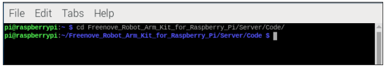

Run sudo python buzzer.py and it will run the following code.

.. code-block:: python
    :linenos:

    if __name__ == '__main__':
        ...

You can try the following commands.

+----------------------------------+-------------------------------------------+
|             Commands             |               Explanations                |
+==================================+===========================================+
| sudo python buzzer.py            | The buzzers makes three beeps with a      |
|                                  |                                           |
|                                  | frequency opf 2kHz, each lasting 100ms.   |
+----------------------------------+-------------------------------------------+
| sudo python buzzer.py 2500       | The buzzers makes three beeps with a      |
|                                  |                                           |
|                                  | frequency opf 2.5kHz, each lasting 100ms. |
+----------------------------------+-------------------------------------------+
| sudo python buzzer.py 2000 300   | The buzzers makes three beeps with a      |
|                                  |                                           |
|                                  | frequency opf 2kHz, each lasting 300ms.   |
+----------------------------------+-------------------------------------------+
| sudo python buzzer.py 2000 100 5 | The buzzers makes five beeps with a       |
|                                  |                                           |
|                                  | frequency opf 2kHz, each lasting 100ms.   |
+----------------------------------+-------------------------------------------+

main.py
=================================

.. literalinclude:: ../../../freenove_Kit/Server/Code/main.py
    :linenos:
    :language: python
    :lines: 1-723
    :dedent:

Write an object to control the robot arm and initialize it.

.. code-block:: python
    :linenos:

    class ArmServer:
    def __init__(self):
        ...

Thread start and stop functions. When the `state` parameter is True, the thread is started. When the `state` parameter is False, the thread is stopped.

.. code-block:: python
    :linenos:

    #Set the message receiving thread
    def setThreadingReceiveState(self, state):
        ...
    #Set the robot arm to move thread
    def setThreadingArmState(self, state):
        ...
    #Set the light thread  
    def setThreadingLedState(self, state):
        ...
    #Set the buzzer thread
    def setThreadingBuzzerState(self, state):
        ...
    #Set the feedback thread      
    def setThreadingFeedbackState(self, state):
        ...

Generate the corresponding command based on the parameters and place it into the respective message queue, waiting for the associated thread to execute the code in the order of the queue.

.. code-block:: python
    :linenos:

    #Buzzer instructions are generated according to the parameters and sent to the message queue
    def setRobotBuzzer(self, frequency, delayms, times):
        ...
    #Generate light instructions according to the parameters and send them to the message queue
    def setRobotLED(self, mode, r, g, b):
        ...
    #The move instruction is generated according to the parameters and sent to the message queue
    def setRobotAction(self, axis):
        ...

This function obtains the IP address of Raspberry Pi.

.. code-block:: python
    :linenos:

    #Get the IP address of the Raspberry PI
    def get_interface_ip(self):
        ...

This functions sends communication data.

.. code-block:: python
    :linenos:

    #socket sending function
    def serverSend(self, data):
        ...

Start the robot arm server thread. Establish socket communication and print the IP address, then create message reception thread, motion execution thread, RGB light thread, and buzzer thread.

.. code-block:: python
    :linenos:

    #Opening the socket Server
    def turn_on_server(self):
        ...

Close the robot arm server thread. Terminate all threads and disconnect the socket connection.

.. code-block:: python
    :linenos:

    #Disable the socket server
    def turn_off_server(self):
        ...

The safety check function for the robotic arm is designed to ensure that the arm is fully set up, thereby minimizing the risk of accidental operation.

.. code-block:: python
    :linenos:

    #Check the installation and operation status of mechanical arm
    def safetyOperationInspection(self):
        ...

The robot arm's reception thread is used to receive commands from the App/Software. It then performs a preliminary parsing of the commands and sends the parsed instructions to the respective message queues for their corresponding functions.

.. code-block:: python
    :linenos:

    #Message receiving thread
    def threadingReceiveInstruction(self):
        ...

The robot arm's motion thread is utilized to control the movement of the arm and the rotation of the servos. When data is detected in the message queue, it parses each message and executes the content derived from the parsing.

.. code-block:: python
    :linenos:

    #The moving action thread
    def threadingRobotAction(self):
        ...

The RGB light thread is used to control the patterns and colors of the lights. When data is detected in the message queue, it retrieves the latest instruction from the queue, parses it, and executes it.

.. code-block:: python
    :linenos:

    #Light thread
    def threadingRobotLed(self):
        ...

The buzzer thread is designed to control the buzzer. When data is detected in the message queue, it parses each message and executes the content derived from the parsing.

.. code-block:: python
    :linenos:

    #Buzzer thread
    def threadingRobotBuzzer(self):
        ...

The motion instruction remaining count feedback thread is activated upon receiving a query start command from the App/Software. It queries the current number of remaining motion instructions every 0.5 seconds and feeds this information back to the App/Software. When a query stop command is received from the App/Software, this thread is terminated.

.. code-block:: python
    :linenos:

    #Feedback thread
    def threadingRobotActionFeedback(self):
        ...

The server connection check thread. When executed, this thread will check whether the server has been started, if there are any users connected, if any users have disconnected, and whether to shut down the server.

.. code-block:: python
    :linenos:

    #Server check thread
    def threadingCheckServer(self):
        ...
    
Open the terminal and jump to the directory where the main.py file is located.

Run sudo python main.py and it will run the following code.

.. code-block:: python
    :linenos:

    if __name__ == '__main__':
        ...

The IP address of the Raspberry Pi will be printed on the Terminal.

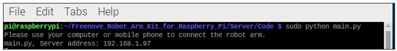

You can connect the APP/Software to the printed IP address of Raspberry Pi.

App

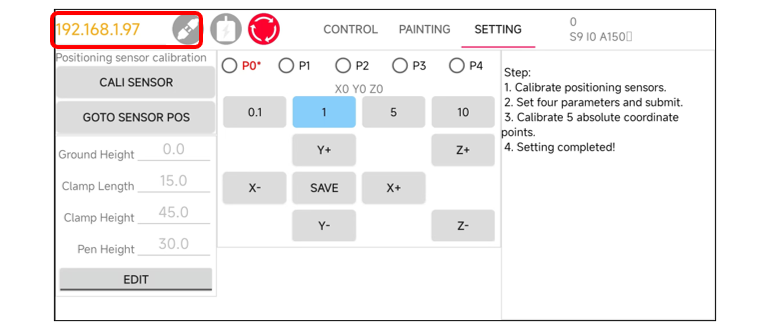

Software

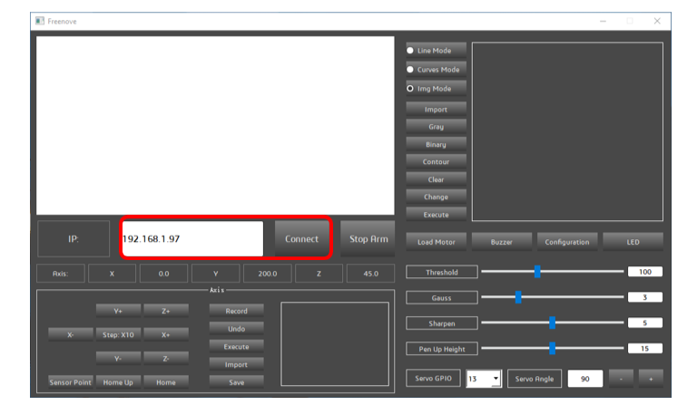