##############################################################################
List
##############################################################################

Before you begin, please check the list to make sure the materials are complete. If you find that your robot arm material is incomplete, please email us in time: support@freenove.com

Calibration Graph
*******************************************************************************

Please check whether the calibration graph is included. If it is not there, please find the .pdf file in the material we provide and print it yourself.

**Freenove_Robot_Arm_Kit_for_Raspberry_Pi/Calibration graph.pdf**

Calibration graph

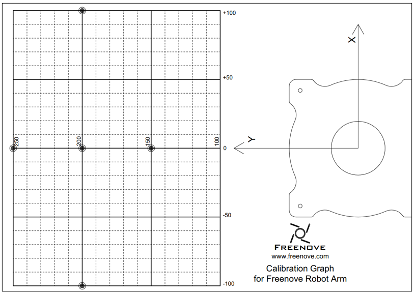

The recommended range of motion for the robot arm is between (-100,150) to (150,250).

Sheet Metal Assembly Components
*******************************************************************************

Here is the overall diagram of the materials. Please check if there is any piece missing or damaged upon unboxing. 

Should any of these happen, please email our support at support@freenove.com.

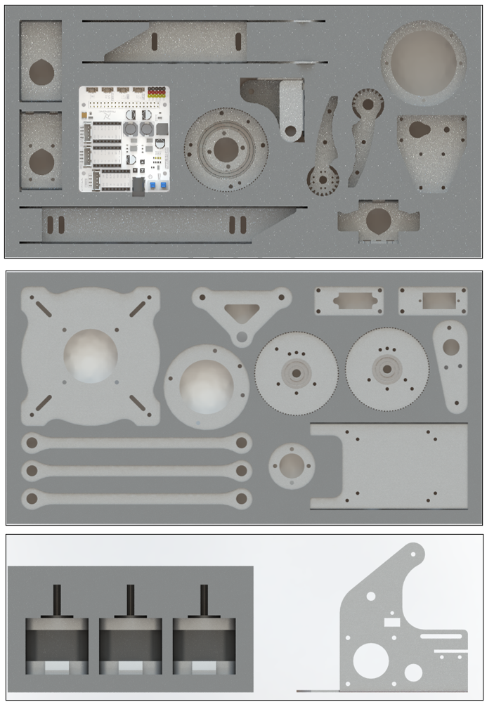

Machinery Parts
*******************************************************************************

Fasteners
===============================================================================

All fasteners come in a large bag, please open it and check whether they are complete.

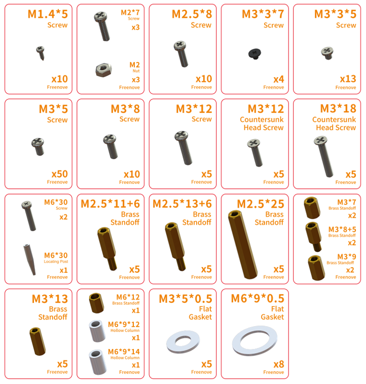

Other Hardware Materials
===============================================================================

.. list-table::
    :align: center

    * - Tension Spring (0.5x5x25)
      - Spring Plunger
      - Timing Pulley 
       
        -2GT-16 Gears
      - Plane Thrust Bearing 
       
        (51106-30x47x11)
    
    * - |List03|
      - |List04|
      - |List05|
      - |List06| 

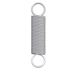
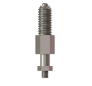
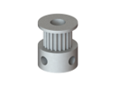
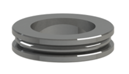

Acrylic Parts 
===============================================================================

.. list-table::
    :align: center

    * - Top Plate
      - LED Module Mounting Plate
      - Tailboard

    * - |List07|
      - |List08|
      - |List09|

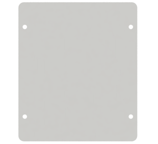
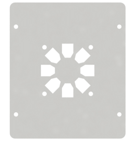

Rubber Parts 
*******************************************************************************

Foot Pad x1

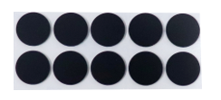

Electronic Parts
********************************************************************************

Robot Arm Board for Raspberry Pi

.. list-table::
    :align: center

    * - Top
      - Bottom

    * - |List11|
      - |List12|

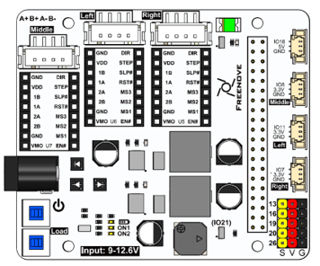
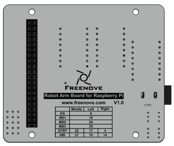

Transmission Parts
================================================================================

.. list-table::
    :align: center

    * - Servo Package X1
      - Stepper Motor X3

    * - |List13|
      - |List14|
  
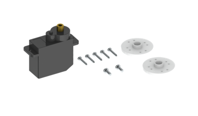
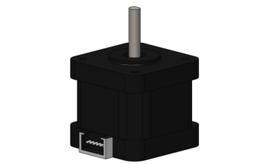

Electronic Module
=================================================================================

.. list-table::
    :align: center

    * - LED Module 
      - Battery Holder

    * - |List15|
      - |List16|

    * - Infrared Sensor Module
      - Stepper Motor Driving Module

    * - |List17|
      - |List18|

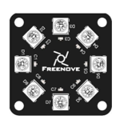
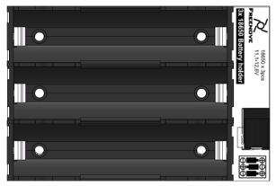
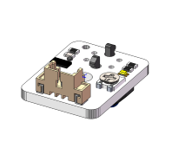
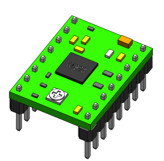

Cables
********************************************************************************

.. list-table::
    :align: center

    * - 20cm 3Pin Cable (Same Direction)
    * - |List19|

    * - Cable For Stepper Motor
    * - |List20|

    * - Power Cord
    * - |List21|

    * - 10cm 3Pin Cable To Jumper Wire
    * - |List22|

    * - 2GT-214 Timing Belt
    * - |List23|

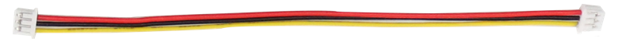
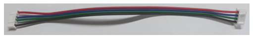
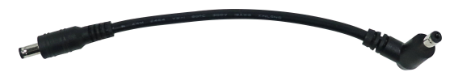
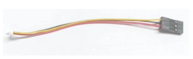
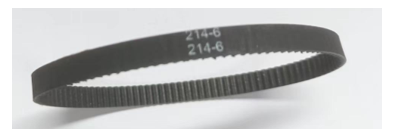

Tools
*******************************************************************************

.. list-table::
    :align: center

    * - Cross Screwdriver (3mm) X1
      - Tweezers 

    * - |List24|
      - |List25|

    * - Allen Key
      - 5mm Open-End Wrench

    * - |List26|
      - |List27|

    * - 7mm Open-End Wrench
      - 8mm Open-End Wrench

    * - |List28|
      - |List29|

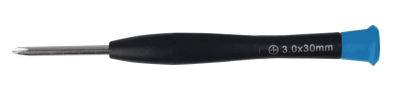
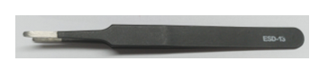
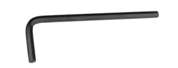
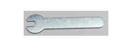
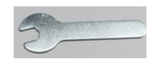
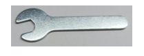

Required but NOT Contained Parts
*******************************************************************************

Three 18650 lithium batteries without protected board. 

:blue:`The continuous discharge current >10A`

It is not easy to find proper batteries on Amazon. Search :blue:`18650 3.7V high drain on eBay` or other websites.

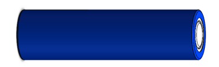

Raspberry Pi (Recommended model: Raspberry 5 / 4B / 3B+/ 3A+ /3B ) x1

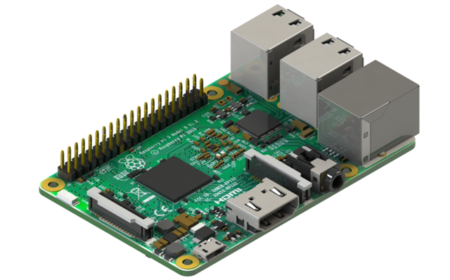