##############################################################################
Preface
##############################################################################

Welcome to use Freenove Robot Arm Kit for Raspberry Pi. Following this tutorial, you can make a very cool robot arm with many functions.

This kit is based on Raspberry Pi, a popular control panel, so you can share and exchange your experience and design ideas with many enthusiasts all over the world. This kit contains all electronic components, modules, and mechanical components required for making the robot arm, all of which are packaged individually. There are detailed instructions for assembly and configuration in this book. 

If you encounter any problems, please feel free to contact us for quick and free technical support.

support@freenove.com 

This book can help enthusiasts with little technical knowledge to make a robot arm. If you are very interested in Raspberry Pi, and want to learn how to program and build the circuit, please visit our website `www.freenove.com <www.freenove.com>`_ or contact us to buy the kits designed for beginners: 

https://github.com/Freenove/Freenove_Ultrasonic_Starter_Kit_for_Raspberry_Pi

Introduction to Raspberry Pi 
********************************************************************************

Raspberry Pi (or RPi, RPI, RasPi, which will be also referenced in this tutorial), a micro-computer with size of a card, quickly swept the world since it was launched. It is widely used in desktop workstation, media center, smart household, robots, and even the servers, etc. It can do almost everything, which continues to attract fans to explore it. Raspberry Pi is used to be running with Linux system and along with the release of windows 10 IoT, we can also run it with Windows. Raspberry Pi (with interfaces USB, network, HDMI, camera, audio, display and GPIO), as a microcomputer, can be run in command line mode and desktop system mode. Additionally, it is easy to operate just like Arduino, and you can even directly operate the GPIO of CPU. 

So far, at this writing, Raspberry Pi has advanced to its fifth generation product offering. Version changes are accompanied by increases in upgrades in hardware and capabilities. However, since the Raspberry Pi 5 has just been released, we are still using the Raspberry Pi 5 as the master system to learn.

The A type and B type versions of the first generation products have been discontinued due to various reasons. What is most important is that other popular and currently available versions are consistent in the order and number of pins and their assigned designation of function, making compatibility of peripheral devices greatly enhanced between versions. 

Below are the Raspberry Pi pictures and model pictures supported by this product.

.. list-table:: 
    :width: 100%
    :align: center

    *   -   Practicality picture of Raspberry Pi 5:
        -   Model diagram of Raspberry Pi 5:
    *   -   |Preface00|
        -   |Preface01|
    *   -   Actual image of Raspberry Pi 4 Model B:
        -   CAD image of Raspberry Pi 4 Model B:
    *   -   |Preface02|
        -   |Preface03|
    *   -   Actual image of Raspberry Pi 3 Model B: 
        -   CAD image of Raspberry Pi 3 Model B+:
    *   -   |Preface04|
        -   |Preface05|
    *   -   Actual image of Raspberry Pi 3 Model B: 
        -   CAD image of Raspberry Pi 3 Model B:
    *   -   |Preface06|
        -   |Preface07|
    *   -   Actual image of Raspberry Pi 2 Model B:
        -   CAD image of Raspberry Pi 2 Model B:
    *   -   |Preface08|
        -   |Preface09|
    *   -   Actual image of Raspberry Pi 1 Model B+:
        -   Actual image of Raspberry Pi 1 Model B+:
    *   -   |Preface10|
        -   |Preface11|
    *   -   Actual image of Raspberry Pi 3 Model A+:
        -   CAD image of Raspberry Pi 3 Model A+:
    *   -   |Preface12|
        -   |Preface13|
    *   -   Actual image of Raspberry Pi 1 Model A+:
        -   Actual image of Raspberry Pi 1 Model A+:
    *   -   |Preface14|
        -   |Preface15|
    *   -   Actual image of Raspberry Pi Zero W:
        -   CAD image of Raspberry Pi Zero W:
    *   -   |Preface16|
        -   |Preface17|
    *   -   Actual image of Raspberry Pi Zero:
        -   CAD image of Raspberry Pi Zero:
    *   -   |Preface18|
        -   |Preface19|

.. |Preface00| image:: ../_static/imgs/Preface/Preface00.png
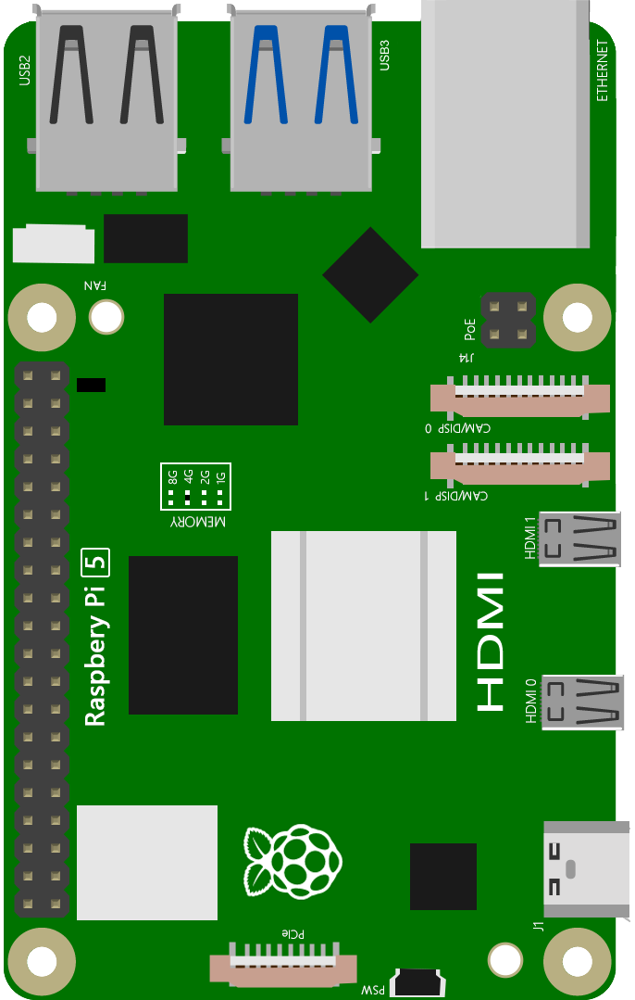
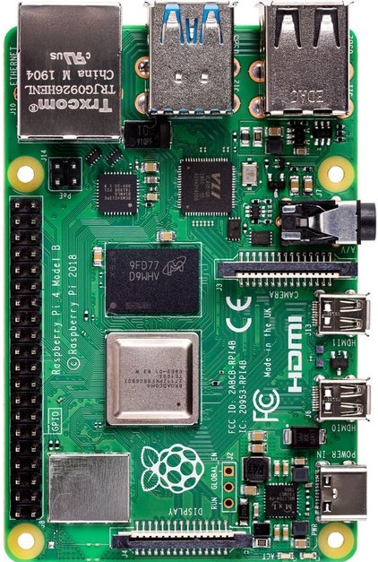
.. |Preface03| image:: ../_static/imgs/Preface/Preface03.png
.. |Preface04| image:: ../_static/imgs/Preface/Preface04.png
.. |Preface05| image:: ../_static/imgs/Preface/Preface05.png
.. |Preface06| image:: ../_static/imgs/Preface/Preface06.png
.. |Preface07| image:: ../_static/imgs/Preface/Preface07.png
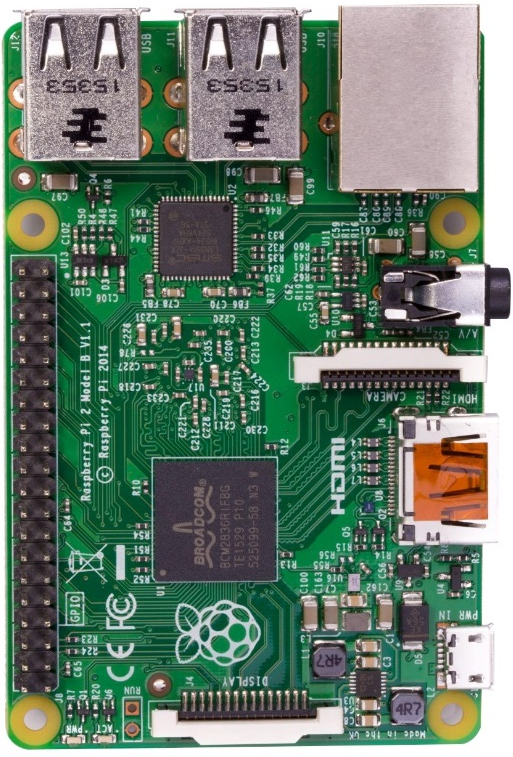
.. |Preface09| image:: ../_static/imgs/Preface/Preface09.png
.. |Preface10| image:: ../_static/imgs/Preface/Preface10.png
.. |Preface11| image:: ../_static/imgs/Preface/Preface11.png
.. |Preface12| image:: ../_static/imgs/Preface/Preface12.png
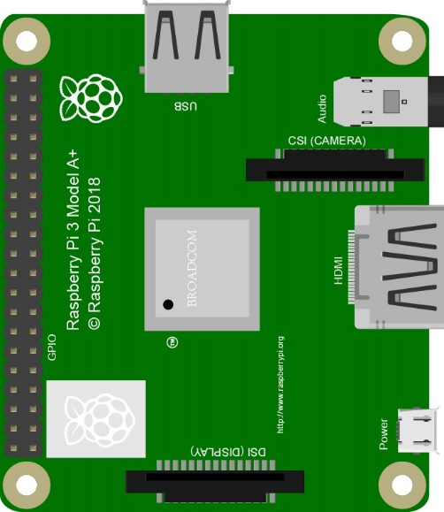
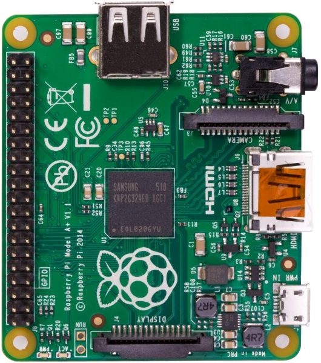
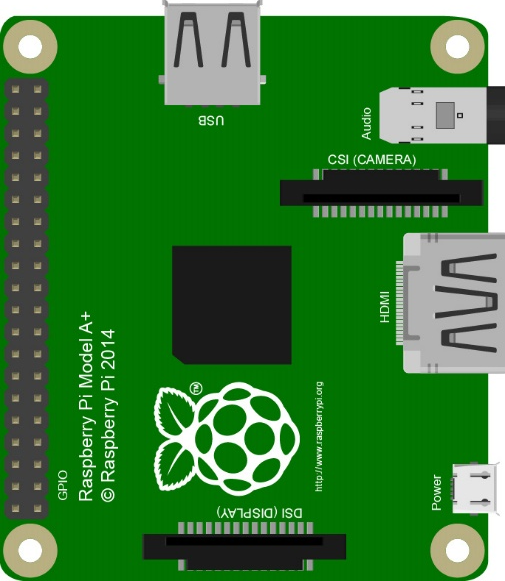
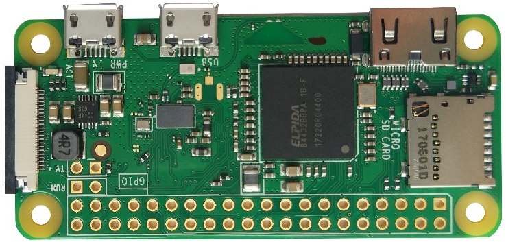
.. |Preface17| image:: ../_static/imgs/Preface/Preface17.png
.. |Preface18| image:: ../_static/imgs/Preface/Preface18.png
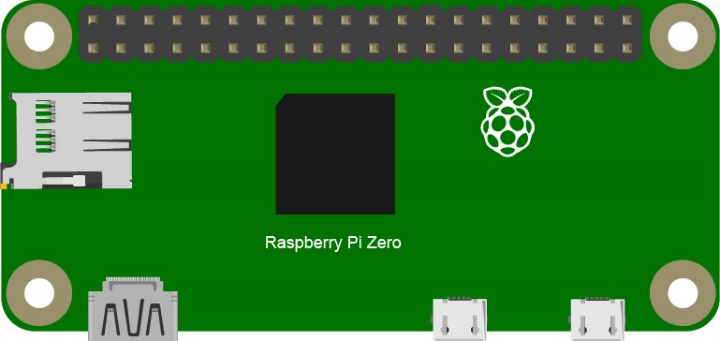

Below are the raspberry pi pictures and model pictures supported by this product. They have 40 pins.

Hardware interface diagram of RPi 5 is shown below: 

.. image:: ../_static/imgs/Preface/Preface20.png
    :align: center

Hardware interface diagram of RPi 4B is shown below:

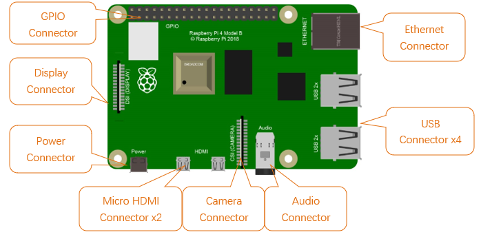

Hardware interface diagram of RPi 3B+/3B/2B/1B+:

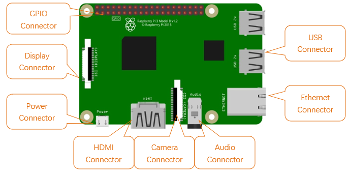

Hardware interface diagram of RPi 3A+/A+:

.. image:: ../_static/imgs/Preface/Preface23.png
    :align: center

Hardware interface diagram of RPi Zero/Zero W:

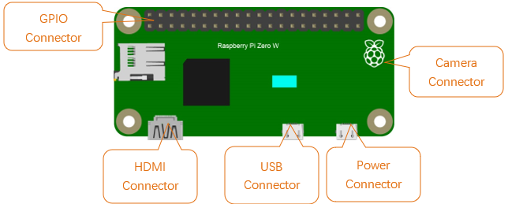

GPIO
================================================================
GPIO: General Purpose Input/Output. Here we will introduce the specific function of the pins on the Raspberry Pi and how you can utilize them in all sorts of ways in your projects. Most RPi Module pins can be used as either an input or output, depending on your program and its functions.

When programming GPIO pins there are 3 different ways to reference them: **GPIO Numbering**, **Physical Numbering** and **WiringPi GPIO Numbering**.

BCM GPIO Numbering
---------------------------------------------------------------
The Raspberry Pi CPU uses Broadcom (BCM) processing chips BCM2835, BCM2836 or BCM2837. GPIO pin numbers are assigned by the processing chip manufacturer and are how the computer recognizes each pin. The pin numbers themselves do not make sense or have meaning as they are only a form of identification. Since their numeric values and physical locations have no specific order, there is no way to remember them so you will need to have a printed reference or a reference board that fits over the pins.

Each pin's functional assignment is defined in the image below:

    .. image:: ../_static/imgs/Preface/Preface25.png
        :align: center

    .. image:: ../_static/imgs/Preface/Preface26.png
        :align: center

.. seealso:: 
    For more details about pin definition of GPIO, please refer to `<http://pinout.xyz/>`_

PHYSICAL Numbering
---------------------------------------------------------------
Another way to refer to the pins is by simply counting across and down from pin 1 at the top left (nearest to the SD card). This is 'Physical Numbering', as shown below:

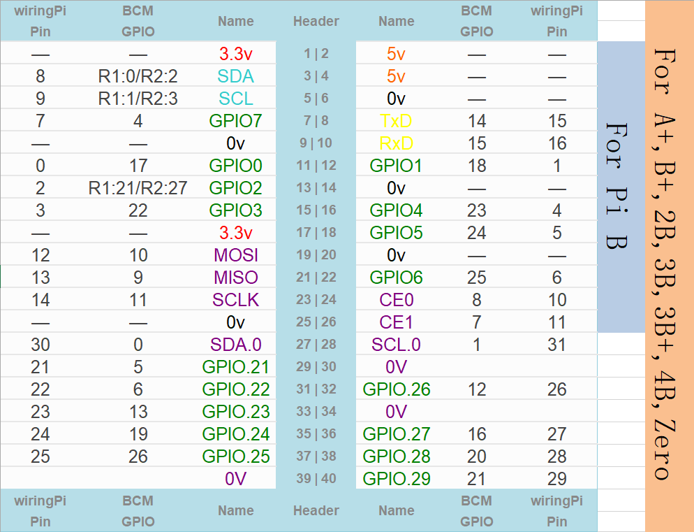

WiringPi GPIO Numbering
---------------------------------------------------------------
Different from the previous two types of GPIO serial numbers, RPi GPIO serial number of the WiringPi are numbered according to the BCM chip use in RPi.

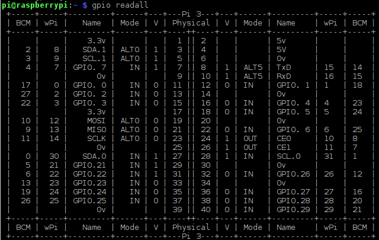

.. seealso:: 
    For more details, please refer to `<https://projects.drogon.net/raspberry-pi/wiringpi/pins/>`_ 

You can also use the following command to view their correlation.

.. code-block:: console

    $ gpio readall

.. seealso:: 

    For more details about pin definition of GPIO, please refer to `<https://github.com/WiringPi/WiringPi>`_